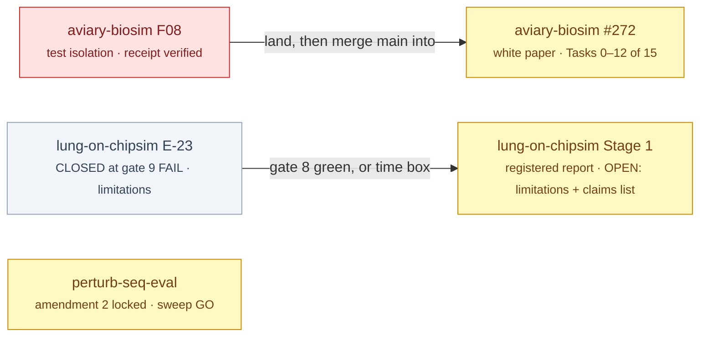

# §build — bioFM

<!-- HACP L1 · local source; the Notion row "bioFM · build" mirrors this file. -->

**Tag:** `§build` · **Layer:** L1 · **Holds:** phases, branches, what is in flight · **Reaches:** each workstream's build plan and worktree branch

**TL;DR** — Three branches in flight, none landed this week; one is a typed command away.

## In flight

*Red waits on the principal's keyboard; yellow is agent work; grey is written but not authorised to draft.*

| Workstream | Branch / plan | State | Next boundary |
|---|---|---|---|
| aviary-biosim | `aviary-biosim` @ `ab8f6f5`; plan #272 r2 (`4a8bb59`) on `whitepaper` @ `b366667` | F08 land-ready; Tasks 0–12 done | `/airdlc:pr-cto-land … --no-release` (principal); Task 13 `/iteration-complete` (agent) |
| lung-on-chipsim | `lung-on-chipsim` @ `6b642d8`; plan r2.50c (`ae894db`) | **E-23 CLOSED** at gate 9 FAIL (same family; no receipt; no r2.51) under the principal's time box; five mechanisms in, requirement 5 descoped to W/F/C/N reporting; findings → Stage 1 limitations | Stage 1 registered report (#411) opens: limitations section + claims list → CTO rigour review |
| perturb-seq-eval | `perturb-seq-eval` @ `4840f0d`; amendment 2 `3bf2a9a` | fixes formatted, 925 green | QG receipt → sweep runs on the standing GO (#283) |
| cellforge-agents | — | not surfaced this cycle | — |

## Presentations

| Workstream | Kind | What it shows | Surface | Written |
|---|---|---|---|---|
| aviary-biosim | Presentation (walkthrough + product cut) | the v2r loop and `BioSimEnv` placed in the system, the five decisions taken, the six HACP sections at `ab8f6f5`, and what is done / owed / undecided at the end of the workstream | [web Artifact](https://claude.ai/artifact/EqRkyfyMT5Jj8ecAcVpsYg) — **not published to the HACP index** (Notion connector not connected at write time; row owed). Source: `workstreams/_adhoc/aviary-biosim-walkthrough.md`, `…-walkthrough-product.md` | 2026-09-28 |
| lung-on-chipsim | Presentation (product cut) | the rig is built, the experiment has not run: the 6,802-compound reference table and every downstream step waiting on a human-owned input; state re-measured 2026-09-29 (T18 delivered, T14 0/26, no runs) | [web Artifact](https://claude.ai/artifact/HDtaxnfh79HumoLY7NWKws) — republished 2026-09-29 (the 2026-09-19 link died); **not published to the HACP index** (Notion connector not connected). Source: `workstreams/lung-on-chipsim/qa/_adhoc/lung-on-chipsim-walkthrough-product.md` | 2026-09-19 / 2026-09-29 |

## Convention

No boundary is claimed without a receipt a third party can verify; no plan runs unsigned; a plan whose text changes is re-signed, never patched. Merges only — the fleet's merge-bases are never rewritten.
