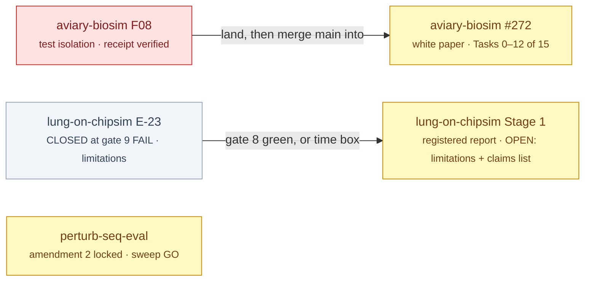

# §build — bioFM

<!-- HACP L1 · local source; the Notion row "bioFM · build" mirrors this file. -->

**Tag:** `§build` · **Layer:** L1 · **Holds:** phases, branches, what is in flight · **Reaches:** each workstream's build plan and worktree branch

**TL;DR** — Three branches in flight, none landed this week; one is a typed command away.

## In flight

*Red waits on the principal's keyboard; yellow is agent work; grey is written but not authorised to draft.*

| Workstream | Branch / plan | State | Next boundary |
|---|---|---|---|
| aviary-biosim | `whitepaper` @ `c66e64c` **pushed**; draft PR [Aviary-BioSim#2](https://github.com/supmo668/Aviary-BioSim/pull/2); receipt `2a9b966` CTO-verified | #272 Tasks 0–13 complete; pr-prep gate closed (76 raw → 13 fixed, 7 routed to the CTO); suites at `c66e64c` 328/42/17/122, mutants 48/48+1 | **CTO A7 rigour review**, queued on the principal's go — the draft does not merge until it runs |
| lung-on-chipsim | **ARCHIVED 2026-10-01** — branch unlanded, unpushed; record preserved on main | `lung-on-chipsim` @ `8face11`; plan r2.50c (`ae894db`) | **E-23 CLOSED** at gate 9 FAIL (same family; no receipt; no r2.51) under the principal's time box; five mechanisms in, requirement 5 descoped to W/F/C/N reporting; findings → Stage 1 limitations | Stage 1 registered report (#411) opens: limitations section + claims list → CTO rigour review |
| perturb-seq-eval | `perturb-seq-eval` @ `4840f0d`; amendment 2 `3bf2a9a` | fixes formatted, 925 green | QG receipt → sweep runs on the standing GO (#283) |
| cellforge-agents | — | not surfaced this cycle | — |

## Presentations

| Workstream | Kind | What it shows | Surface | Written |
|---|---|---|---|---|
| perturb-seq-eval | Presentation (result review) | the v0.6.0 abstract with resolved numbers, the five pre-registered gates (H1–H4 PASS, H5 FAIL, tally 4/5 as pre-registered), run validity (0 fallbacks / refusals / mismatches, $8.93), what is not claimed | [HACP row (Notion)](https://app.notion.com/p/3eb749bd250d8112a6aeca8ae015149c) — Presentation · §eval · indexed by *bioFM · eval*. Source: `workstreams/perturb-seq-eval/qa/_adhoc/v060-result-review.md` | 2026-09-29 / 2026-09-30 |
| aviary-biosim | Presentation (walkthrough + product cut) | the v2r loop and `BioSimEnv` placed in the system, the five decisions taken, the six HACP sections at `ab8f6f5`, and what is done / owed / undecided at the end of the workstream | [HACP row (Notion)](https://app.notion.com/p/3eb749bd250d810abd55ffd606eae42b) — Presentation · §build · indexed by the subproject row [*aviary-biosim (bioFM) — Index*](https://app.notion.com/p/3ec749bd250d81a9acc5eb3fef50c4aa) (re-indexed 2026-10-01 on the principal's direction; local source `docs/hacp/aviary-biosim/index.md`), written 2026-09-30 (the interim web Artifact is superseded). Source: `workstreams/_adhoc/aviary-biosim-walkthrough.md`, `…-walkthrough-product.md` | 2026-09-28 |
| lung-on-chipsim | Presentation (product cut) | the rig is built, the experiment has not run: the 6,802-compound reference table and every downstream step waiting on a human-owned input; state re-measured 2026-09-29 (T18 delivered, T14 0/26, no runs) | [HACP row (Notion)](https://app.notion.com/p/3eb749bd250d81daa9f9f674cde3c60f) — Presentation · §build · indexed by the subproject row *ChipSim (bioFM) — Index* (moved from *bioFM · build* 2026-10-01, matching aviary-biosim), written 2026-09-30 (the two web Artifacts are superseded). Source: `workstreams/lung-on-chipsim/qa/_adhoc/lung-on-chipsim-walkthrough-product.md` | 2026-09-19 / 2026-09-29 |

## Convention

No boundary is claimed without a receipt a third party can verify; no plan runs unsigned; a plan whose text changes is re-signed, never patched. Merges only — the fleet's merge-bases are never rewritten.
