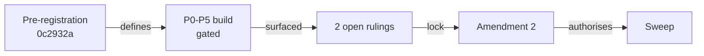

<!-- HACP L0 · Project bioFM · Kind Index. Currently surfaces the perturb-seq-eval workstream only.
     Notion: https://app.notion.com/p/3e7749bd250d8140a751d01f6a820b7d (HACP Index row under the AI-RDLC root) -->
# bioFM — Index

| | |
|---|---|
| **Project** | bioFM · `github.com/supmo668/bioFM` |
| **Surfaced so far** | perturb-seq-eval only — other workstreams (lung-on-chipsim, aviary-biosim, cellforge-agents) not yet on this index |
| **perturb-seq-eval phase** | P0-P5 closed (boundary `dfaf8c3`, receipt `cfe931f`); pre-registration amendment 2 in draft (9 ruled, 2 open); sweep held |
| **Alignment** | aligned with A&D + pre-registration `0c2932a`, except the measurand findings routed to rulings — 10 ruled, 2 open (see Decisions) |

| Section | State | Count |
|---|---|---|
| §vision | no PVR — requirements came from CTO #202 + the review | 0 |
| §design | A&D approved (D1–D5) | 1 |
| §build | plan r3 signed; P0-P5 built | 1 |
| §eval | P0-P5 QGR receipt (phase closed 2026-09-26); 748 tests green | 1 |
| §risk | defect register DF-01…DF-12 | 12 |
| §decision | **2 open** rulings (A2-10, A2-11) | 1 |

**TL;DR** — perturb-seq-eval rebuilds the v0.5.0 experiment so every number traces to one pre-registered, provenance-complete run. It is waiting on two rulings (the ACE_norm feature and the sign of ΔC) before amendment 2 locks and the sweep runs.

*The sweep cannot run until every measurand-changing ruling is in amendment 2.*

## Decisions needed
- **perturb-seq-eval — P0-P5 rulings for amendment 2** (2 open) → `docs/hacp/perturb-seq-eval-decision-p0p5.md` · [Notion](https://app.notion.com/p/3e7749bd250d8127b2b0c293fb8c0522)

## Sections
- §design — A&D: `workstreams/perturb-seq-eval/AND.md`
- §build — build plan: `workstreams/perturb-seq-eval/plan/build-plan.md`
- §eval — QGR + evidence: `workstreams/perturb-seq-eval/qgr/`
- §risk — `workstreams/perturb-seq-eval/deferred-findings.md`
