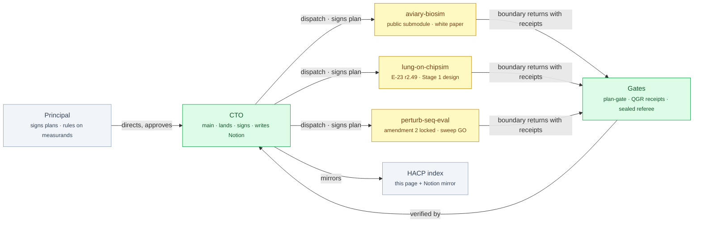

# bioFM — Index

<!-- HACP L0 · local source. The Notion row "bioFM — Index" (CTO-written) mirrors this file; edit here, never there. -->

| | |
|---|---|
| **Project** | `bioFM` — a coordination repo for three research workstreams run under the AI-RDLC lifecycle, plus one public submodule |
| **This page** | L0 — the project index. One screen. |
| **Alignment** | Each workstream builds under a hash-signed plan; every boundary is receipted. Divergences are recorded in each workstream's approval log, never patched over: lung-on-chipsim has 55 logged revisions incl. two accepted gate failures; perturb-seq-eval's amendment 2 re-derived two estimators after a CTO re-check; aviary-biosim's plan was re-signed once (r2) after its referee contract changed. |
| **Protocol** | HACP (`REFERENCE-HACP.md`, shipped with the airdlc plugin) |
| **Public** | Repo is public. No page here names a sequence identifier, a chemical identifier, or a secret. |

## Index

| Tag | State | Count |
|---|---|---|
| [`§vision`](vision.md) | three workstreams, no PVR for perturb-seq-eval (requirements came from a review) | 3 |
| [`§design`](design.md) | A&Ds approved for all three; lung-on-chipsim's Stage 1 registered-report design written | 3 A&D + 1 paper design |
| [`§build`](build.md) | aviary-biosim land-ready + white paper Tasks 0–12; lung-on-chipsim E-23 r2.49 in flight; perturb-seq-eval amendment 2 locked, sweep on standing GO | 3 in flight |
| [`§eval`](eval.md) | aviary-biosim receipt `4217902` verified; perturb-seq-eval 925 tests green; lung-on-chipsim 0 results by design (evaluator not yet frozen) | 2 receipts, 1 blocked input |
| [`§risk`](risk.md) | evidence-integrity finding (seeded run state), unpinned prompts, held F31, unfrozen evaluator | 4 project-level |
| [`§decision`](decision.md) | 2 principal actions open (both keyboard, not judgement) | 2 |

**TL;DR** — Three research workstreams run under one rule: no boundary is claimed without a receipt a third party can verify, and no plan runs unsigned. aviary-biosim is one typed command from landing and its white paper is at Task 13 of 15; lung-on-chipsim is on its 49th plan revision building a content guard whose own blind spots are measured; perturb-seq-eval's pre-registration amendment 2 is locked and its sweep is authorised.

## Where it sits

*Green is the trust boundary: an agent's own report closes nothing; the CTO lands only what a receipt verifies, under a plan whose hash matches its signature.*

## Decisions taken

| Decision | Chosen | Alternatives considered | Why this one | Impact | Date |
|---|---|---|---|---|---|
| Plans are hash-signed and every revision is logged | `plan-gate sign/verify`; append-only approval log per workstream | Prose approval in chat | A plan that can change after approval certifies nothing | 55 logged revisions on lung-on-chipsim alone; two gate failures accepted rather than patched | 2026-09 |
| Content-guard scope is a decidable property, not a path list (E-23) | five named properties; unaccounted sites reported as a sum identity | a scope registry of files | a registry is the path allowlist that caused #412; 87% of shaped sites are structurally unmarkable | r2.49b to be re-signed; time box: one more revision after a gate-8 fail | 2026-09-28 |
| Entropy measurands re-derived for perturb-seq-eval | `ace_d` replaces softmax ACE_norm (range ≈[0.92,1]); unclipped ΔC | keep the pinned formulas | the pinned forms could not distinguish the hypotheses they scored | amendment 2 locked (`3bf2a9a`) | 2026-09-26 |
| White paper claims are traced by script | `paper/claims.yaml` + `claims.py` fail on any unmapped number | reviewer reads every number | the paper's thesis is that mechanisms report success while the property is absent; it must not do that itself | A7 runs before the CTO rigour review | 2026-09-25 |
| Input identifier published openly (F33) | accession + release + sequence sha256 in `paper/evidence/` + methods | hash only | a digest over an enumerable grammar is a lookup, not a redaction; the association is already public | confirmed by the principal | 2026-09-28 |
| lung-on-chipsim publishes as a Stage 1 registered report | methods + pre-registered analysis before results exist; short form written separately | conventional paper with a thin results section | the project has complete machinery and zero results by design (no agent writes a biological number) | draft gated behind gate 8 | 2026-09-26 |

## Decisions needed

- **Land F08** *(since 2026-09-26)* — the principal types `/airdlc:pr-cto-land aviary-biosim --no-release`; the CTO cannot invoke it. Preflight green.
- **Relaunch two agents under airdlc** *(since 2026-09-28)* — aviary-biosim (Task 13 owed), then perturb-seq-eval (sweep). lung-on-chipsim is live.

## Sections

| Tag | Holds | State | Updated |
|---|---|---|---|
| [`§vision`](vision.md) | what is attempted and why now | current | 2026-09-28 |
| [`§design`](design.md) | A&Ds, the Stage 1 paper design, decisions with declined alternatives | current | 2026-09-28 |
| [`§build`](build.md) | phases, branches, in flight | 3 in flight | 2026-09-28 |
| [`§eval`](eval.md) | receipts, sealed suites, what is proven and what is blocked | current | 2026-09-28 |
| [`§risk`](risk.md) | known gaps and proxies | 4 open | 2026-09-28 |
| [`§decision`](decision.md) | what the principal owns | 2 open | 2026-09-28 |
