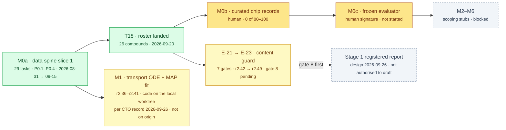

# §build — ChipSim (lung-on-chipsim)

<!-- HACP L2 leaf · local source; Parent = bioFM §build. Compiled 2026-09-28. -->

**Tag:** `§build` · **Layer:** L2 (leaf under [bioFM §build](../build.md)) · **Holds:** phases, artifacts, the human-owned ledger, what is in flight · **Reaches:** the `lung-on-chipsim` branch, the build plan, the gate reports

**TL;DR** — Milestone M0a slice 1 is complete: all 29 agent-implementable tasks are built and
gated, and the pipeline has produced its first real artifact. Three of the five human-owned inputs
for this slice have been delivered; the fourth is half-delivered and the fifth is absent. The last
two weeks went into a content guard (E-21 to E-23) that has been through seven gates. Nothing
past the data spine has run.

## Phases

*Yellow is in flight. Amber waits on a human. The paper cannot start before gate 8 closes; the science cannot start before the amber boxes exist.*

## Artifacts on the branch, measured on `c04e701`

| Artifact | State | Evidence |
|---|---|---|
| DrugBank 4.2 snapshot (2015-03-19), three TSVs | Fetched 2026-09-13 by pinned commit `3e87872…`; DVC-tracked, gitignored; `SHA256SUMS.json` and three `.dvc` pointers tracked | `data/raw/drugbank/` on the branch |
| `provenance.yaml` (T2 + T1 structured half) | Source and audited commit match; licence CC BY-NC 4.0 with a written non-commercial commitment; decided by the principal 2026-09-09, transcribed by the CTO. **`PROVENANCE.md`, the prose half, is still owed** | same |
| `barrier_panel.yaml` (T8) | Seven entries with faces; `ratified: true` by the principal 2026-09-12; sealed by an unkeyed digest over the panel | `configs/barrier_panel.yaml` |
| `poc_compounds.yaml` (T18) | 26 compounds, identity and citation only, from a guarded 39-candidate list; validated by the real roster loader in the gate of 2026-09-20 | `configs/poc_compounds.yaml`; [candidate list](../../../workstreams/lung-on-chipsim/qa/_adhoc/lung-on-chipsim-t18-candidate-list.md) |
| `drugbank_compounds.parquet` (T5a) | The first real artifact: 6,802 compounds, 9 attributes, read out of the parquet on 2026-09-19; the parquet is DVC-tracked and the `.sha256` sidecar is git-tracked | `data/processed/drugbank_compounds.sha256`; [product walkthrough](../../../workstreams/lung-on-chipsim/qa/_adhoc/lung-on-chipsim-walkthrough-product.md) |
| Adjudicated P-gp labels (T14) | **Absent.** The worksheet emitter (T13) exists and runs under the approve-on-execute record | — |
| `theta_priors.yaml`, `assumptions.yaml`, `transport_prior.yaml` | **Absent by design**; a green test asserts their absence until a human writes them | build plan S6, S13, S14 |
| Run journal (S12) | Config copies, resolved versions, digest verification; 13 tests; the crashed-run restamp defect (QG-1) fixed | `chipsim/journal.py` |
| Content guard (E-21 → E-23) | `guards/` (7 modules) and `record_content.py`, the one entry point with three states: clean, files-fail, could-not-scan | `chipsim/guards/`, `chipsim/record_content.py` |
| Audit package | Pre-hoc power simulation, cliff-pair power curve, budget ledger with pre-emptive re-projection, analog-series structure from SMILES | `chipsim/audit/` |
| n8n ETL export (T16) | Workflow JSON with five nodes; provisioning (T16a) descoped | `orchestration/n8n/etl_drugbank.json` |

Paths above are on branch `lung-on-chipsim`
([browse on GitHub](https://github.com/supmo668/bioFM/tree/lung-on-chipsim/projects/lung-on-chipsim));
`main` carries only the slice-1 files from the v0.3.0 land of 2026-09-03.

## The human-owned ledger

A task is agent-implementable if its done-condition is a test that can fail; it is human-owned if
its output is a claim.

| Task | What only a human can produce | State on `c04e701` |
|---|---|---|
| T2 | A 40-hex commit personally resolved from `dhimmel/drugbank` | **delivered** 2026-09-09 |
| T1 | Licence posture in the human's own words | **half** — structured commitment in `provenance.yaml`; `PROVENANCE.md` prose owed |
| T8 | Seven accessions and seven faces checked by hand, then `ratified: true` | **delivered** 2026-09-12 |
| T18 | 20–40 lung-relevant compounds with published exposure | **delivered** 2026-09-20, 26 entries |
| T14 | A P-gp verdict per compound with an evidence DOI | **absent** |
| T20 | Six device and physiology θ fields, each cited | absent — four already citable from the Huh/Ingber line approved 2026-09-23 |
| T21 | 3–8 reference compounds with published on-chip transport | absent |
| T28 | The `(α, k_sink)` transport prior | absent |
| M0b | 80–100 curated chip records, sealed three-way | absent — 0 records |
| M0c | A signature on the evaluator freeze | absent |

**T14 is the keystone now**, as T2 was in August: it gates T15, the label-safety chain and the
two-group conditioning every coverage claim rests on.

## Volume

| | Measured on `c04e701` |
|---|---|
| Source lines under `chipsim/` | 10,318 |
| Test lines under `tests/` | 16,953 across 37 modules |
| Ratio | 1.6 lines of test per line of source |

## In flight

| Item | State | Evidence |
|---|---|---|
| E-23 gate 8 under r2.49 | Signed as drafted 2026-09-26 (plan hash `26d95ad`, commit `8f0b530`): a smaller tree, seven build items (a)–(g), then one gate. Stopping rule: a failure on the same family goes to the principal for a time box, not to a ninth gate | [approval log](../../../workstreams/lung-on-chipsim/plan/plan-approval-log.md) row 53; CTO directive #445 |
| M1 transport core | S13, T22–T27 signed in r2.36–r2.41; the paper design measured `transport/{ode,fit,prior,theta}.py` at ~920 lines on 2026-09-26. **Not on `origin/lung-on-chipsim`**, whose tip predates it | [paper design](../../../workstreams/lung-on-chipsim/paper/2026-09-26-stage1-registered-report-design.md) §1 |
| Stage 1 registered report | Design written 2026-09-26; sequencing: gate 8, then a claims list for CTO review, then the long form, then a separately written short form | same, §8 |
| Trunk and worktree sync | `origin/lung-on-chipsim` is 685 commits ahead of `main` and 8 days behind the local worktree | measured 2026-09-28 |

## Descoped, with the reason recorded

- **T16a** n8n provisioning and end-to-end execution: the export and its validation exist; standing up n8n does not.
- **Further ingestors** (ChEMBL, BindingDB, TDC, LINCS): the plan's own scope check rules that more parsers "would move the actual completion date not at all". The next slice is M0b curation, which is human-owned.

## Read the source

- [`projects/lung-on-chipsim/README.md`](../../../projects/lung-on-chipsim/README.md) — the module README on `main` (2026-09-03); its status table is stale on both branches and says so nowhere, see [§risk](risk.md)
- [`plan/build-plan.md`](../../../workstreams/lung-on-chipsim/plan/build-plan.md) — every task with its done-condition
- [`plan/quality-gate-reports.md`](../../../workstreams/lung-on-chipsim/plan/quality-gate-reports.md) — P0.1, P0.2, P0.4 in full
- [`dev-log.md`](../../../workstreams/lung-on-chipsim/dev-log.md) — one line per landed iteration

Back to the [index](index.md).
