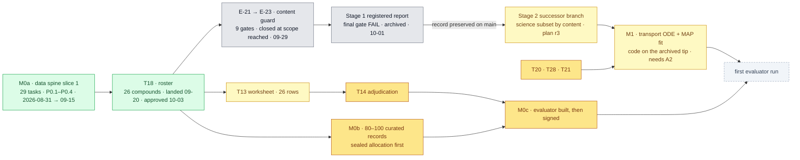

# §build — ChipSim (lung-on-chipsim)

<!-- HACP L2 leaf · Section = build · Indexed by "ChipSim (bioFM) — Index".
     SOURCE OF TRUTH: the Notion row (principal, 2026-10-03). This file mirrors it; see notion-map.json.
     Renewed 2026-10-03 after the Stage 1 closure of 2026-10-01. -->

**Tag:** `§build` · **Layer:** L2 (leaf under [bioFM §build](../build.md)) · **Holds:** phases, where the code is, the human-owned ledger, what is in flight · **Reaches:** `main`, the archived branch on `origin` at `c04e701`, the build plan, the gate records

**TL;DR** — Milestone M0a slice 1 was built and gated (29 of 29 agent tasks), the content guard
went through nine gates and closed at the scope it reached, and Stage 1 was archived on
2026-10-01 with its record preserved on `main`. The code that the next phase builds on is
split across three places, and bringing the science-bearing subset onto a successor branch is
the first build-phase item. The roster is approved; the adjudication worksheet is the next
artifact.

## Phases

*Grey is closed and archived. Yellow is in flight. Amber waits on a human. The first result waits on the amber boxes and on nothing else.*

## Where the code is

| Location | What it holds | State |
|---|---|---|
| `main` @ `38bf64e` (2026-10-03) | the v0.3.0 land of 2026-09-03: `ingest/`, `harmonize/` (6 modules), `eval/provenance_block.py`, `journal.py`, `pipeline.py`, the ratified `barrier_panel.yaml`, `provenance.yaml`; plus the preserved Stage 1 record under `workstreams/lung-on-chipsim/` (78 of 83 files) | landed |
| `origin/lung-on-chipsim` @ `c04e701` (2026-09-20) | the roster `poc_compounds.yaml`, the three DVC pointers + `SHA256SUMS.json`, the parquet sidecar, `label_structure_reference.yaml`, `unparseable_compounds.yaml`, `harmonize/{label_reference,merge_report}.py`, `audit/` (4 modules), `guards/` (7 modules), `record_content.py`, the T13 worksheet CLI, 37 test modules | archived, unlanded; measured 2026-09-28: 1,013 passed / 3 failed / 9 skipped on a fresh checkout |
| the archived tip on the principal's disk (`8face11` → `04b994d`, 435 commits past `c04e701`) | `transport/{ode,fit,prior,theta}.py` (~920 lines), the S13/S14 templates, E-22/E-23 and the Stage 1 evidence tooling | **not on any remote**; A2 in [§decision](decision.md) asks for an `archive/` push |

The successor branch (A1) takes the science-bearing files from the second and third rows by
content and leaves the guard machinery where it closed.

## The human-owned ledger

A task is agent-implementable if its done-condition is a test that can fail; it is human-owned if
its output is a claim.

| Task | What only a human can produce | State 2026-10-03 |
|---|---|---|
| T2 | A 40-hex commit personally resolved from `dhimmel/drugbank` | **delivered** 2026-09-09 |
| T1 | Licence posture in the human's own words | **half** — structured commitment in `provenance.yaml`; `PROVENANCE.md` prose owed (B5) |
| T8 | Seven accessions and seven faces checked by hand, then `ratified: true` | **delivered** 2026-09-12 |
| T18 | 20–40 lung-relevant compounds with published exposure | **delivered** 2026-09-20 · **approved as final** 2026-10-03, 26 entries |
| T14 | A P-gp verdict per compound with an evidence DOI | **next** — worksheet to be emitted over the approved roster (B1); 0 of 26 |
| T20 | Six device and physiology θ fields, each cited | absent — four citable now (B2) |
| T21 | 3–8 reference compounds with published on-chip transport | absent (B4) |
| T28 | The `(α, k_sink)` transport prior | absent (B3) |
| M0b | 80–100 curated chip records, sealed three-way | absent — 0 records (B6) |
| M0c | A signature on the evaluator freeze | absent (B8) |

## In flight

| Item | State | Evidence |
|---|---|---|
| Stage 2 successor branch (A1) | proposed 2026-10-03; needs plan r3 signed and a QG receipt; the CTO's clean suite re-measurement is owed at cut time | [§decision](decision.md) A1 |
| T13 adjudication worksheet | ready to emit once A1 exists and the DVC payload is pulled; approve-on-execute is recorded by T29 | build plan T13, T29 |
| Audit power check on the realised roster | ready to run: series structure from SMILES, simulated power at Δρ = 0.5 against the 0.80 floor; a simulation, not a biological value | `audit/series.py`, `audit/power.py`; ADR-0003 |
| M0b record schema + validator + sealed-allocation tool | to write before the first record is curated | ADR-0002 |
| Module README regeneration (C4) | at the successor's first boundary | — |

## Closed, with the record preserved

| Item | Outcome | Record |
|---|---|---|
| E-21 → E-23 content guard | nine gates; gate 9 failed on the same family; closed at the scope reached under the principal's time box; requirement 5 descoped to reporting | approval log rows 41–58; `qgr/gate9-findings.md` |
| Stage 1 registered report | final gate failed on the same mechanism; repair stopped; archived 2026-10-01 with 78 of 83 record files on `main`; five withheld (structure shapes) | `qgr/stage1-closure.md`, `qgr/2026-10-01-cto-disposition.md`, `paper/stage1-*.md` |
| T16a n8n provisioning; further ingestors | descoped; the plan's own scope check rules more parsers would not move the completion date | build plan §7 |

## Read the source

- [`plan/build-plan.md`](../../../workstreams/lung-on-chipsim/plan/build-plan.md) — every task with its done-condition (r2.50c on `main`)
- [`plan/plan-approval-log.md`](../../../workstreams/lung-on-chipsim/plan/plan-approval-log.md) — 61 numbered revisions, 65 rows, rows 54–61 the closure range
- [`qgr/stage1-closure.md`](../../../workstreams/lung-on-chipsim/qgr/stage1-closure.md) and [`qgr/2026-10-01-cto-disposition.md`](../../../workstreams/lung-on-chipsim/qgr/2026-10-01-cto-disposition.md) — the closure and the archive ruling
- [`qgr/deferred-findings-register.md`](../../../workstreams/lung-on-chipsim/qgr/deferred-findings-register.md) — S-01, S-02, S-06, S-07, S-20 first; do not open by repairing it
- [`projects/lung-on-chipsim/README.md`](../../../projects/lung-on-chipsim/README.md) — stale status table (C4)

Back to the [index](index.md).
