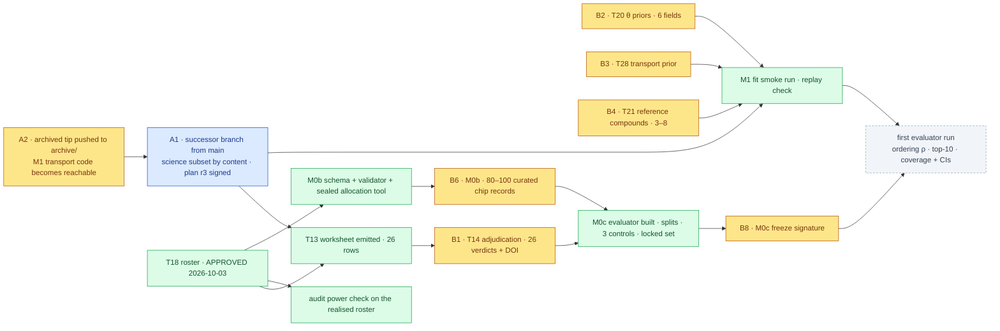

# §decision — ChipSim (lung-on-chipsim): the build-phase unblock ledger

<!-- HACP L2 leaf · Section = decision · Indexed by "ChipSim (bioFM) — Index".
     SOURCE OF TRUTH: the Notion row (principal, 2026-10-03). This file mirrors it; see notion-map.json.
     Renewed 2026-10-03 after the Stage 1 closure of 2026-10-01. Resolved rows stay, dated. -->

**Tag:** `§decision` · **Layer:** L2 (leaf under [bioFM §decision](../decision.md)) · **Holds:** what the principal owns, and what unblocks the Stage 2 build phase · **Reaches:** the archived Stage 1 record, the build plan, the ADRs

**TL;DR** — Stage 1 closed on 2026-10-01 with zero biological results, by design. The build phase
that produces the first result (Stage 2) is blocked on exactly four kinds of input a human must
write, one governance decision about which code base to build on, and three quick rulings. The
compound roster is now approved, which releases the adjudication worksheet. Nothing below asks an
agent to write a biological number.

## Standing assumption recorded 2026-10-03

| Decision | Route | What it releases |
|---|---|---|
| **T18 compound roster approved as final: 26 entries, each with an evidence DOI** | principal, via Claude session 2026-10-03 (*"Assume admin approval on compound roster"*; [session](https://claude.ai/code/session_0181c6Cgx1w4D61dgPg73r7f)); to be carried into the approval log as a signed row by the CTO | T13 may emit the adjudication worksheet over the final roster; the audit's series-structure and power check may run on the realised roster; M0b record curation may start against a fixed compound set |

## The dependency graph, with owners

*Amber is a claim only a human may write. Green is agent work that writes schema, validators, tooling or simulations, never a biological value. Blue is the CTO's land. Grey is the first result.*

## Blocking the science — the critical path

| # | Item | Owner | What the agent prepares (no biological number) | What the human supplies | Acceptance: the validator that rejects it | Est. human time | Unblocks | Target |
|---|---|---|---|---|---|---|---|---|
| A1 | **Successor code base for Stage 2.** Cut `lung-on-chipsim-stage2` from `main`; bring the science-bearing files over from the archived branch **by content**, never by merging the branch: the roster, the three DVC pointers and `SHA256SUMS.json`, the parquet sidecar, `label_structure_reference.yaml`, `unparseable_compounds.yaml`, `harmonize/{label_reference,merge_report}.py`, `audit/`, the T13 worksheet CLI and its tests, the S13/S14 templates, `transport/` once A2 makes it reachable. Exclude `guards/`, `record_content.py`, `tests/shape_scan.py` and the E-21…E-23 evidence tooling: that work item closed with 36 registered findings and the successor guidance is *do not open by repairing the register*. Alternatives declined: land the whole archived branch (carries the failed-gate machinery and five withheld files); restart from `main` (loses 29 gated tasks) | CTO lands; principal signs plan r3 | the file list above, measured against `c04e701`; a QG gate with a receipt; the CTO's read-only `scan-artifacts.py` pass before the land, as on 2026-10-01 | the r3 signature | plan-gate verify; receipt-verify; the clean suite re-measurement the CTO owes (453 s clean vs 900 s killed under load) | 10 min to sign | everything agentic in Stage 2 | 2026-10-07 |
| A2 | **Push the archived tip to `archive/lung-on-chipsim-stage1`.** The CTO's record copy preserved 78 workstream files but no code; `transport/{ode,fit,prior,theta}.py` (~920 lines) exists only on the principal's disk | principal | — | one `git push origin <tip>:refs/heads/archive/lung-on-chipsim-stage1` | the remote ref resolves; A1 can take `transport/` by content | 2 min | A1's M1 half; the M1 smoke run | 2026-10-06 |
| B1 | **T14 — adjudicate the P-gp labels.** One verdict per roster compound (`substrate` / `non-substrate` / `unknown`) with an evidence DOI; genuinely uncertain stays `unknown` and is excluded from both calibration groups | principal | the worksheet, emitted by the T13 CLI over the approved roster with approve-on-execute recorded; it carries the name beside the key and never leaves the untracked output roots | 26 verdicts and 26 DOIs | `load_adjudicated_labels` rejects a verdict without a DOI, a duplicate key, or an out-of-domain value; T15's label-safety tests | 60–90 min (plan estimate) | T15; the two P-gp groups every coverage claim conditions on | 2026-10-14 |
| B2 | **T20 — θ priors, six fields, each cited.** Four are citable now from the Huh/Ingber line approved 2026-09-23 (`membrane_um`, `strain_pct`, `coating`, flow); `porosity` and `area_mm2` enter as `assumed: true` with a stated width | principal | the S13 template with every field typed, unit-checked and `assumed`-flagged; the validator `_require_sourced_theta` | the values and citations | the fit refuses to run on an unsourced or unflagged entry | 20–30 min (plan estimate) | the M1 fit | 2026-10-14 |
| B3 | **T28 — the `(α, k_sink)` transport prior.** It does real work on the reported result (Finding E), so it is a human entry, not a default | principal | the S14 template and its validator | the prior and its source | same refusal as B2 | 15–20 min (plan estimate) | the M1 fit | 2026-10-14 |
| B4 | **T21 — 3–8 reference compounds with published on-chip transport ordering** | principal | the schema and loader, mirroring the roster validator | the compounds, the published ordering, the citations | loader rejects an entry without a citation or outside the roster | 20–30 min (plan estimate) | M1 gate check T27 | 2026-10-14 |
| B6 | **M0b — 80–100 curated chip records**, the binding cost of the PoC. The allocation is sealed three-way **before any record is read** (conformal ~40 as two P-gp groups × ~20, delta-calibration ~20, locked test 20–40; ADR-0002) | principal | the record schema, its validator, and the sealed-allocation tool: a seeded split written and digested before the first record exists | the records: one curated chip condition each, with source and the fields the schema names | the validator rejects an unsourced field; the allocation digest is checked at every read | the plan gives no per-record figure; **planning assumption** 3–4 weeks, replaced by the measured rate after the first 10 records | M0c; every coverage figure | 2026-11-11 |
| B8 | **M0c — sign the evaluator freeze.** Frozen splits, the three controls, the locked test set; nobody edits it afterwards | principal signs; agent builds | the evaluator as a versioned module with its signature slot empty; replay-determinism test green on the M1 smoke run | the signature, before any fit on real records | the gate refuses an unsigned evaluator; the locked set opens at most twice in the project's lifetime | 15 min to review and sign | the first evaluator run | 2026-11-13 |

## Owed, not blocking

| # | Item | Owner | Context | Options | Target |
|---|---|---|---|---|---|
| A3 | The five withheld record files (structure shapes) | principal | redacting hash-covered evidence is the principal's alone (CTO disposition 2026-10-01) | redact-then-publish; or leave on the archived branch, gap recorded | with A2 |
| A4 | Is the Stage 1 closure publishable as a short methods note? | principal | the mechanism, nine instances, six from repair, plus the pinning rule; the only publishable thing the branch produced ([paper walkthrough](https://app.notion.com/p/3ed749bd250d8163b58bd2a75b3edb14)) | yes, as a standalone note; no; fold into Stage 2 | 2026-10-17 |
| B5 | `PROVENANCE.md`, the prose half of T1 | principal | the plan requires it "in your own words"; the CTO has deliberately not drafted it | — | 2026-10-14 |
| B7 | R5 pair stratum, ~50 matched pairs | principal | curated, never discovered from the diversity roster (ADR-0004); zero Modal spend; needed for the audit's cliff test, not for the first ordering result | curate in parallel with M0b; defer until after the first result | 2026-11-11 |
| C1 | SLC15A1 — revisit or keep | principal | contested in the literature is not positive evidence of absence; kept under the T8 ruling ([T8 record](../../../workstreams/lung-on-chipsim/T8-review-record.md)) | keep; revisit with a citation | 2026-10-07 |
| C2 | AM-6 residual — pre-register the sample-size contingency or strike it | principal | ADR-0002 closed the arithmetic; the README still recommends evaluating the two-group veto only at ≥30 per group | pre-register; strike as superseded | 2026-10-07 |
| C3 | Retroactive scope of the identifier constraint (item H) | principal | row 59 (2026-09-29) ruled that the association-shaped lines in the two hash-covered plan files **stand**; what remains is whether any other pre-existing site needs a ruling | confirm none remain; rule per site | 2026-10-07 |
| C4 | Regenerate the module README | agent, at the successor's first boundary | the status table still reports 284 tests and 0 of 5 human artifacts | — | with A1 |

## Resolved (kept, dated)

| Decision | Ruling | Date |
|---|---|---|
| E-23 time box | gate-8 fail → design note → one revision (r2.50) → else descope; applied at gate 8 (row 54) | 2026-09-28 |
| E-23 requirement 5 | descoped to reporting: W/F/C/N buckets, file-level citation counts, needs-curation reported never marked (r2.50c) | 2026-09-29 |
| E-23 | **closed at the scope reached** — gate 9 failed on the same family; no receipt, no r2.51 (row 58) | 2026-09-29 |
| Gate-9 security referral | the association-shaped lines in the two hash-covered plan files stand (row 59) | 2026-09-29 |
| Artifact-scan surface | = classified scope; instrument disagreements recorded, never resolved by hand (row 60) | 2026-09-30 |
| Stage 1 repair | **stopped: "Stop; the mechanism is the result"** (row 61) | 2026-09-30 |
| Stage 1 disposition | **archive; preserve the record on main** — 78 of 83 files + CTO disposition note; branch unlanded, unpushed, not deleted | 2026-10-01 |
| Push the trunk / sync the worktree (the 2026-09-26 item) | superseded by the archive ruling; replaced by A2 above | 2026-10-01 |
| Stage 1 registered report — venue, authors, go (the 2026-09-26 item) | moot for Stage 1: never submitted; publication path reopens as A4 and, after the first result, as Stage 2 | 2026-10-01 |
| Publication genre | Stage 1 registered report, dual granularity, short form written separately | 2026-09-26 |
| T18 roster finalised at 26 | principal ruling recorded as Hash D in receipt `9899100` | 2026-09-20 |

Back to the [index](index.md).
