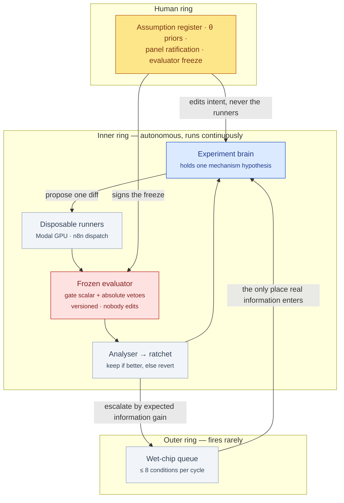
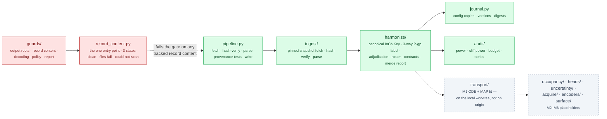

# §design — ChipSim (lung-on-chipsim)

<!-- HACP L2 leaf · local source; Parent = bioFM §design. Compiled 2026-09-28. -->

**Tag:** `§design` · **Layer:** L2 (leaf under [bioFM §design](../design.md)) · **Holds:** architecture, interfaces, and decisions with their declined alternatives · **Reaches:** the A&D, the build plan and its approval log, four decision records

**TL;DR** — One model spine, a thin agent over a thick environment, and a frozen evaluator that
nobody may edit. The design's most unusual artifact is not the architecture but its decision
record: 53 plan revisions, each hash-locked to the plan text it approved, each naming what
changed, why, and who approved it by which route.

## Three rings

*The brain searches mechanisms, not architectures; a diff is a scientific claim. Any veto reverts the diff regardless of the headline number.*

## The environment contract — five calls

| Call | Responsibility | Who may change it |
|---|---|---|
| `configure(θ)` | instantiate a chip: geometry, flow, porosity, strain, and the binding-site inventory | human, via `theta_priors.yaml` |
| `reset(drug, schedule)` | load a compound and dosing profile | agent, freely — this is the action space |
| `step(dt)` | advance occupancy-coupled transport to a quasi-static fixed point | agent may swap the mechanism; may not hand-edit a trajectory |
| `observe()` | project state onto readout channels with calibrated uncertainty | human, via the readout heads |
| `score()` | return the gate scalar plus veto flags | **nobody — frozen and versioned** |

The state *is* the occupancy model: `s_t = (C_a, C_b, C_free, φ_barrier, θ_target, z_ctx)`. Two
chips differing only in binding-site inventory are two different environments. Given
`(θ, drug, schedule, seed)` the environment must replay bit-identically, or the ratchet is
meaningless.

## The M0 data spine, as built

*Red is the content guard: every writer whose payload can carry DrugBank record content resolves its destination through one helper and refuses anything outside a declared untracked root.*

## The decision record — 53 hash-locked revisions

The build plan is sealed: appending anything to it changes its hash and blocks the plan gate, so
gate reports live elsewhere and every amendment is a signed row in
[`plan-approval-log.md`](../../../workstreams/lung-on-chipsim/plan/plan-approval-log.md).
Measured over the log on `main` (53 rows, r2 → r2.49):

| Route | Rows | Meaning |
|---|---|---|
| `standing-delegation` | 45 | CTO-invoked under a recorded delegation — the judgement was the principal's, the invocation was not |
| `principal-directed` | 4 (+1 CTO-invoked) | explicit real-time direction |
| `human-direct` | 2 | the principal signed or instructed in so many words |
| `principal + standing-delegation` | 1 | a principal ruling applied under delegation |

**That distribution is itself a reportable datum**: it answers the question a referee of
AI-assisted science actually has — how much of this methodology was chosen by a human and how
much by an agent under delegation. The log also records reversals beside the original rather than
replacing them (r2.35 corrects a false factual claim in r2.34; r2.44 was re-signed after its own
text turned the accession guard red; r2.47a retracts half a gate finding).

## Decisions, with the alternative declined

| Record | Decided | Declined | Date |
|---|---|---|---|
| [ADR-0001](../../../projects/lung-on-chipsim/docs/adr/0001-run-journal-does-not-record-git-state.md) | The run journal records no git state; the feature was deleted rather than hardened | Validate the path and disable repo-local config; accept the risk | 2026-09-02 |
| [ADR-0002](../../../projects/lung-on-chipsim/docs/adr/0002-poc-conformal-calibration-at-20-per-group.md) | Three-way sealed allocation, ~20 conformal points per group, coverage always with its CI | 200–240 records; thin the locked test set; marginal coverage; a sample-size contingency | 2026-09-02 |
| [ADR-0003](../../../projects/lung-on-chipsim/docs/adr/0003-power-floor-and-stratified-roster.md) | Power floor 0.80 on directly simulated clustered power; two-stratum roster | One integrated ~60 set; ~40 diverse only; a 0.70 floor; disclosure only | 2026-09-08, amended 2026-09-11 |
| [ADR-0004](../../../projects/lung-on-chipsim/docs/adr/0004-pair-stratum-is-curated-not-discovered.md) | Pair stratum curated toward ~50 pairs; never loosen the ≥100-fold cliff to fill it | Discover pairs from the diversity roster; ~25 curated pairs | 2026-09-11 |

## Where the build diverged from the design

| Divergence | Status | Where recorded |
|---|---|---|
| S3's done-condition ("exits non-zero if `testpaths` is removed") is unachievable via the CLI | Asserted against the parsed config instead; plan wording amended (E-2) | [quality-gate reports](../../../workstreams/lung-on-chipsim/plan/quality-gate-reports.md) P0.1 |
| The plan put the DVC remote inside the git worktree, so removing the worktree destroyed the only copy of the snapshot | Remote moved to an absolute path outside every worktree, machine-specific and gitignored (E-5) | same, P0.2 |
| A forbidden `configs/` name (deny-list) guarded record-bearing writes | Replaced by an allow-list of untracked roots checked by directory identity, after reviewers executed three bypasses | build plan r2.19 → r2.20 / r2.23 |
| r2.34 stated T13 "IS currently exported as a node" in the n8n workflow | It was not; the agent corrected the CTO's signed clause and r2.35 records the correction in place | approval log rows 33–34 |
| The PVR asks for ≥30 calibration points per group | ~20 per group under a three-way allocation; the bar is kept, the precision is disclosed | ADR-0002 |
| A synthetic test constant was to be investigated before replacement | Replaced without investigating, because the guard is shape-only and the investigation would itself be the association the constraint forbids | approval log row 29 (r2.30) |
| The approval log itself carried two shape-valid identifier literals as probe values | The accession guard caught the CTO's own row; forms are now described, never written | approval log rows 30–31 (r2.31) |
| The run journal was to record commit, dirty flag and dirty file list | Dropped; a record cannot prove the tree was clean | ADR-0001 |

## Read the source

- [`A-and-D.md`](../../../workstreams/lung-on-chipsim/A-and-D.md) — architecture (Part I) and design (Part II); section numbers inherited from the PRD (imported 2026-08-26)
- [`plan/build-plan.md`](../../../workstreams/lung-on-chipsim/plan/build-plan.md) — the sealed plan at r2.49 on `main` (2,290 lines; global constraints, tasks S1–S14, T1–T29, M1 slice, M2–M6 stubs)
- [`plan/plan-approval-log.md`](../../../workstreams/lung-on-chipsim/plan/plan-approval-log.md) — append-only, 53 rows, each hash-locked and routed
- [`docs/adr/`](../../../projects/lung-on-chipsim/docs/adr/) — the four decision records
- [`roster-schema.md`](../../../workstreams/lung-on-chipsim/roster-schema.md) — the roster's schema, written before the human filled it

Back to the [index](index.md).
