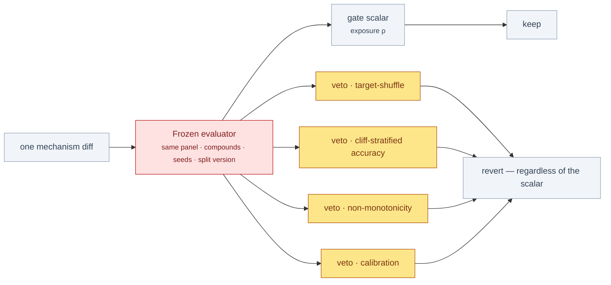

# §eval — ChipSim (lung-on-chipsim)

<!-- HACP L2 leaf · local source; Parent = bioFM §eval. Compiled 2026-09-28. -->

**Tag:** `§eval` · **Layer:** L2 (leaf under [bioFM §eval](../eval.md)) · **Holds:** what proves it works — the measured suite, signed receipts, pre-registered commitments, the only computed results · **Reaches:** the gate reports, the receipts under `qgr/`, the ADRs

**TL;DR** — Three kinds of evidence exist and none of them is a biological result: a suite
measured today on the branch tip, nine receipts recorded at their gates, and two power
simulations that are the project's only computed numbers. Every figure below says which it is.

## Measured for this review, 2026-09-28

| Claim | Value | How |
|---|---|---|
| Offline suite on `c04e701` | **1,013 passed / 3 failed / 9 skipped / 16 network tests deselected** | fresh checkout, Python 3.11.13, `uv sync` from the committed lock, `pytest -m "not network"` |
| Lint | `ruff check` and `ruff format --check` clean, 81 files | same checkout |
| A first run in a checkout under the system temp directory | **39 failed** | the output-roots guard refused pytest's tmp root because the project root was inside it — the r2.23 `TMPDIR=<project>` defence, firing as designed. Re-run outside `/tmp` for the count above |

The three failures on the clean run, classified:

| Test | Why it fails here | Kind |
|---|---|---|
| `test_provenance.py::test_snapshot_hashes_match_manifest` | The DVC payload is absent: the remote lives on the principal's machine and only the digests are tracked | expected on any checkout without `dvc pull` |
| `test_snapshot_fetch.py::test_t4_dvc_pointers_track_the_snapshot` | "drugbank.tsv is not on disk — fetch the snapshot before this leg" | same |
| `test_record_content_guard.py::test_two_tracked_paths_the_filesystem_conflates_are_REFUSED_not_silently_merged` | The test's premise is a case-insensitive volume (APFS, NTFS). On a case-sensitive Linux volume `Data.csv` and `data.csv` never conflate, so the guard correctly has nothing to refuse and the test reports "did not raise" | a portability finding in the test, not the guard — [§risk](risk.md) row 11 |

That failed first run is worth keeping: it is the guard doing what its signed clause says, and it
is the kind of evidence the project's own gates keep asking for.

## Recorded at their gates

| Gate | Result | Date | Receipt |
|---|---|---|---|
| P0.1 — scaffold S1–S11 | 106 passed / 5 skipped; 20 findings fixed, 2 rejected as false | 2026-08-31 | `qgr/…-20260831-1059-0653839.md` |
| P0.2 — T5–T19, S11a, rulings E-1…E-5 | 284 passed / 6 skipped, 15 network; 27 fixed; every reviewer-proved-vacuous test re-run under mutation, all 7 now fail | 2026-08-31 | `qgr/…-20260831-1148-b7d4221.md` |
| P0.4 — T4 per-file DVC pointers | 567 passed / 0 failed / 4 skipped; QG-1: `dvc status` without `-q` passed on a stale md5 | 2026-09-15 | `qgr/…-20260915-0231-2e1937e.md` |
| §11 — E6-7 met | 962 passed / 5 skipped; receipt verified "1 of 23" | 2026-09-17 | `qgr/…-20260917-1343-1ea4db8.md` |
| T18 — roster validated through the real loader | Principal ruling recorded as Hash D; receipt `9899100` | 2026-09-20 | `qgr/…-20260920-1535-9899100.md` |
| E-22 gates 1–4 | **FAIL ×4** | 2026-09-25 | approval log rows 43–48 |
| E-22 WI-1 + WI-2, gate 5 | **PASS** after five failed gates; 12 findings fixed in-gate incl. a build-introduced regression; extended tier 248 s, 2.89 GB | 2026-09-25 | Hash E `8f2d12e`, CTO-verified |
| E-23 gate 6 | **FAIL** (#410) — a near-revert self-report ratified | 2026-09-26 | approval log row 52 |
| E-23 gate 7 | **FAIL** (#442) — five survivors, two ledger defects, a counting tool that could not count | 2026-09-26 | approval log row 53 |
| E-23 gate 8 | pending under r2.49 | — | — |

Receipts live under [`workstreams/lung-on-chipsim/qgr/`](../../../workstreams/lung-on-chipsim/qgr/)
(the first three on `main`, the rest on the branch). A receipt's Hash E is the digest of the diff
it attests to; a receipt whose diff has moved refuses to verify.

## What the evaluator will hold, pre-registered

| Commitment | Where |
|---|---|
| The metric is a **vector**: a gate scalar plus vetoes, and vetoes are absolute | A&D §2A |
| 20–30 gated diffs per milestone, pre-registered; the locked test set opened at most twice in the project's lifetime; the gate-evaluation count reported next to coverage | A&D §2A selection budget |
| The two P-gp subgroups are fixed **before** any coverage is computed | build plan M5; A&D §2D |
| Every coverage figure is reported with its per-group confidence interval | ADR-0002 |
| Ratchet drift is measured against the locked set at every milestone; degradation discards the leaderboard, not the test set | A&D §2A addition 3 |
| Replay: given `(θ, drug, schedule, seed)` the trajectory reproduces exactly; the run record carries config copies, never references | A&D §2B; `journal.py` |
| The audit's primary inference halts before any spend if simulated power < 0.80 | ADR-0003; `audit/power.py` |

## The only computed results — pre-hoc power, not biology

Both are simulations at seed 4242, and both are **upper bounds** because measured affinities are
treated as noise-free.

Sign test over seven targets, Δρ = 0.5 ([ADR-0003](../../../projects/lung-on-chipsim/docs/adr/0003-power-floor-and-stratified-roster.md)):

| Roster | n_eff | Power |
|---|---|---|
| 30 structurally diverse | 30.0 | **0.85** |
| 40 diverse | 40.0 | 0.95 |
| 40, series of 5, ICC 0.5 | 13.3 | 0.71 |
| 40, series of 5, ICC 0.8 | 9.5 | 0.50 |
| 60, series of 5, ICC 0.5 | 20.0 | 0.92 |

One-sided exact McNemar on discordant pairs, baseline 0.55, 2,000 trials ([ADR-0004](../../../projects/lung-on-chipsim/docs/adr/0004-pair-stratum-is-curated-not-discovered.md)):

| LBM accuracy | 20 pairs | 40 | 60 |
|---|---|---|---|
| 0.80 (+25 pts) | 0.37 | 0.71 | **0.87** |
| 0.90 (+35 pts) | 0.69 | 0.97 | 1.00 |
| 0.70 (+15 pts) | 0.16 | 0.31 | 0.46 |

Fewer than five discordant pairs can never reach α = 0.05, independent of effect size.

## What evaluation does not yet exist

- **No fit has been performed.** The M1 fit refuses to run without sourced θ.
- **No coverage has been computed.** The subgroups exist as a rule, not as data.
- **No evaluator has been frozen or signed** (M0c).
- **No wet-lab validation**, and the PoC ODE is a two-compartment model, not a physiological one.
- **No result number appears in any project document**, and the paper design forbids one appearing as an illustration.

## Read the source

- [`plan/quality-gate-reports.md`](../../../workstreams/lung-on-chipsim/plan/quality-gate-reports.md) — P0.1, P0.2, P0.4 with every finding and its falsification
- [`workstreams/lung-on-chipsim/qgr/`](../../../workstreams/lung-on-chipsim/qgr/) — receipts; the branch carries 23 iteration-complete receipts to 2026-09-20
- [`T8-review-record.md`](../../../workstreams/lung-on-chipsim/T8-review-record.md) — the live UniProt verification of the panel and the rulings it produced
- [`chipsim-lbm-audit/verification/`](../../../workstreams/chipsim-lbm-audit/verification/) — the CTO's independent cross-check of the power simulation

Back to the [index](index.md).
