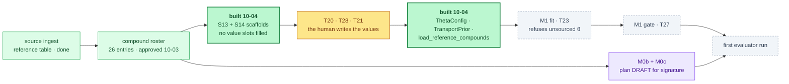

# §experiment — ChipSim (lung-on-chipsim): the M1 input contracts, built

<!-- HACP L2 leaf · Section = build · Indexed by "ChipSim (bioFM) — Index".
     SOURCE OF TRUTH: the Notion row (principal, 2026-10-03). This file mirrors it; see notion-map.json.
     New 2026-10-04: the agent-side implementation of the chain the status one-pager named. -->

**Tag:** `§experiment` · **Layer:** L2 (leaf under [`§build`](build.md)) · **Holds:** what was built on 2026-10-04, what each validator refuses, and what is still a human's to write · **Reaches:** the build plan's S13/S14/T21/T24/T28, the M0b/M0c plan draft, the test suite

**TL;DR** — The experiment chain is ingest → roster → transport inputs → fit and evaluation →
registered report. Ingest is done and the roster is approved, so the next link is the transport
inputs, and that link is now **built on the agent side**: two scaffolds with no values, three
validators that refuse what an agent must not supply, five read-only CLI commands, 45 new tests,
and a CI job. The fit cannot run yet, and that is the point: it refuses to, by design, until a
human writes six θ fields, one prior and three to eight reference compounds. M0b and M0c were
**not** implemented, because the build plan gives them no done-conditions; a plan draft was
written for signature instead.

## The chain, and where the work landed

*Dark green is what this phase built. Amber is a claim only a human may write. Purple is a plan
awaiting a signature, deliberately not code. Dashed is still blocked.*

## What was built

| Artifact | Path | Plan task | What it is |
|---|---|---|---|
| θ scaffold | `configs/templates/theta_priors.scaffold.yaml` | S13 | six fields, every `value` and `citation` empty, every field flagged `assumed: true` |
| Transport-prior scaffold | `configs/templates/transport_prior.scaffold.yaml` | S14 | two log-normal entries, no numbers, both flagged assumed |
| θ container and validator | `chipsim/transport/theta.py` | T24 | `ThetaConfig`, frozen, read-only; the only path into the fit |
| Transport prior validator | `chipsim/transport/prior.py` | T28 | `TransportPrior`, same posture |
| Reference-compound loader | `chipsim/harmonize/reference_compounds.py` | T21 | mirrors S11a's roster validator |
| CLI | `chipsim/pipeline.py` | — | `theta-scaffold`, `transport-prior-scaffold`, `theta-check`, `transport-prior-check`, `reference-compounds-check` |
| Tests | `tests/test_m1_inputs.py` | — | 31 contract tests; 45 new tests in total with the fixture registry |
| CI | `.github/workflows/chipsim-m1-inputs.yml` | — | lint, `ty`, the contracts, the fixture guard, and the two absence invariants |

## What each validator refuses

Every refusal below is a test that can fail, not a comment. The three distinctions were each a
silent failure somewhere else in this project before they were named here.

| Refusal | Why it is a refusal and not a default |
|---|---|
| an empty `value` | absent is not unknown; a substituted default is indistinguishable from a measurement once it is in the fit |
| a value with no `citation` and no `assumed: true` | assumed is not cited; the flag is what makes a gap *stated* rather than quiet, and it is what the run journal counts |
| a `unit` the schema does not declare | typed is not checked; a unit declared and never compared is decoration, and a wrong unit would rescale the fit |
| a misspelled key such as `citaton:` | a permissive loader ignores it, which is how an unsourced value passes for a sourced one |
| `assumed: "yes"` | a truthy string would flag every field as assumed and silence the guard everywhere |
| `sigma_log: 0` | a zero-width prior is a point mass; it would fix the parameter rather than prior it |
| a duplicate `canonical_inchikey` | it double-weights one compound in a reference set of at most eight |
| an overwrite of a filled file | defect 22's failure mode: a routine re-emit that blanks a human's cited values with no error |
| a write to `configs/theta_priors.yaml` | that file's **absence** is how Global Constraint 1 is enforced (S6, ruling r2.37(c)) |

## What is still a human's to write

| Task | What the validator will accept | Target |
|---|---|---|
| T20 | six θ fields, each with a citation or `assumed: true` | 2026-10-14 |
| T28 | `mean_log` and `sigma_log` for both priors, cited or explicitly uninformative | 2026-10-14 |
| T21 | 3–8 compounds with an independently published on-chip transport measurement | 2026-10-14 |

Two of six θ fields are expected to enter as assumptions. **That is a stated limitation, not a
failure**: `theta-check` prints the cited/assumed split, the run journal records it, and the
paper carries it. What the validator refuses is silence.

## Why M0b and M0c are a plan draft, not code

The grill approved agent preparation for both. The build plan assigns them to the agent in its
ownership table and then says, for each, *"Its own plan."* There is no file path, no field list,
no signature format and no done-condition for the chip-record schema, the sealing tool, the hash
ledger, the splits or the freeze.

Implementing them now would mean inventing the specification and then verifying the code against
the specification it invented — the Stage 1 closure's mechanism exactly, and six of its nine
instances arrived through work confident about the wrong reference point. So this phase wrote
[the M0b/M0c plan draft](../../../workstreams/lung-on-chipsim/plan/m0b-m0c-plan-draft-2026-10-04.md)
with done-conditions a human can refuse, and stopped. It carries one open methodological question
for the principal: whether the sealed allocation seals record *identities* or record *slots*.
Only slots are consistent with sealing before any record is read.

## Measured

| | Value | Kind |
|---|---|---|
| New tests, all passing | 45 (31 contract + 14 fixture-registry) | **measured 2026-10-04** |
| Offline suite | 434 passed / 3 failed / 4 skipped / 30 deselected | **measured 2026-10-04** |
| Pre-existing failures, unchanged by this work | 3 (two need the DVC payload on disk; one is the human panel ratification of 2026-09-12 outrunning its own test) | measured before and after |
| Lint and type check | `ruff check`, `ruff format --check`, `ty check` all clean | **measured 2026-10-04** |
| Biological numbers written by an agent | 0 | the standing constraint, now enforced by three validators |
| Numeric values in either scaffold | 0 | asserted in CI, not just in a test |

Back to the [index](index.md).
