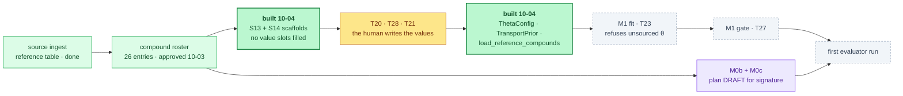

# §experiment — ChipSim (lung-on-chipsim): the M1 input contracts, built

<!-- HACP L2 leaf · Section = build · Indexed by "ChipSim (bioFM) — Index".
     SOURCE OF TRUTH: the Notion row (principal, 2026-10-03). This file mirrors it; see notion-map.json.
     New 2026-10-04: the agent-side implementation of the chain the status one-pager named. -->

**Tag:** `§experiment` · **Layer:** L2 (leaf under [`§build`](build.md)) · **Holds:** what was built on 2026-10-04, what each validator refuses, and what is still a human's to write · **Reaches:** the build plan's S13/S14/T21/T24/T28, the M0b/M0c plan draft, the test suite

**TL;DR** — The experiment chain is ingest → roster → transport inputs → fit and evaluation →
registered report. Ingest is done and the roster is approved, so the next link is the transport
inputs, and that link is now **built on the agent side**: two scaffolds with no values, three
validators that refuse what an agent must not supply, five read-only CLI commands, 45 new tests,
and a CI job. The fit cannot run yet, and that is the point: it refuses to, by design, until a
human writes six θ fields, one prior and three to eight reference compounds. M0b and M0c were
**not** implemented, because the build plan gives them no done-conditions; a plan draft was
written for signature instead.

## The chain, and where the work landed

*Dark green is what this phase built. Amber is a claim only a human may write. Purple is a plan
awaiting a signature, deliberately not code. Dashed is still blocked.*

## What was built

| Artifact | Path | Plan task | What it is |
|---|---|---|---|
| θ scaffold | `configs/templates/theta_priors.scaffold.yaml` | S13 | six fields, every `value` and `citation` empty, every field flagged `assumed: true` |
| Transport-prior scaffold | `configs/templates/transport_prior.scaffold.yaml` | S14 | two log-normal entries, no numbers, both flagged assumed |
| θ container and validator | `chipsim/transport/theta.py` | T24 | `ThetaConfig`, frozen, read-only; the only path into the fit |
| Transport prior validator | `chipsim/transport/prior.py` | T28 | `TransportPrior`, same posture |
| Reference-compound loader | `chipsim/harmonize/reference_compounds.py` | T21 | mirrors S11a's roster validator |
| CLI | `chipsim/pipeline.py` | — | `theta-scaffold`, `transport-prior-scaffold`, `theta-check`, `transport-prior-check`, `reference-compounds-check` |
| Tests | `tests/test_m1_inputs.py` | — | 31 contract tests; 45 new tests in total with the fixture registry |
| CI | `.github/workflows/chipsim-m1-inputs.yml` | — | lint, `ty`, the contracts, the fixture guard, and the two absence invariants |

## What each validator refuses

Every refusal below is a test that can fail, not a comment. The three distinctions were each a
silent failure somewhere else in this project before they were named here.

| Refusal | Why it is a refusal and not a default |
|---|---|
| an empty `value` | absent is not unknown; a substituted default is indistinguishable from a measurement once it is in the fit |
| a value with no `citation` and no `assumed: true` | assumed is not cited; the flag is what makes a gap *stated* rather than quiet, and it is what the run journal counts |
| a `unit` the schema does not declare | typed is not checked; a unit declared and never compared is decoration, and a wrong unit would rescale the fit |
| a misspelled key such as `citaton:` | a permissive loader ignores it, which is how an unsourced value passes for a sourced one |
| `assumed: "yes"` | a truthy string would flag every field as assumed and silence the guard everywhere |
| `sigma_log: 0` | a zero-width prior is a point mass; it would fix the parameter rather than prior it |
| a duplicate `canonical_inchikey` | it double-weights one compound in a reference set of at most eight |
| an overwrite of a filled file | defect 22's failure mode: a routine re-emit that blanks a human's cited values with no error |
| a write to `configs/theta_priors.yaml` | that file's **absence** is how Global Constraint 1 is enforced (S6, ruling r2.37(c)) |

## What is still a human's to write

| Task | What the validator will accept | Target |
|---|---|---|
| T20 | six θ fields, each with a citation or `assumed: true` | 2026-10-14 |
| T28 | `mean_log` and `sigma_log` for both priors, cited or explicitly uninformative | 2026-10-14 |
| T21 | 3–8 compounds with an independently published on-chip transport measurement | 2026-10-14 |

Two of six θ fields are expected to enter as assumptions. **That is a stated limitation, not a
failure**: `theta-check` prints the cited/assumed split, the run journal records it, and the
paper carries it. What the validator refuses is silence.

## Why M0b and M0c are a plan draft, not code

The grill approved agent preparation for both. The build plan assigns them to the agent in its
ownership table and then says, for each, *"Its own plan."* There is no file path, no field list,
no signature format and no done-condition for the chip-record schema, the sealing tool, the hash
ledger, the splits or the freeze.

Implementing them now would mean inventing the specification and then verifying the code against
the specification it invented — the Stage 1 closure's mechanism exactly, and six of its nine
instances arrived through work confident about the wrong reference point. So this phase wrote
[the M0b/M0c plan draft](../../../workstreams/lung-on-chipsim/plan/m0b-m0c-plan-draft-2026-10-04.md)
with done-conditions a human can refuse, and stopped. It carries one open methodological question
for the principal: whether the sealed allocation seals record *identities* or record *slots*.
Only slots are consistent with sealing before any record is read.

## Update 2026-10-08: tests green, and the inputs could not be sourced

> **Tests and CI: resolved.** The offline suite is green for the first time on this branch — **447 passed, 0 failed, 5 skipped**. The three failures it carried were fixed at their causes, not suppressed: the manifest test now skips only when the snapshot is unfetched and still fails when a payload is present without its manifest; the vendoring allow-list names `data/raw/sources.yaml`, the principal-approved release-provenance record it had been flagging as redistributed DrugBank for three weeks; and the panel test was replaced by the attribution check its own docstring asked for once a human ratified. CI now gates on the whole offline suite.

> **The six θ fields are NOT filled, under the principal's own condition.** The instruction of 2026-10-08 authorised agent-drafted-from-cited-sources, with the condition *"Unbacked data cannot be used and reference must be cited"*. No primary source could be read: this container's egress policy answered **403 to CONNECT** for `pmc.ncbi.nlm.nih.gov`, `pubchem.ncbi.nlm.nih.gov`, `doi.org`, `www.nature.com`, `pubs.rsc.org`, `www.science.org`, `www.ebi.ac.uk` and `en.wikipedia.org`. Web search worked; a search summary is a model's prose over snippets, from which no sentence can be quoted, no DOI confirmed, and no figure read. Writing values from it would have produced exactly the fabricated citation this project is built to refuse.

> **The sourcing attempt produced the fabrication failure live, which settled the question.** The search relay repeatedly returned membrane and pore geometry from **gut-chip and kidney-chip patent embodiments** in answer to lung-chip questions, and twice volunteered a figure prefixed *"from memory"*. Separately it surfaced four lung chips whose numbers are routinely quoted together but are not interchangeable — one has a rigid polyester membrane and no cyclic strain, and the commercial-era figures come from a vendor FAQ and contradict the primary paper by roughly fivefold.

### What was built instead

| Artifact | What it does |
|---|---|
| `chipsim/transport/sourcing.py` | the intake rule, mechanized: **a row may be empty; a row may not carry a value without its verbatim quote, its DOI, and a confirmed-DOI flag.** `derived` additionally needs its formula; `assumed` needs a width and must not quote a source |
| `sourcing-worksheet.yaml` | six θ rows, four prior rows, the reference-compound slots — every value empty, each carrying its extraction target, the paper, where inside it the number lives, and the derivation formula where one applies |
| `experimental-design.md` | the design: the two-compartment model, which field feeds which term, which device θ describes and why that had to be settled first, three supported approximations with their formulae, two caveats that change the model rather than the numbers, and the bibliography marked unverified throughout |
| `chipsim sourcing-check` | reports how much of the worksheet is backed; exits non-zero only on a value that cannot back itself |
| 10 new tests | each refusal is a test that can fail |

### Two caveats that change the model, not just the numbers

- **PDMS loss is probably not first-order.** Uptake into bulk polymer is typically saturable. If it is, a single `k_sink` is misspecified and any converted rate is an effective value over one measurement window, not a transferable constant. A decision before the prior is fixed, with three stated options in the design.
- **A log-normal cannot represent "no measurable loss".** At least one compound in the identified literature showed none. A log-normal has no mass at zero, so the left tail must be deliberately generous — a better argument for a wide prior than convention.

### The unblock, two ways

Allow egress for the six publisher and identity hosts, **or** drop the PDFs into the repository and no firewall change is needed. Three of the four key documents have an open-access route; the fourth, holding `flow_ul_min` and `area_mm2`, may need a subscription. Nothing else in the chain is waiting.

## Measured

| | Value | Kind |
|---|---|---|
| New tests, all passing | 55 (41 contract + 14 fixture-registry) | **measured 2026-10-08** |
| Offline suite | **447 passed / 0 failed / 5 skipped / 30 deselected** | **measured 2026-10-08**; was 434/3 on 10-04 |
| Pre-existing failures | **0** — all three resolved at their causes 2026-10-08 | **measured 2026-10-08** |
| θ fields filled with a cited value | **0 of 6** — no primary source was readable; 8 hosts returned 403 to CONNECT | **measured 2026-10-08** |
| Worksheet rows carrying an unbacked value | **0** — the validator refuses them, and none was written | **measured 2026-10-08** |
| Lint and type check | `ruff check`, `ruff format --check`, `ty check` all clean | **measured 2026-10-04** |
| Biological numbers written by an agent | 0 | the standing constraint, now enforced by three validators |
| Numeric values in either scaffold | 0 | asserted in CI, not just in a test |

Back to the [index](index.md).
