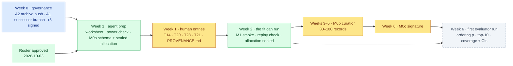

# ChipSim (bioFM) — Index

<!-- HACP L1 subproject index · Kind = Index · Indexed by "bioFM — Index".
     SOURCE OF TRUTH: the Notion row https://app.notion.com/p/b7c749bd250d83dab06201f85d61ee49
     (principal, 2026-10-03: Notion HACP is the SoT for human review and communication). This file
     mirrors it; notion-map.json records each page's URL and last sync. Renewed 2026-10-03;
     twelve rulings taken 2026-10-04 in the principal's grill, locked "Over and out". -->

> ## Stage 1 is CLOSED and the branch is ARCHIVED — 2026-10-01
>
> The final gate **failed on the same mechanism**. Under approval-log row 61 (principal, verbatim *"Stop; the mechanism is the result"*) and CTO #541, Stage 1 **closes at the scope reached**: no QGR receipt is signed, nothing was pushed, the branch does not land. Principal's disposition the same day: **archive, and preserve the record on main.**
>
> **The result is the mechanism, stated plainly:** *a fix is verified against the thing that was changed, not against the property the claim names.* Nine dated instances, six of them introduced by the repair of a previous instance. **Record:** `workstreams/lung-on-chipsim/qgr/stage1-closure.md` + the deferred-findings register, preserved on `main` (78 of 83 files; five withheld because they carry structure identifiers). **Owed:** a clean re-measurement of the suite before any future timing-ceiling call.

| | |
|---|---|
| **Project** | `lung-on-chipsim` — a proof-of-concept in-silico lung-on-a-chip: predict on-chip drug exposure and barrier response, with every scientific input human-entered and cited |
| **This page** | The L1 review index for the project. One screen. **For review and communication this Notion page is the source of truth (principal, 2026-10-03)**; the floor copy under `docs/hacp/lung-on-chipsim/` mirrors it and is regenerated from it. |
| **Phase** | **Stage 2 build phase: the science, governance cleared.** Stage 1 closed 2026-10-01. On 2026-10-04 the principal ruled every open governance question (see [§decision](decision.md)): the successor branch is taken by content, the archive push is due 10-06, the withheld files stay withheld, the closure is published as a methods note, C1–C3 are closed. What remains is **only** human-written scientific input and one signature. |
| **Verdict** | **The rig is built. The experiment has not run — and nothing in the way of it is a decision any more.** No fit, no coverage, no frozen evaluator, 0 of 80–100 curated chip records. The roster is approved as final (26 entries, 2026-10-03) and the twelve governance rulings of 2026-10-04 leave four human inputs, one signature and the CTO's branch cut. |
| **Measured from** | `main` @ `38bf64e` (2026-10-03) and the archived branch on `origin` @ `c04e701` (2026-09-20). The archived tip (435 commits further, holding the M1 transport code) is on no remote; it is cited from the CTO's records, never as verified. |
| **Protocol** | HACP (`REFERENCE-HACP.md`, shipped with the airdlc plugin). Parent: [bioFM — Index](../index.md). |
| **Public** | The repository is public. No page here writes a DrugBank accession or pairs an identifier with a substance. |

## Index

| Tag | State | Count |
|---|---|---|
| [`§vision`](vision.md) | current — imported from Notion 2026-08-26, unchanged | 1 PRD, 1 A&D, 1 audit PVR |
| [`§design`](design.md) | current, 8 divergences recorded | 61 numbered plan revisions · 4 decision records |
| [`§build`](build.md) | Stage 1 archived; Stage 2 successor branch **ruled 2026-10-04**; roster approved; worksheet next | 29 agent tasks built · 0 results · 3 code locations |
| [`§eval`](eval.md) | 0 biological results by design; last clean suite 1,013 passed on `c04e701` (2026-09-28); Stage 1 final gate FAIL (2026-10-01) | 1 measured run · 10 recorded gates · 0 results |
| [`§risk`](risk.md) | 11 gaps on 2026-09-28; two transformed by the closure, one added (the science code is on no remote) | 12 |
| [`§experiment`](experiment.md) | **new 2026-10-04**: the M1 input contracts built — 2 scaffolds, 3 validators, 5 CLI commands, 45 tests | 3 of 3 agent-side inputs |
| [`§decision`](decision.md) | **the build-phase unblock ledger**: 8 critical-path items, 7 owed, 20 resolved — every governance question ruled 2026-10-04 | 8 + 7 |
| [Stage 2 kickoff checklist](stage2-kickoff-checklist.md) | pre-conditions in satisfiable order, week 0 → week 7 | 3 ticked of 36 |

**TL;DR** — A data spine for one lung barrier is built and verified; the methodology paper written
on it closed without a result and that closure is itself a finding. The build phase now has a
fixed compound set **and no open governance question**: the principal's grill of 2026-10-04 ruled
all twelve. Four kinds of human input (adjudication, θ priors with a transport prior, reference
compounds, curated chip records) and one signature (the evaluator freeze) stand between today and
the first evaluator run. The timeline below puts the first result in the week of 2026-11-18, with
the single unmeasured duration, record curation, re-estimated after the first ten records.

## Build phase: what unblocks what

*Amber is a claim only a human may write. Green is agent work: schema, validators, tooling, simulations, never a biological value. Blue is the CTO's land.*

## Timeline (planning targets set 2026-10-03)

| Week | Dates | Principal | CTO / agent | Exit condition |
|---|---|---|---|---|
| 0 | 10-03 → 10-07 | push the archived tip to `archive/` (A2); sign plan r3 (C1–C3 ruled 10-04) | cut the successor branch by content (A1); clean suite re-measurement; land the floor | r3 verified; the successor suite green and timed |
| 1 | 10-08 → 10-14 | T14 adjudication (60–90 min); T20 / T28 / T21 entries (~1 h); `PROVENANCE.md` (5 min) | emit the T13 worksheet; run the audit power check on the realised roster; write the M0b schema, validator and sealed-allocation tool; regenerate the README | every M1 input present and validator-green |
| 2 | 10-15 → 10-21 | start M0b curation; decide whether the pair stratum runs in parallel | T15 loads labels; M1 smoke run with the replay check; seal the allocation **before** the first record is read | the fit executes on sourced θ; the allocation digest is written |
| 3–5 | 10-22 → 11-11 | M0b records to 80–100 | build the M0c evaluator: frozen splits, three controls, locked test set | the validator accepts every record; the evaluator's signature slot is empty |
| 6 | 11-12 → 11-18 | sign the evaluator freeze (B8) | first evaluator run on the sealed allocation; result-review row under §eval | ordering ρ, top-10 recovery, coverage with per-group CIs, gate-evaluation count reported |
| 7 | 11-19 → 11-25 | ratify the closure methods note (A4a, drafted by 10-17); choose the Stage 2 path | — | publication path recorded |

Every date is a target, not a measurement. The plan's own human-time estimates are used where
they exist (T14, T20, T21, T28, T1); M0b has none and its 3–4 weeks is a planning assumption
replaced by the measured rate in week 2.

## Status at a glance

| | Value | Kind |
|---|---|---|
| Agent-implementable tasks, M0a slice 1 | 29 of 29 | recorded (build plan) |
| Human-owned inputs | T2, T8, T18 delivered (T18 approved 2026-10-03); T1 half; T14, T20, T21, T28, M0b, M0c absent | measured from `configs/` and `data/raw/` on `c04e701`; T18 approval per this session |
| Test suite, last clean run | 1,013 passed / 3 failed / 9 skipped / 16 network deselected on `c04e701` | **measured 2026-09-28**; the archived tip's last run was 900 s killed under load vs 453 s clean, not comparable |
| Plan revisions, hash-locked | 61 numbered, 65 rows; 47 standing-delegation | re-derived at `af17cd2` by the closure's own instrument |
| Gates on the content guard and the paper | 9 on E-22/E-23 (4 FAIL accepted), Stage 1 final gate FAIL | recorded, approval log rows 43–61 |
| Simulation, evaluation or fit runs | 0 | recorded; nothing to measure |
| Biological numbers written by an agent | 0 | the standing constraint, enforced by validators |
| Code locations the successor must reconcile | 3 — `main`, `origin/lung-on-chipsim` @ `c04e701`, the archived tip on one disk | measured 2026-10-03 |
| M1 input contracts built (S13, S14, T21, T24, T28) | 2 scaffolds, 3 validators, 5 CLI commands, 45 new tests, all passing | **measured 2026-10-04** — [§experiment](experiment.md) |
| Milestones with no plan done-conditions | 2 — M0b and M0c, both deferred by the build plan to "its own plan"; a [plan draft](../../../workstreams/lung-on-chipsim/plan/m0b-m0c-plan-draft-2026-10-04.md) awaits signature | measured 2026-10-04 |

## Decisions taken

| Decision | Chosen | Alternatives considered | Why this one | Impact | Date |
|---|---|---|---|---|---|
| Where DrugBank comes from | A public 2015 snapshot (DrugBank 4.2, `dhimmel/drugbank`), pinned by commit, DVC-tracked, never vendored | The licensed current release behind an application gate | Zero administrative lead time; identity and drug→transporter edges are all M0 needs, never affinities | Every model-card mention says *DrugBank 4.2 (2015-03-19 snapshot)*; the P-gp label is three-way — [build plan §3](../../../workstreams/lung-on-chipsim/plan/build-plan.md) | 2026-08-30 |
| Who writes a biological number | Nobody but the human; the agent writes the schema and the validator that rejects an unsourced entry | Agents draft values with citations for human review | A fabricated citation passes every schema check ever written | The M1 fit refuses to run without sourced θ | 2026-08-30 |
| How the roster is authored | Hand-curated by the principal from a guarded 39-candidate list, 26 with a resolvable DOI | Filter the snapshot mechanically | Lung relevance is a claim, not a filter result | 26 entries — [candidate list](../../../workstreams/lung-on-chipsim/qa/_adhoc/lung-on-chipsim-t18-candidate-list.md) | 2026-09-20 |
| **Roster approved as final** | 26 entries stand; no further curation before Stage 2 | reopen the roster after adjudication | the worksheet and the sealed allocation both need a fixed compound set | releases T13, the power check, M0b — [§decision](decision.md) | **2026-10-03** |
| The T8 deletion criterion | Delete a panel entry only on positive evidence of absence | Delete anything not annotated as airway-expressed | A curated sample is not an atlas | All seven kept — [T8 record](../../../workstreams/lung-on-chipsim/T8-review-record.md) | 2026-09-01 |
| PoC calibration size | ~20 conformal points per P-gp group in a three-way sealed allocation of 80–100 records | 200–240 records; thin the locked set; marginal coverage | Conformal coverage is valid at any n; only precision degrades | Every coverage figure carries its per-group CI — [ADR-0002](../../../projects/lung-on-chipsim/docs/adr/0002-poc-conformal-calibration-at-20-per-group.md) | 2026-09-02 |
| The audit's power floor and roster shape | Simulated power ≥ 0.80 at Δρ = 0.5; ~30 diverse compounds + a curated pair stratum of ~50 | A 0.70 floor; one integrated ~60 set; pairs discovered from the roster | Composition buys more power than count; diversity and matched pairs are opposite criteria | [ADR-0003](../../../projects/lung-on-chipsim/docs/adr/0003-power-floor-and-stratified-roster.md), [ADR-0004](../../../projects/lung-on-chipsim/docs/adr/0004-pair-stratum-is-curated-not-discovered.md) | 2026-09-08 / 09-11 |
| What the run journal records | Config copies, resolved versions, digests; **not** git state | Shell out to `git` at runtime | A planted repository ran arbitrary commands three times in the gate | [ADR-0001](../../../projects/lung-on-chipsim/docs/adr/0001-run-journal-does-not-record-git-state.md) | 2026-09-02 |
| Publication genre | Stage 1 registered report, dual granularity | A conventional paper with a thin results section | The blocker becomes the genre | written, gated, never submitted — [paper design](../../../workstreams/lung-on-chipsim/paper/2026-09-26-stage1-registered-report-design.md) | 2026-09-26 |
| E-23 time box and descope | one revision after a gate-8 fail (r2.50: mechanisms, not repairs); requirement 5 descoped to reporting | patch the survivors; a ninth revision | machinery growing faster than the evidence that any of it works | closed at the scope reached when gate 9 failed on the same family — approval log rows 54–58 | 2026-09-28 / 09-29 |
| Stage 1 repair | **stopped** — *"Stop; the mechanism is the result"* | another repair round | across four gate rounds one mechanism recurred, four times introduced by repair | the closure is the result — row 61, `qgr/stage1-closure.md` | 2026-09-30 |
| Stage 1 disposition | **archive; preserve the record on main** | reopen; land; delete | the record must not depend on one machine's disk; repair is how six of nine instances arrived | 78 of 83 files on `main`; five withheld — `qgr/2026-10-01-cto-disposition.md` | 2026-10-01 |
| **Where Stage 2 builds** | a successor branch from `main`, science-bearing files by content, guard machinery left closed | land the archived branch; restart from `main` | the archived branch carries 36 registered findings and five withheld files; a restart loses 29 gated tasks | the CTO cuts it on the r3 signature — [§decision](decision.md) A1 | **ruled 2026-10-04** |
| **The Stage 1 record's withheld files** | leave the five on the archived branch; the gap stays recorded | redact, then publish to `main` | redacting hash-covered evidence is the principal's alone, and the record on `main` already states the gap | A3 closed; no redaction work scheduled | **2026-10-04** |
| **The Stage 1 closure as a publication** | a standalone short methods note: the mechanism, nine instances, the pinning rule | fold it into the Stage 2 paper; do not publish | it is the only publishable thing the branch produced, and it travels to every other work-stream | CTO drafts by 2026-10-17; the principal is author of record and ratifies | **2026-10-04** |
| **M0b curation shape** | one curator, the principal; the rate is re-measured after ten records | a named second curator; defer M0b behind the M1 smoke run | the 3–4 week figure is an assumption, and a measured rate is worth more than a second pair of hands against one validator | the schema, validator and sealed-allocation tool are written first | **2026-10-04** |
| **AM-6 residual (C2)** | struck as superseded by ADR-0002 | pre-register the ≥30-per-group contingency; leave it open | the arithmetic was closed in 2026-09; the count check belongs against real records | the README line goes in the C4 regeneration | **2026-10-04** |
| **SLC15A1 (C1)** | kept under the T8 ruling; re-checked at the M1 re-ratification | revisit now with a citation; drop it from the panel | contested in the literature is not positive evidence of absence, and the panel is signed once, settled | no change to the ratified panel before Stage 2 | **2026-10-04** |

## Decisions needed

**No decision is outstanding.** The grill of 2026-10-04 ruled all twelve items, so what is left is
production, not adjudication. Detail, owners, acceptance checks and targets in
[§decision](decision.md); the ordered pre-conditions in the
[Stage 2 kickoff checklist](stage2-kickoff-checklist.md).

What the principal still **writes or does**, in order:

1. **A2 · the archive push** — one command by 2026-10-06; it is the only copy of the M1 transport code.
2. **Plan r3 · the signature** — 10 minutes; it is what lets the CTO cut the successor branch.
3. **B1 · T14** — 26 adjudicated P-gp labels with DOIs (60–90 min) by 2026-10-14.
4. **B2 / B3 / B4 · T20, T28, T21** — θ priors, the transport prior, the reference compounds (~1 h) by 2026-10-14.
5. **B5 · `PROVENANCE.md`** — the prose half of T1, in the principal's own words (5 min).
6. **B6 · M0b** — 80–100 curated chip records as sole curator; the rate is re-measured after ten.
7. **B8 · M0c** — the evaluator freeze signature before any fit on real records.

## Sections

State summary only. The **ChipSim index** database at the bottom of the Notion page is the canonical membership surface.

| Tag | Holds | State | Updated |
|---|---|---|---|
| [`§vision`](vision.md) | the PRD's one claim, the minimum viable chip, the three controls | current | 2026-09-28 |
| [`§design`](design.md) | the A&D, the hash-locked decision record, four ADRs, eight divergences | current | 2026-09-28 |
| [`§build`](build.md) | phases, where the code is, the human-owned ledger, what is in flight | renewed | 2026-10-04 |
| [`§eval`](eval.md) | the measured suite, ten recorded gates, the pre-registered commitments, the power simulations | 2026-10-03 update callout | 2026-10-03 |
| [`§risk`](risk.md) | twelve gaps and the recurring defect family | 2026-10-03 update callout | 2026-10-03 |
| [`§experiment`](experiment.md) | what was built, what each validator refuses, what is still a human's to write | new | 2026-10-04 |
| [`§decision`](decision.md) | the build-phase unblock ledger, with the twelve rulings of 2026-10-04 | renewed | 2026-10-04 |
| [Stage 2 kickoff checklist](stage2-kickoff-checklist.md) | pre-conditions in satisfiable order | 3 of 36 ticked | 2026-10-04 |

## Mirrors and sync

| Surface | Where | Note |
|---|---|---|
| **Notion HACP rows** | [ChipSim (bioFM) — Index](https://app.notion.com/p/b7c749bd250d83dab06201f85d61ee49) and its indexed pages | **source of truth** for review and communication; every row's URL and last sync date is in [`notion-map.json`](notion-map.json) |
| This floor | `docs/hacp/lung-on-chipsim/` | mirror; a page edited after its recorded sync date fails the `hacp-docs` workflow until re-synced |
| Superseded | the 2026-09-28 artifact and the draft tree in the other Notion workspace | superseded by the HACP rows; kept only in the walkthrough record's history |

## How this index was made

Counts marked *measured* were read from the files or produced by running the suite; counts marked
*recorded* are copied from a receipt, a signed plan row, or the closure record with its date.
Renewed 2026-10-03 from the 2026-09-28 paper cut after the Stage 1 closure, and updated 2026-10-04 with the principal's twelve Stage 2 rulings; the product cut of
2026-09-19 and the paper walkthrough of 2026-10-02 remain indexed as Presentations.
