# ChipSim (lung-on-chipsim) — review index

<!-- HACP L2 · local source. Each section page here is a leaf row under the matching bioFM
     §section in the HACP Index (Parent = §vision … §decision); this page is the entry row.
     Walkthrough, paper cut, compiled 2026-09-28. Edit here; the Notion mirror follows. -->

| | |
|---|---|
| **Project** | `lung-on-chipsim` — a proof-of-concept in-silico lung-on-a-chip: predict on-chip drug exposure and barrier response, with every scientific input human-entered and cited |
| **This page** | The review index for the paper cut. One screen; six section pages below it. |
| **Verdict** | **The rig is built. The experiment has not run.** The one claim under test cannot yet be tested: no fit has been performed, no coverage computed, no evaluator frozen, and 0 of the 80–100 curated chip records exist. That is a blocked input, not a delay, and the project chose its publication genre (a Stage 1 registered report) to say so. |
| **Alignment** | What is built matches the PoC scope of [`PVR.md`](../../../workstreams/lung-on-chipsim/PVR.md) §4 and the build plan at revision r2.49 (53 hash-locked revisions). Divergences are recorded, not hidden; see [§design](design.md). |
| **Measured from** | branch `lung-on-chipsim` at `c04e701` (last pushed 2026-09-20) and `main` at `6d0d6c5` (2026-09-26). Work after 2026-09-20 exists only in the principal's local worktree and is cited here from the CTO's records, never as verified. |
| **Protocol** | HACP — the framework's documentation protocol (`REFERENCE-HACP.md`, shipped with the aiadlc plugin). The bioFM-level sections are [`../vision.md`](../vision.md) … [`../decision.md`](../decision.md). |
| **Public** | No — private superproject. No page here writes a DrugBank accession or pairs an identifier with a substance. |

## Index

| Tag | State | Count |
|---|---|---|
| [`§vision`](vision.md) | current — imported from Notion 2026-08-26, unchanged | 1 PRD, 1 A&D, 1 audit PVR |
| [`§design`](design.md) | current, 8 divergences recorded | 53 plan revisions · 4 decision records |
| [`§build`](build.md) | M0a slice 1 complete; 4 human inputs delivered, 6 owed; gate 8 in flight | 29 agent tasks built · 0 results |
| [`§eval`](eval.md) | last measured suite green (2026-09-28); gates 6 and 7 failed, gate 8 pending | 1 measured run · 9 recorded receipts · 0 biological results |
| [`§risk`](risk.md) | 11 known gaps | 11 |
| [`§decision`](decision.md) | 12 open, all owned by the principal | 12 |

**TL;DR** — A data spine for one lung barrier is built and verified: a pinned 2015 DrugBank snapshot,
canonical compound identity, a ratified seven-protein barrier panel, a 26-compound curated roster
with citations, a run journal, and a content guard that keeps licensed record content out of the
repository. Nothing downstream of it has run, because every remaining input is a scientific claim
only a human may write. The most reportable thing the project owns today is its decision record:
53 contemporaneous, hash-locked methodology revisions, 45 of them signed under a recorded
delegation rather than by the principal directly.

## Where the work stops

```mermaid
flowchart LR
  classDef done fill:#dcfce7,stroke:#16a34a,color:#14532d
  classDef human fill:#fde68a,stroke:#b45309,color:#78350f
  classDef wait fill:#f1f5f9,stroke:#94a3b8,color:#334155,stroke-dasharray:4 3
  S["DrugBank 4.2 snapshot<br/><small>pinned by commit · T2 · 2026-09-13</small>"]:::done
  I["Compound identity<br/><small>6,802 canonical keys · digest-tracked</small>"]:::done
  P["Barrier panel<br/><small>7 proteins · ratified T8 · 2026-09-12</small>"]:::done
  R["PoC roster<br/><small>26 compounds · T18 · 2026-09-20</small>"]:::done
  G["Content guard<br/><small>E-21 · E-22 · E-23 · gate 8 pending</small>"]:::done
  A["P-gp adjudication<br/><small>T14 · human · absent</small>"]:::human
  C["Curated chip records<br/><small>M0b · human · 0 of 80–100</small>"]:::human
  E["Frozen evaluator<br/><small>M0c · human signature · absent</small>"]:::human
  T["θ priors + transport prior<br/><small>T20 · T28 · human · absent</small>"]:::human
  F["M1 transport fit<br/><small>refuses to run without sourced θ</small>"]:::wait
  X["Results<br/><small>ordering · occupancy · coverage</small>"]:::wait
  S --> I --> P --> R --> A --> C --> E --> X
  R --> T --> F --> X
  G -.->|"guards every write"| I
```

*Green has run and is verified from the repository. Amber is a claim only a human may write. Grey cannot start until the amber above it exists.*

## Status at a glance

| | Value | Kind |
|---|---|---|
| Agent-implementable tasks, M0a slice 1 | 29 of 29 | recorded (build plan) |
| Human-owned inputs delivered | T2, T8, T18 delivered; T1 half-delivered; T14 absent | measured from `configs/` and `data/raw/` on `c04e701` |
| Test suite on `c04e701`, offline | 1,013 passed / 3 failed / 9 skipped / 16 network tests deselected — the 3 failures need the DVC payload (2) or a case-insensitive volume (1); see [§eval](eval.md) | **measured 2026-09-28** |
| Lint | `ruff check` and `ruff format --check` clean | **measured 2026-09-28** |
| Source / test volume | 10,318 / 16,953 lines · 37 test modules | measured on `c04e701` |
| Plan revisions, hash-locked | 53 (r2 → r2.49) | measured from the approval log on `main` |
| Simulation, evaluation or fit runs | 0 | recorded; nothing to measure |
| Biological numbers written by an agent | 0 | the standing constraint, enforced by validators |

## Decisions taken

| Decision | Chosen | Alternatives considered | Why this one | Impact | Date |
|---|---|---|---|---|---|
| Where DrugBank comes from | A public 2015 snapshot (DrugBank 4.2, `dhimmel/drugbank`), pinned by commit, DVC-tracked, never vendored | The licensed current release behind an application gate | Zero administrative lead time; identity and drug→transporter edges are all M0 needs, and never affinities | Every model-card mention must say *DrugBank 4.2 (2015-03-19 snapshot)*; the P-gp label is three-way and absence of an edge is never "not a substrate" — [build plan §3](../../../workstreams/lung-on-chipsim/plan/build-plan.md) | 2026-08-30 |
| Who writes a biological number | Nobody but the human. The agent writes the schema and the validator that rejects an unsourced entry | Agents draft values with citations for human review | A fabricated citation passes every schema check ever written | Five inputs are absent rather than approximated; the M1 fit refuses to run without sourced θ | 2026-08-30 |
| How the roster is authored | Hand-curated by the principal from a guarded candidate list the CTO owes (39 ATC R03 candidates, 26 with a resolvable DOI) | Filter the snapshot mechanically | Lung relevance is a claim, not a filter result | 26 entries, identity and citation only — [candidate list](../../../workstreams/lung-on-chipsim/qa/_adhoc/lung-on-chipsim-t18-candidate-list.md) | 2026-09-20 |
| The T8 deletion criterion | Delete a panel entry only on positive evidence of absence; silence in a database is not evidence | Delete anything not annotated as airway-expressed | Five of seven entries, including the P-gp keystone, have no lung mention in UniProt; a curated sample is not an atlas | All seven kept; the rule is now standing in `CONTEXT.md` — [T8 review record](../../../workstreams/lung-on-chipsim/T8-review-record.md) | 2026-09-01 |
| PoC calibration size | ~20 conformal points per P-gp group in a three-way sealed allocation of 80–100 records | Grow the corpus to 200–240; keep ≥30 and thin the locked test set; marginal coverage | Conformal coverage is valid at any n; only the estimate's precision degrades, and the active-learning bucket fed machinery deferred from the PoC | Every coverage figure is reported with its per-group CI — [ADR-0002](../../../projects/lung-on-chipsim/docs/adr/0002-poc-conformal-calibration-at-20-per-group.md) | 2026-09-02 |
| The audit's power floor | Simulated power ≥ 0.80 at Δρ = 0.5 on the realised roster; a two-stratum roster (~30 diverse + curated pairs) | A 0.70 floor; no floor; one integrated ~60-compound set | ~30 diverse compounds measured 0.85 against 0.50–0.71 for 40 clustered ones | Composition buys more power than count — [ADR-0003](../../../projects/lung-on-chipsim/docs/adr/0003-power-floor-and-stratified-roster.md) | 2026-09-08 |
| Where the cliff pairs come from | Curated toward ~50 matched pairs | Discovered from the diversity roster | Diversity and matched pairs are opposite criteria; fewer than five discordant pairs can never reach α = 0.05 | R5 detects only a large effect and the model card must say so — [ADR-0004](../../../projects/lung-on-chipsim/docs/adr/0004-pair-stratum-is-curated-not-discovered.md) | 2026-09-11 |
| Record-bearing output | An allow-list of untracked output roots, checked by directory identity | A forbidden `configs/` name (deny-list) | Reviewers executed three bypasses of the deny-list in one gate | Writers must resolve through one helper; a registry test enumerates them — build plan r2.20/r2.23 | 2026-09-16 |
| What the run journal records | Config copies, resolved versions, digests; **not** git state | Shell out to `git` at runtime | A planted repository's `core.fsmonitor` ran arbitrary commands three times in the gate | A run record cannot prove the tree was clean — [ADR-0001](../../../projects/lung-on-chipsim/docs/adr/0001-run-journal-does-not-record-git-state.md) | 2026-09-02 |
| Publication genre | Stage 1 registered report, methods and pre-registered analysis plan before results | A conventional paper with a thin results section | The blocker becomes the genre rather than an obstacle to route around | Not authorised to draft; queued behind the E-23 gate — [paper design](../../../workstreams/lung-on-chipsim/paper/2026-09-26-stage1-registered-report-design.md) | 2026-09-26 |
| E-23's scope after gate 7 | A smaller tree: two axes deleted, three clauses bound by construction, one shared bracket tool, a stopping rule for gate 8 | Patch the survivors and run gate 8 on the same tree | "Machinery growing faster than the evidence that any of it works" (the CTO's own diagnosis) | If gate 8 fails on the same family, the CTO takes E-23 to the principal for a time box — [approval log](../../../workstreams/lung-on-chipsim/plan/plan-approval-log.md) row 53 | 2026-09-26 |

## Decisions needed

Twelve, every one the principal's; the science stops at the first four. Detail in [§decision](decision.md).

1. **T14** — adjudicate the P-gp labels with an evidence DOI each (60–90 min).
2. **M0b** — 80–100 curated chip records, the binding cost of the PoC.
3. **T20 / T21 / T28** — θ priors, reference compounds, the transport prior; the M1 fit cannot start without them.
4. **M0c** — sign the evaluator freeze before any fit.
5. **E-23** — whether an eighth gate on two clauses is worth it if gate 8 fails on the same family.
6. **Push the trunk and the worktree** — nothing after 2026-09-20 is verifiable from the repository.

## Sections

| Tag | Holds | State | Updated |
|---|---|---|---|
| [`§vision`](vision.md) | what is attempted and why now → the PRD's one claim, the minimum viable chip, the three controls | current | 2026-09-28 |
| [`§design`](design.md) | architecture and declined alternatives → the A&D, the hash-locked decision record, four ADRs | current, 8 divergences | 2026-09-28 |
| [`§build`](build.md) | phases, artifacts, the human-owned ledger, what is in flight | gate 8 in flight | 2026-09-28 |
| [`§eval`](eval.md) | what proves it works → the measured suite, nine receipts, the pre-registered commitments, the only computed results (power simulations) | green, 0 results | 2026-09-28 |
| [`§risk`](risk.md) | what is unverified → eleven gaps and the recurring defect family | 11 open | 2026-09-28 |
| [`§decision`](decision.md) | what only the principal can supply | 12 open | 2026-09-28 |

## Mirrors

| Surface | Where | Note |
|---|---|---|
| Illustrated single page | [claude.ai artifact](https://claude.ai/artifact/VL8WMBZERBehinw1z36yQm) | private; rendered from these seven files |
| Notion draft tree | [review index](https://app.notion.com/p/3e9ac60c018c81618c71c5c6c192cb06) with six child pages | private drafts in the connected workspace; the HACP Index database is in a workspace this session could not reach, so the pages await placement under `bioFM — Index` and the six `§sections` |
| Walkthrough record | [`lung-on-chipsim-walkthrough-paper.md`](../../../workstreams/lung-on-chipsim/qa/_adhoc/lung-on-chipsim-walkthrough-paper.md) | frontmatter carries both links |

## How this index was made

Counts marked *measured* were read from the files or produced by running the suite on a fresh
checkout of `c04e701` on 2026-09-28; counts marked *recorded* are copied from a receipt or a signed
plan row with its date. The earlier product-cut walkthrough is
[`lung-on-chipsim-walkthrough-product.md`](../../../workstreams/lung-on-chipsim/qa/_adhoc/lung-on-chipsim-walkthrough-product.md)
(2026-09-19); this paper cut supersedes its counts, not its verdict.
