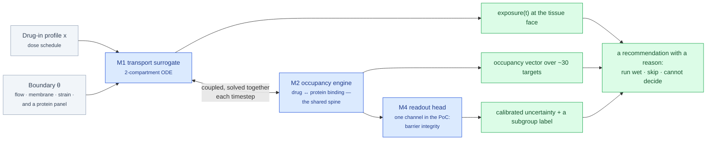

# §vision — ChipSim (lung-on-chipsim)

<!-- HACP L2 leaf · local source; Parent = bioFM §vision. Compiled 2026-09-28. -->

**Tag:** `§vision` · **Layer:** L2 (leaf under [bioFM §vision](../vision.md)) · **Holds:** what is being attempted and why now · **Reaches:** the PRD, the A&D's premise, the audit PVR

**TL;DR** — The rate limiter in tissue-engineered drug testing is the validation loop: every
candidate condition needs a wet chip run to learn how much drug actually reaches the tissue.
ChipSim is a cheap, falsifiable estimate of *delivered* exposure and the response it induces,
built entirely from public data, where the barrier is **parameterised, not simulated** and the
biological engine is a stack of drug→protein interaction models.

## What is attempted

*The barrier itself is an occupancy event: crossing is binding, sorting and release, so transport and pharmacology share one mechanism. M1 and M2 are coupled, never chained.*

| The problem | The answer |
|---|---|
| Chips iterate in weeks; the useful design space is 10⁶+ conditions. Nominal dose is not delivered dose (PDMS absorption, tubing, protein binding). "No effect" cannot be told from "no delivery", so every negative result is uninterpretable, and with no surrogate there is nothing to optimise against. | Predict the exposure profile at the barrier for any (drug, dose, θ); predict which targets are occupied at that exposure; fan occupancy out to readouts; emit calibrated uncertainty so wet runs are spent only where they can falsify the model. |

## The one claim under test

> For held-out drug scaffolds on a single lung barrier, an LBM-supplied occupancy vector plus a
> two-compartment transport state predicts exposure ordering at **Spearman ρ ≥ 0.6**, recovers
> known mechanism-of-action targets in the **top-10** panel, and holds **90% Mondrian subgroup
> coverage** at intervals no narrower than the assay-noise floor.

| If it… | Then |
|---|---|
| holds | the validation gap is addressable in silico and the programme is justified |
| fails on ordering | transport conditioning is not being learned; the kill criterion applies and ML retreats to the biology leg |
| holds on ordering but fails coverage | the artefact is a ranker, not a validator; the wet queue cannot be safely shrunk. **A real result, publishable as one.** |

**Success is decision-grade, not absolute:** correct rank ordering of conditions plus honest
error bars. A system that never abstains has not been calibrated, only fitted.

## The minimum viable chip

| Element | PoC setting | Why this and not more |
|---|---|---|
| Barrier | one alveolar–endothelial bilayer: passive baseline + two carrier terms (P-gp efflux, one uptake carrier) | enough to exhibit saturation and non-monotonicity; few enough to stay identifiable |
| Target panel | about 30 proteins, not 300 | panel-truncation bias is measurable at 30 and merely asserted at 300 |
| Compounds | 20–40 inhaled, lung-relevant drugs with published exposure, plus matched molecular pairs | the disambiguation and cliff tests need pairs, so pair count matters more than compound count |
| θ | 5–8 identifiable parameters | per feasibility argument FP1 |
| Readouts | exposure(t), occupancy vector, one biological channel | the multi-channel fan-out is the programme, not the PoC |

## Three controls, not one benchmark

The tools are weak in exactly the direction ChipSim needs: audits find co-folding affinity heads
insensitive to pocket mutation and sometimes to target exchange. So the occupancy engine ships with:

1. **Target-shuffle and site-mutation control** — predicted affinity must degrade when the pocket is mutated or the target swapped. *Failing it kills the moiety claim.*
2. **Cliff-stratified splits** — accuracy reported separately on matched pairs crossing a potency or efflux cliff.
3. **Non-monotonicity test** — reproduce at least one published case where *reducing* affinity *increases* delivery. *Failing it kills the delivery claim.*

Every LBM ships with a named non-LBM fallback that keeps the system running, so what the model
contributed can be measured as a delta. An LBM that cannot beat its own fallback is a finding, not
a failure. Control 1 is run first, as its own method-validation study
([audit PVR](../../../workstreams/chipsim-lbm-audit/PVR.md)), because the whole moiety claim rests on it.

## Why it is achievable

Six first-principles arguments, of which the strongest is **FP6: calibration is cheaper than
accuracy** — a model three-fold off but correctly ranked and correctly uncertain still removes most
wet runs. FP1 (well-mixed channels collapse transport from a PDE to a few ODE states) puts the
high-dimensional part where public data is rich. Only one of seven links in the achievability
ledger, occupancy → pathway, carries real scientific risk, and a wrong answer there is detectable.

## The standing constraint that shapes everything

**No coding agent writes a biological number.** The agent writes the schema and the validator
that rejects an unsourced entry; the human writes the value with its citation. This is why the
project has complete machinery and zero results, and why that is by design.

## Read the source

- [`PVR.md`](../../../workstreams/lung-on-chipsim/PVR.md) — the PRD: problem, vision, the occupancy core mechanism, the scoped PoC, FP1–FP6, the assumption register A1–A13 (imported from Notion 2026-08-26)
- [`A-and-D.md`](../../../workstreams/lung-on-chipsim/A-and-D.md) — architecture and design (imported 2026-08-26)
- [`CONTEXT.md`](../../../projects/lung-on-chipsim/CONTEXT.md) — the domain glossary; read it before the code
- [`chipsim-lbm-audit/PVR.md`](../../../workstreams/chipsim-lbm-audit/PVR.md) — the moiety-sensitivity audit that runs control 1 first (approved 2026-09-01)

Back to the [index](index.md).
