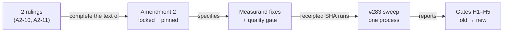

<!-- HACP §decision · Project bioFM · workstream perturb-seq-eval · Kind Decision. Wiki rendering of Source:
     workstreams/perturb-seq-eval/qgr/principal-decisions-p0p5.md (fc33ebe) + qgr/prereg-amendment-2-DRAFT.md (rev 2, 2026-09-26)
     + workstreams/perturb-seq-eval/qa/_adhoc/2026-09-26-entropy-formulation-review.md (main, 26b2798).
     Notion: https://app.notion.com/p/3e7749bd250d8127b2b0c293fb8c0522 (Kind=Decision, Project=bioFM) -->
# perturb-seq-eval — P0-P5 rulings for pre-registration amendment 2

| | |
|---|---|
| **State** | D1 approved · 9 ruled · **2 open** (A2-10, A2-11 — from the CTO's entropy-formulation review) |
| **Blocks** | amendment 2 lock → fixes + quality gate → the #283 sweep ($12 stop / $28 kill) |
| **Pre-registration** | `paper/PREREGISTRATION.md` pinned at `0c2932a`; amendment 2 DRAFT rev 2 (not locked) |
| **Phase** | P0-P5 **closed** 2026-09-26 — boundary commit `dfaf8c3`, derived receipt `cfe931f` (Hash D = principal approval, CTO #421) |
| **Alignment** | build matches the A&D and pre-registration **except** the measurand findings below; the quality gate caught them before any data |
| **Links** | repo paths below are local — branch `perturb-seq-eval` is not yet on GitHub (needs `git push origin main` first) |

**TL;DR** — The P0-P5 quality gate found that, as built, the sweep would answer the title question (H4) on an imputed constant and measure H3 on an unintended quantity. All ten of those are now ruled and drafted into amendment 2. A mathematical re-check of the entropy formulations (CTO, 2026-09-26) then found two pre-registered formulas that are well-defined but ill-conditioned for the hypothesis they serve; those two decisions remain before the lock.

*Order is the point: a fix applied after the data exist would change a pre-registered measurand post hoc.*

## Decisions needed

### A2-10 · The ACE_norm feature for H4/H5 (review F1, blocking)
Softmax at τ = 1 over confidences in [0, 1] can never be far from uniform: for a five-role round the pre-registered ACE_norm occupies at most **[0.92, 1.00]**, eight percent of its nominal range. With rounded LLM confidences (0.7, 0.8, 0.9) that is a tie machine, so the ACE_norm rows of H4 are under-powered by construction and H5 fits ridge weights to a feature with no spread. `metrics.ace_d` (direct simplex projection, no temperature) already exists with full range [0, 1] on the same inputs.
| Option | Does | Forecloses |
|---|---|---|
| **a · pre-register `ace_d` as the ACE_norm feature; softmax version descriptive only** ✅ (CTO) | full-range feature for H4/H5 and TDI_lifecycle; weights carried over unchanged | comparability with the v0.4 softmax definition (already declared non-comparable) |
| b · keep softmax τ = 1 | no change | power on the ACE_norm rows; ties may decide them |

### A2-11 · The sign of ΔC (review F3)
1−ΔC clips every falling-confidence run to exactly 1.0, tied with every flat run — the strongest difficulty signal in the trace is discarded and a tie block sits at the top of the ranking.
| Option | Does | Forecloses |
|---|---|---|
| **a · pre-register the unclipped 1−ΔC (range [0, 2]) for the Spearman tests, H5 and TDI_lifecycle (outer clip removed); clipped value descriptive** ✅ (CTO) | falling confidence ranks above flat | — |
| b · keep the clip | no change | distinguishing falling from flat |

## Already ruled

### 2026-09-26 (principal, via CTO #421)
| Item | Ruling |
|---|---|
| **D1** phase boundary | **Approved.** Boundary commit `dfaf8c3`; derived receipt `cfe931f` with Hash D = sha256 of the #421 payload. Does not authorise the sweep |
| 2c · H3 (NEW-1 + backbone part of C1) → A2-6 | (c) gate on the **stated** backbone; omitted or off-menu → schema failure, never defaulted or counted; executed backbone reported alongside. Menu pinned {linear, mlp, scgpt_small}; ceiling ln 3 derived from the menu; Miller–Madow value beside the plug-in for any breakdown with N < 50; 0.5 nats ≈ an 86/7/7 split; H3 is a statement about the pool |
| 2d · C13 gene universe → A2-5 | (a) top-20 DEGs selected once per task from the dataset's full post-QC gene axis, force-included in both paths' feature sets; the list recorded in provenance |
| 2e · C25 task draw → A2-7 | (a) text describes the seeded per-stratum draw + top-up to the exact pool total; task set unchanged |
| 2f · C6 prompts + cache → A2-8 | (a) dataset + modality in every prompt; each pre-registered version starts on an empty, version-namespaced cache (`v0.6.0-a2`); entry count and cache hits must be 0 |
| 2g · C20 FWER → A2-9 | (a) state the non-negative-dependence assumption; add the reversed-ranks permutation bound, computed under the lock commit |

### 2026-09-25 (principal)
| Finding | Ruling |
|---|---|
| C1 confidence → A2-1 | required verbalised `confidence` ∈ [0,1] in every role; missing/non-numeric → schema failure → run invalid; never imputed |
| C3 rounds → A2-2 | fixed 3 rounds, no early stop; Validator verdict + threshold recorded, not acted on; ΔC defined for every run |
| C2 + C8 agent config → A2-3 | applied; precedence Validator delta > Architect > DataCurator > defaults; tested through real `parse_proposal` output |
| C7 config grid → A2-4 | N dropped; oracle = best over the distinct backbone × R configurations, count and seeds stated |

## Evidence (L3 — local paths)
- Decision brief (Source): `workstreams/perturb-seq-eval/qgr/principal-decisions-p0p5.md`
- Amendment 2 draft rev 2: `workstreams/perturb-seq-eval/qgr/prereg-amendment-2-DRAFT.md`
- Entropy-formulation review (CTO, on main): `workstreams/perturb-seq-eval/qa/_adhoc/2026-09-26-entropy-formulation-review.md`
- Pre-registration: `projects/perturb-seq-eval/paper/PREREGISTRATION.md` · FWER evidence `qgr/evidence/h4-gate-null-fwer.json.txt`
- Quality gate: receipts `qgr/…qgr-phase-complete-20260925-1301-7d3d659.md` → derived `…-20260926-1132-cfe931f.md`; red/green `qgr/evidence/qg-p0p5-*.txt`
- Register of v0.5.0 defects: `workstreams/perturb-seq-eval/deferred-findings.md` (DF-01…DF-12)
- CTO thread: dispatches #283 (sweep GO), #390, #392, #395, #421
