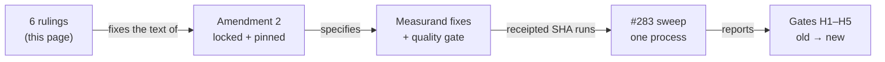

<!-- HACP §decision · Project bioFM · workstream perturb-seq-eval · Kind Decision. Wiki rendering of Source:
     workstreams/perturb-seq-eval/qgr/principal-decisions-p0p5.md (fc33ebe) + qgr/prereg-amendment-2-DRAFT.md (6e896b9).
     Notion: https://app.notion.com/p/3e7749bd250d8127b2b0c293fb8c0522 (Kind=Decision, Project=bioFM) -->
# perturb-seq-eval — P0-P5 rulings for pre-registration amendment 2

| | |
|---|---|
| **State** | 4 ruled · **6 open** |
| **Blocks** | amendment 2 lock → fixes + quality gate → the #283 sweep ($12 stop / $28 kill) |
| **Pre-registration** | `paper/PREREGISTRATION.md` pinned at `0c2932a`; amendment 2 DRAFT at `6e896b9` (not locked) |
| **Alignment** | build matches the A&D and pre-registration **except** the measurand findings below; the quality gate caught them before any data |
| **Links** | repo paths below are local — branch `perturb-seq-eval` is not yet on GitHub (needs `git push origin main` first) |

**TL;DR** — The P0-P5 quality gate found that, as built, the sweep would answer the title question (H4) on an imputed constant and measure H3 on an unintended quantity. Four fixes are ruled; six decisions remain before amendment 2 can be locked and the sweep can run.

*Order is the point: a fix applied after the data exist would change a pre-registered measurand post hoc.*

## Decisions needed

### D1 · Approve the P0-P5 phase boundary (Hash D)
All 17 implementation-only findings are fixed (`040f022…0f85e29`); evidence re-derived on a verified tree (748 tests green; 68 new tests red at the pre-fix commit, 6 negative controls pass).
| Option | Does | Forecloses |
|---|---|---|
| **Approve** ✅ | closes P0-P5; signs the held `--boundary phase` commit | nothing — does **not** authorise the sweep |
| Reject | P0-P5 stays open | the amendment-2 build waits |

### 2c · What H3 measures (NEW-1 + backbone part of C1)
Steps record the backbone the Architect *stated*; the one that *ran* can be overridden by the Validator's rotation rule. An omitted field currently defaults to one backbone.
| Option | Does | Forecloses |
|---|---|---|
| a · gate on executed | H3 = backbone actually run | testing the Architect's own choice |
| b · gate on stated, omitted excluded | pure Architect choice | visibility of the override |
| **c · gate on stated, executed reported** ✅ | answers "does the Architect exercise choice", override visible | — |

### 2d · Shared gene universe for MSD (C13)
Top-20 DEGs are chosen inside each path's HVG columns; trainer and lifecycle differ, so H1/H2 and H4 MSD are different quantities.
| Option | Does | Forecloses |
|---|---|---|
| **a · one fixed gene universe for both** ✅ | H1/H2 and H4 comparable | nothing material |
| b · state that they differ | no code change | comparing H1/H2 with H4 |

### 2e · Task-set draw wording (C25)
Text says "every stratum filled exactly"; code tops up bins and checks pool totals.
| Option | Does | Forecloses |
|---|---|---|
| **a · amend text to the top-up that runs** ✅ | keeps the task set | — |
| b · change the draw to exact per-bin fill | text stays | the current task set (it changes) |

### 2f · LLM input and cache start (C6, prompt part)
Prompts omit dataset and modality (CRISPRi vs CRISPRa); a warm cache would replay earlier replies (now flagged per step).
| Option | Does | Forecloses |
|---|---|---|
| **a · add dataset + modality; empty, version-scoped cache** ✅ | fresh, context-complete replies | reuse of earlier replies |
| b · keep prompts, allow warm cache, report hit fraction | cheaper | freshness guarantee |

### 2g · FWER wording (C20)
The H4 false-positive bracket (2.35–5.81 %) assumes non-negative dependence; under negative dependence it can exceed the top (measured ≈ 6.15 %).
| Option | Does | Forecloses |
|---|---|---|
| **a · state the assumption + add a negative-dependence permutation arm** ✅ | bracket becomes a stated bound | — |
| b · wording only | no extra run | a measured number for that case |

## Already ruled — 2026-09-25 (principal)
| Finding | Ruling |
|---|---|
| C1 confidence | required verbalised `confidence` ∈ [0,1] in every role; missing/non-numeric → schema failure → run invalid; never imputed |
| C3 rounds | fixed 3 rounds, no early stop; Validator verdict + threshold recorded, not acted on; ΔC defined for every run |
| C2 + C8 agent config | applied; precedence Validator delta > Architect > DataCurator > defaults; tested through real `parse_proposal` output |
| C7 config grid | N dropped; oracle = best over the distinct backbone × R configurations, count and seeds stated |

## Evidence (L3 — local paths)
- Decision brief (Source): `workstreams/perturb-seq-eval/qgr/principal-decisions-p0p5.md`
- Amendment 2 draft: `workstreams/perturb-seq-eval/qgr/prereg-amendment-2-DRAFT.md`
- Pre-registration: `projects/perturb-seq-eval/paper/PREREGISTRATION.md` · FWER evidence `qgr/evidence/h4-gate-null-fwer.json.txt`
- Quality gate: receipt `qgr/…qgr-phase-complete-20260925-1301-7d3d659.md`; red/green `qgr/evidence/qg-p0p5-*.txt`
- Register of v0.5.0 defects: `workstreams/perturb-seq-eval/deferred-findings.md` (DF-01…DF-12)
- CTO thread: dispatches #283 (sweep GO), #390, #392, #395
