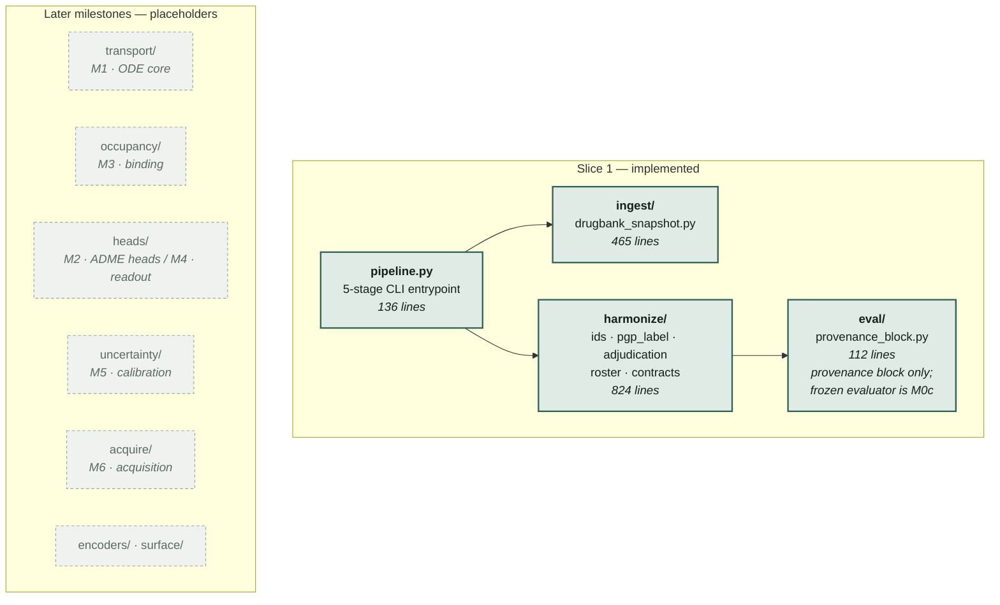
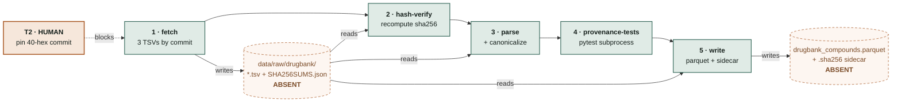
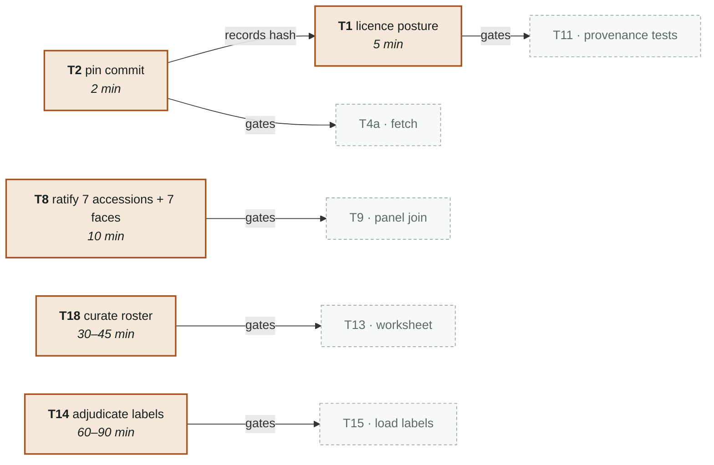

# ChipSim — M0 Data Spine

Lung-on-chip exposure and barrier-response simulator. This directory currently contains
**slice 1 of milestone M0**: the DrugBank data spine through compound identity and the
barrier-panel layer.

> **Usability status — the pipeline is complete and cannot run.**
>
> Every stage is implemented and tested. Execution stops before the first one, because the
> fetch requires a source commit that only a human may pin (`T2`). This is by design, not a
> defect: five artifacts in this slice are *claims* rather than code, and no agent may
> manufacture them. See [Human-owned artifacts](#human-owned-artifacts).
>
> **What you can do today:** run the full test suite against committed fixtures.
> **What you cannot do:** produce any real data artifact.

---

## Status at a glance

| | |
|---|---|
| Agent-implementable tasks | **29 / 29 complete** |
| Human-owned artifacts | **0 / 5 delivered** |
| Tests (offline) | **284 passed / 6 skipped** |
| Tests (network-marked) | 15 passed / 1 skipped |
| Lint | `ruff check` + `ruff format --check` clean |
| Source / test volume | 1,622 / 3,530 lines |
| Real data artifacts on disk | **none** — `data/raw/drugbank/` absent |
| `configs/barrier_panel.yaml` | `ratified: false` |

Two quality-gate iterations are recorded in
`workstreams/lung-on-chipsim/plan/quality-gate-reports.md` (path from the repository root;
`../../workstreams/...` from this directory). Every test a reviewer proved
vacuous was re-run under mutation after fixing; all 7 that previously passed now fail.

---

## Architecture

Ten subpackages are scaffolded to the full target architecture so later milestones add files
rather than restructure. **Three carry slice 1**; the rest are deliberate placeholders.



### Module responsibilities

| Module | Responsibility |
|---|---|
| `ingest/drugbank_snapshot.py` | Fetch the pinned snapshot by 40-hex commit; write `SHA256SUMS.json`; verify hashes; parse compound and protein-edge tables |
| `harmonize/ids.py` | Canonical InChIKey — salt strip, neutralize, tautomer canonicalize |
| `harmonize/pgp_label.py` | Three-way P-gp substrate label; resolves ABCB1 **from the panel config**, never hard-coded |
| `harmonize/adjudication.py` | Load human-adjudicated labels; reject a verdict lacking an evidence DOI |
| `harmonize/roster.py` | Validate the PoC compound roster before a human spends time filling it |
| `harmonize/contracts.py` | Provenance contract — nine keys, eight unconditional, conditional rationale |
| `eval/provenance_block.py` | Model-card data-provenance section |
| `pipeline.py` | `argparse` CLI; the entrypoint the n8n ETL export invokes |

---

## Data flow

Five stages, run as subcommands of `python -m chipsim.pipeline`. Nothing is passed in memory
between stages — **every handoff is a file on disk**, which is why a missing fetch halts the
whole chain rather than degrading it.



Notes that matter when reading the code:

- Stages **3 and 5 each independently re-read and re-canonicalize** from `raw_dir`. There is no
  shared in-memory state between subcommands.
- `write_compounds()` raises if `canonical_inchikey` is missing — canonicalization (`T5b`) must
  run before persistence (`T5a`).
- The parquet is written with `pyarrow` pinned to an exact version, `version="2.6"`,
  `compression=None`, sorted by `canonical_inchikey`. Parquet bytes are not stable across
  pyarrow versions and the `.sha256` sidecar records a digest over the serialized file.
- The parquet is DVC-tracked and gitignored; **the sidecar is git-tracked**, so a substituted
  artifact shows up in review.

---

## Human-owned artifacts

A task is agent-implementable if its done-condition is a test that can fail. A task is
human-owned if its output is a **claim** — something whose wrongness no test in this repository
would catch. A fabricated citation passes every schema check ever written, which is why these
five are absent rather than approximated.



**`T2` is the keystone** — two minutes of work that unblocks the entire provenance and fetch
phase, gating `T4a` and `T1` directly and `T11` transitively.

| Task | What a human must produce | Why not an agent |
|---|---|---|
| `T2` | A 40-char commit SHA personally resolved from `dhimmel/drugbank` | A plausible-looking SHA is indistinguishable from a real one until fetch fails |
| `T1` | Licence posture in your own words, incl. non-commercial commitment | It is a commitment, not a computation |
| `T8` | Seven UniProt accessions **and** seven `face` assignments checked by hand, then `ratified: true`; an entry may be deleted only on positive evidence of absence, never on silence in a database | A wrong accession or face *empties* a join — a failure that looks like success |
| `T18` | 20–40 inhaled/lung-relevant compounds with published exposure | Curation judgement; a roster is a claim about relevance |
| `T14` | Per-compound P-gp verdict with an evidence DOI | A fabricated DOI corrupts the M5 coverage claim invisibly |

**No agent may set `ratified: true`, write a biological number, or invent a DOI.** Genuinely
uncertain compounds stay `unknown` and are excluded from both calibration groups rather than
guessed into one.

---

## Getting started

Supports Python 3.11–3.12 (`requires-python = ">=3.11,<3.13"`; RDKit wheel availability is the
binding constraint on the upper bound). 3.11 is the recommended version and the one the
quickstart below pins. Also needs [`uv`].

```bash
cd projects/lung-on-chipsim
uv venv --python 3.11
uv sync
```

`uv sync` already installs the `dev` dependency group; there is no
`[project.optional-dependencies]` table, so `--all-extras` would do nothing.

### Run the tests — this works today

```bash
uv run pytest -m "not network"     # 284 passed, 6 skipped — fixtures only
uv run pytest -m network           # 15 passed, 1 skipped — hits UniProt
uv run ruff check . && uv run ruff format --check .
```

Skipped tests are keyed to the absent human artifacts and **self-lift** once the artifact
appears — no code change needed.

### Run the pipeline — this does not work yet

```bash
uv run python -m chipsim.pipeline fetch --dest data/raw/drugbank --commit <40-hex>
```

Fails without `T2`'s pinned commit. `fetch_snapshot` raises `ValueError` on anything that is
not 40 hex characters, and it fetches **only** by pinned commit, never by a mutable ref such
as a branch name.

---

## Layout

```
projects/lung-on-chipsim/
├── chipsim/              # the package (3 of 10 subpackages populated)
├── configs/
│   ├── barrier_panel.yaml    # 7 accessions, ratified: false
│   └── env.yaml              # paths + source coordinates, NON-BIOLOGICAL only
├── data/                 # raw/ interim/ processed/ — bulk payload DVC-tracked + gitignored;
│                         # provenance files, .dvc pointers and .sha256 digests stay git-tracked
├── orchestration/n8n/    # etl_drugbank.json workflow export
├── tests/                # 14 modules + 19 fixtures
├── CONTEXT.md            # domain glossary — read this before the code
└── pyproject.toml
```

`configs/theta_priors.yaml` and `configs/assumptions.yaml` are **deliberately absent**. Every
value in them is a human-entered biological number with a citation; no agent may create them.

DVC remote resolves to an absolute path **outside every git worktree**, so that removing a
worktree cannot destroy the only copy of the snapshot.

---

## Provenance and licence

Data comes from [`dhimmel/drugbank`], a public snapshot of **DrugBank 4.2, downloaded
2015-03-19**, archived at `doi:10.5281/zenodo.45579` and redistributed as derived TSVs under
**CC BY-NC 4.0**.

- **Compound identity and drug→transporter/carrier edges only. Never affinities.**
- **Non-commercial only**, inherited from the source licence.
- **ChipSim never redistributes DrugBank.** The snapshot is DVC-tracked and gitignored; a test
  fails if any snapshot byte becomes git-tracked, in file *or* blob form.
- The snapshot **cannot support a coverage claim**. Anywhere the model card says DrugBank it
  must say **DrugBank 4.2 (2015-03-19 snapshot)**.

The staleness matters most for P-gp annotation. The uncertainty stack conditions on P-gp
substrate status, so a stale label would silently redefine the groups a coverage claim is
conditioned on. Hence the three-way label, the rule that absence of an edge is **never** read
as "not a substrate", and human adjudication against current literature.

---

## Known open items

- **`T16a` deferred** — n8n provisioning and end-to-end execution. The workflow JSON export and
  its entrypoint validation are present; standing up n8n is not.
- **`AM-6` unresolved** — the two-group calibration arithmetic. A *calibration point* is one
  curated chip record, never a compound; under that reading the two-group Mondrian veto needs
  ~200–240 records against an M0 target of 60–100. Gates M5 pre-registration, not M0. The
  current recommendation is to **pre-register a sample-size contingency** — evaluate the veto
  only if the sealed conformal bucket yields ≥30 points per group, otherwise report marginal
  coverage with binomial CIs and disclose the downgrade — with the threshold tested against the
  allocation *as written down before reading*, never a post-hoc re-cut.
- **Further ingestors not scheduled** — ChEMBL / BindingDB / TDC / LINCS ingestion is the same
  shape as this slice repeated. The plan's own scope check rules that building more parsers
  first "would feel productive and would move the actual completion date not at all". The next
  slice is **M0b** curation, which is human-owned, then **M0c**, the frozen evaluator.
- **Panel integrity after ratification** — once `T8` sets the attestation fields, nothing today
  detects a later edit to any `configs/barrier_panel.yaml` entry. The gap is being closed by a
  `ratified_panel_sha256` seal over the ratified panel — approved, not yet implemented.

[`uv`]: https://docs.astral.sh/uv/
[`dhimmel/drugbank`]: https://github.com/dhimmel/drugbank
