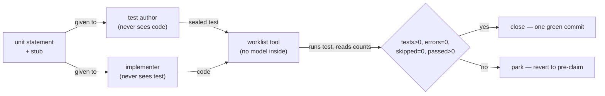

# aviary-biosim white paper — paper walkthrough

<!-- Surface skill: /walkthrough-paper · HACP Presentation · Project=bioFM · Section=eval · L1 — Review.
     Written by the CTO 2026-10-02 from the whitepaper branch @ 84181e4 (receipt ec9daf3).
     Every number is bound to paper/claims.yaml, which fails the build on an unmapped or mislabelled one.
     NO sequence identifier appears on this page: F33 scopes the accession to paper/evidence + methods. -->

| Row | |
|---|---|
| **Citation** | Mang-yin Mo · unsubmitted white paper · 2026 · `projects/aviary-biosim` (public), branch `whitepaper` @ `84181e4` |
| **Read level** | **PARTIAL** — the loop and the failure taxonomy are the contribution; the science is a worked example, deliberately |
| **Modality** | protein — a peptide hormone (recombinant human insulin); the field's usual modality list has no row for it |
| **Wet-lab dependency** | **none** — and that is a limitation, not a feature |
| **Oracle chain** | masked-LM log-probability ratio → "substitution intolerance" → folding constraint (**1 surrogate hop; the expected answer comes from clinical genetics, independently**) |
| **Innovation tags** | **orchestration** *(worker cannot grade its own work)* · environment *(ESM-2 behind an aviary Environment)* · evaluation *(22 failure modes, each pinned)* |
| **Stack role** | method donor + benchmark |

## Index
TL;DR · Context · Schematic · Data setup · Formulation · RL anatomy · Results · Limitations · Lineage · **Decision needed**

## TL;DR
An agent that writes code and grades its own work will eventually report a pass for a property that is absent; this paper describes a build loop where that cannot happen by construction, and uses it to build a drug-discovery environment as the worked experiment. The science result recovers a constraint that was already known — which is the point, because it is how you validate an instrument.

## Context
Agentic build loops report their own success. The failure mode is not a crash but a green tick over an absent property, and it is invisible to the thing that produced it. Computational biology already solved the social version of this: pre-registration, blinded assessment, a notebook, protocol amendments between runs. The paper teaches the loop as that lab method, then spends it on a real question.

## Schematic

*The only party that can say "pass" never saw the code, and reads counts rather than an exit code — so a test that never ran cannot look like one that failed, nor like one that passed.*

> **The one thing to take away.** The verdict is computed from observed test counts by a tool with no model in it. Every other property of the loop follows from that single refusal to let the worker score itself.

## Data setup

| Field | |
|---|---|
| **Source** | one human preproinsulin sequence, fetched live from UniProt at run time — never bundled. Identifier, release and sequence digest live in `paper/evidence/` + methods under ruling F33, and deliberately not here |
| **Shape** | sequence `x ∈ A^L`, `L = 110`, `A = 20`; per position the model returns `logits ∈ ℝ^(L×A)`; the scan emits `2090` scalars, one per substitution |
| **Size** | 110 forward passes → 2,090 single-residue substitutions; 1,634 of them in the mature protein (from position 25) |
| **Labels** | **none** — self-supervised; the model was never trained on this question |
| **Role in training** | eval-only. Nothing is fitted; the model is used as an instrument |
| **Leakage guards** | **none — flag it.** ESM-2 has certainly seen insulin. The design answers this by choosing a question whose answer is independently known, not by holding anything out |

**Axes.** `L = 110` residues — the full preprotein, so positions 1–24 are a signal peptide that is cleaved and must be excluded from the contrast. `A = 20` amino acids. `d = 1280`, learned, **no physical meaning**. The 6 cysteines are positions, not a learned quantity.

## Formulation

The masked-marginal substitution score, one equation, the only one that matters:

$$s(i, a) = \log P(x_i = a \mid x_{\setminus i}) - \log P(x_i = x_i^{\mathrm{wt}} \mid x_{\setminus i})$$

**Every scalar, traced.**

| Scalar | Producer · fit · units · direction · hops |
|---|---|
| **substitution score `s`** | ESM-2 650M masked-LM, one forward pass per position · fit to UniRef50 sequences, not to this protein · log-probability ratio, dimensionless · more negative = less tolerated · **1 hop** (sequence likelihood → "intolerance") |
| **cysteine mean** | mean of `s` over substitutions at the six cysteines · −13.02 · same units · the contrast quantity |
| **spend ceiling** | `SpendTracker` total vs a declared ceiling · USD · refuses the next tool call above it · **built, sealed-tested, never exercised end to end** |

## RL anatomy

| Slot | What fills it |
|---|---|
| **policy** | the discovery agent choosing which residues to probe — a prompted LLM, not a trained policy |
| **reward** | **N/A, deliberately wired to 0.0.** aviary carries a reward because it is an RL gym; this is tool-mediated discovery. Inventing a scalar to fill the slot would be a fabricated signal, and saying so is cheaper than faking it |
| **environment** | `BioSimEnv` — an aviary `Environment` whose `step()` runs ESM-2 on a real sequence; tools `score_variant`, `embed_sequence`, `spend_remaining` |
| **data/labels** | one real sequence, fetched live; no labels |
| **algorithm** | **N/A** — no update rule; the agent is not trained, it is metered |

## Results
- **The instrument recovers the known constraint.** Mean substitution score at the six disulfide cysteines **−13.02** against **−5.85** for every other mature residue — the bonds that limit correct folding are where the model says the protein is least tolerant.
- **The control the agent ran unprompted.** The C-peptide (57–87) is excised during maturation, so it should tolerate substitution: measured **+1.53, +1.08, +0.18, +0.17, −0.10**. Nobody asked for these; the objective never mentions the C-peptide.
- **The loop's own evidence.** 445 tests green across the science, register and sealed suites; **48 of 48** live mutants killed (1 retired with a reason); the 2026-09-26 re-run matched the published figure on **every** headline field at the same device and seed.

## Limitations / oracle risk
Recovery of a known constraint, not new biology — no wet experiment, and the model has seen insulin. Attribution, not reproduction: per-unit prompts are not pinned. Self-improvement is a mechanism the loop has, not a result this paper measured — one pass ran and closed everything, leaving a second pass nothing to improve. The ortholog-embedding comparison the script computes is **not** in the evidence set, so it is not a claim. Budget enforcement has never run end to end. F31 (cache read-path integrity) is held, so the published numbers' provenance is not verifiable from the repository alone.

## Lineage
Builds on aviary (environment interface), ESM-2 650M (the instrument), and the `/v2r-loop` build method. Enables: a sealed-referee template other workstreams can adopt, and a 22-row failure taxonomy each with the regression test that pins it.

## Decision needed to unblock a publication-ready result

| # | Decision | Owner | What it unblocks |
|---|---|---|---|
| 1 | **A7 publication-rigour review** — claims vs evidence, labels, and the new label-checking behaviour in `claims.py` | **CTO (me)** — queued, awaiting your go | the deposit gate. This is the last review step |
| 2 | **Plan amendment + re-sign** — F33 rule note + this gate's QGR row (rule only; the author literal stays governed by the manifest) | CTO, ruled 2026-10-02 | removes the last contradiction between the signed plan and current rulings |
| 3 | **Declare a token price**, or record that budget enforcement stays unexercised | principal | either exercises the budget guard end to end, or converts it from a gap into a stated limitation |
| 4 | Keep or withdraw the one capability with no caller (R5); choose a lessons-pin fix (A/B/C) or state it as a limitation | principal | two open rows in the paper's own limitations |

**Not blocked on:** the science, the suites, or the evidence chain. Blocked on review and two declarations.

## Pen notes

<b>Masked marginal</b> — mask one position, read what the model expects there

One forward pass per position scores all 19 substitutions at once, so a 110-residue protein costs 110 passes. The score is a log-probability ratio against the wild-type residue. Standard practice for variant-effect prediction with protein language models.

<b>Disulfide bond</b> — a covalent clasp between two cysteines

Insulin's three disulfides are what hold the A and B chains together; forming them correctly is the step that limits soluble yield in microbial hosts. Cysteine mutations in human INS cause permanent neonatal diabetes through proinsulin misfolding — which is why the expected direction was known before the run.

<b>C-peptide</b> — the middle segment that gets cut out

Proinsulin is folded as one chain; the C-peptide (positions 57–87) is excised during maturation and does not appear in the finished hormone. Substitutions there should therefore be tolerated — which makes it the natural negative control, and the model agrees (scores at or above zero).

<b>ESM-2 650M</b> — a protein language model trained only on sequences

No structures, no labels, no insulin-specific supervision. It is used here as an instrument, not fitted. The weights file is 2.6 GB and its SHA-256 is recorded with the result, because "which model" is part of the claim.

<b>Sealed test</b> — written by an author who never sees the implementation

The blinded-assessment half of the loop. Its digest is recorded at seal time, so a test edited after authoring is a halt, not a pass. This is the mechanism the whole paper rests on.

<b>Mutant catalogue</b> — deliberately broken copies that the suite must catch

49 catalogued variants (48 live, 1 retired with a reason); a suite that fails to kill one is a suite that would not have noticed the real defect. It is how the paper tests its own tests rather than asserting they work.

<b>aviary Environment</b> — a two-method contract from an RL gym

Implementing it gets you tool dispatch and rollout plumbing for free. What matters here is what sits behind `step()`: a real model over a real sequence, not a simulation — and a reward channel left explicitly at 0.0 rather than filled with an invented number.

