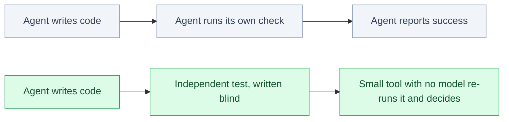

# aviary-biosim — what was delivered, what it cost, what is next

<!-- HACP Presentation (product cut) · Project=bioFM · Section=build · written separately from the beats,
     for the person who decides on the land, the paper and the deposit. One screen. -->

**In one sentence.** We built an automated coding loop that cannot mark its own work as passing, used
it to build a drug-discovery environment around a protein language model, and turned what it taught us
into a white paper that is one review step from a deposit.

*Before: the worker grades its own homework. After: the only party that can say pass never saw the code.*

## What changed for us

| | Before | Now |
|---|---|---|
| Who says a task passed | the agent doing the work | a tool with no model in it, from an observed test run |
| A test that never ran | looked like a failure, burning attempts | halts the loop and says so |
| A failed attempt | could leave broken code behind | is reverted and kept aside; every commit is green |
| The environment | none for chemistry or assays in aviary | one that runs a protein model, with a budget the agent cannot forge |
| Evidence | numbers in a summary | every figure labelled measured, carried forward, reconstructed or reported |

## What it cost

- Six hardening passes on the science tests after the first version could pass by accident.
- One correction of a published claim (reproduction narrowed to attribution) rather than an overclaim
  in a public repository.
- Budget enforcement is built and tested but has never run end to end, because no token price has
  been declared.

## Where it stands

- The hardened branch is gated and receipted; **it lands when you run the land command** (no version
  bump, no release — the paper's versions are its deposits).
- The white paper's plan is signed; twelve of thirteen tasks are done; the last is the boundary check,
  then the CTO's claims review, then the deposit.
- Author block is set; affiliation is *Independent researcher*.

## Decisions waiting on you

1. Run the land.
2. Pick a fix for the lessons pin, or leave it as a stated limitation.
3. Whether to run a second pass before or after the paper.
4. Supply a token price, or record that budget enforcement stays unexercised.
5. Keep or withdraw the one capability that has no caller.

## What this does not claim

The science result recovers a known biological constraint; it discovers nothing new. No wet
experiment has been run. Self-improvement is a mechanism we built, not a result we measured. One
security finding about the cache stays held until publication is decided.
