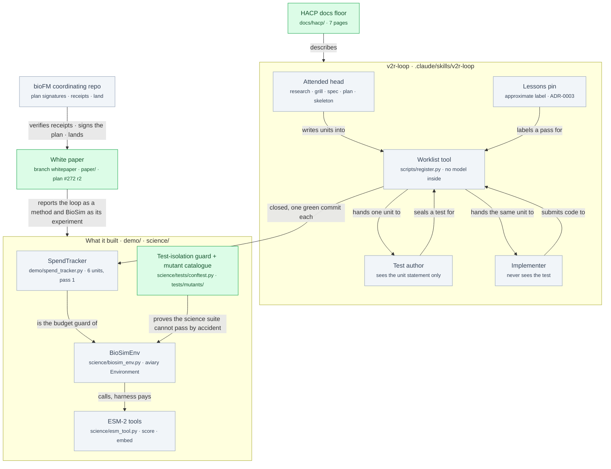
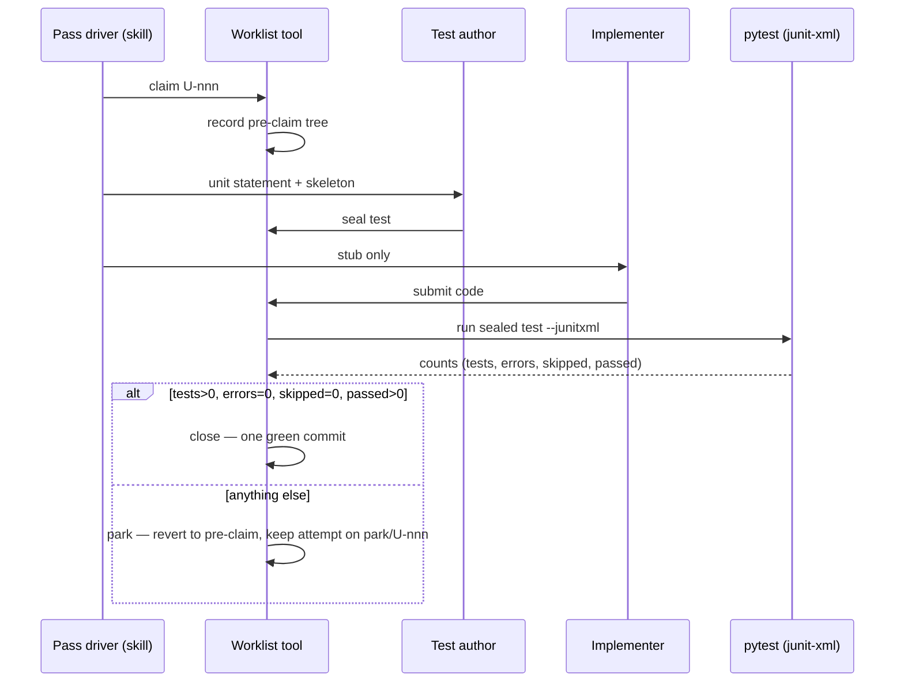
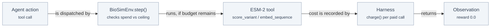

# aviary-biosim — completion walkthrough: the v2r loop and the BioSim environment

<!-- HACP Presentation · Project=bioFM · Section=build · local source; the Notion row mirrors this file.
     Written by the CTO 2026-09-28 from Aviary-BioSim @ ab8f6f5 (branch aviary-biosim) and b366667 (branch whitepaper).
     Reader: a teammate who did not build it. A separate product cut exists: aviary-biosim-walkthrough-product.md -->

## At a glance

**What it is.** A build loop in which the agent that writes the code cannot record that it passed — an
independent test, re-run by a 483-line tool with no model inside, is the only thing that can close a
task — and a protein-model environment (`BioSimEnv`, for Future-House's aviary) built under it.

**Read this if…** you will maintain or extend `v2r-loop` or `BioSimEnv`, you review the white paper
that grew out of them, or you decide on the land, the deposit, or the four open decisions at the end.

**Where the delivery ends.** Branch `aviary-biosim` @ `ab8f6f5` is gated, receipted (Hash E `4217902`,
CTO-verified) and waiting for the principal's land; branch `whitepaper` @ `b366667` carries the signed
paper plan (#272, r2) with Tasks 0–12 done and Task 13's boundary gate owed.

### Where it sits

*Green is what this delivery adds on top of the loop that already existed; grey is the system it sits
in. The worklist tool is the only component trusted by everything downstream.*

### Decisions taken

| Decision | Chosen | Alternatives considered | Why this one | Impact |
|---|---|---|---|---|
| Who may close a unit | The worklist tool re-runs the sealed test itself | The model reads and writes the worklist file | A worklist kept by an interested party drifts optimistic exactly when nobody is checking | Every close is an observed pass; the tool's own tests are adversarial — ADR-0001 |
| How the gate reads a test run | pytest's junit-xml counts: tests > 0, errors = 0, skipped = 0, passed > 0; exit codes ignored | The exit code (the original table) | Exit 1 could not distinguish *failed* from *never ran*; an independent review found every unit would have parked without one assertion executing | A sealed test that collects nothing, or skips, can never close a unit — `register.py` `_parse_junit` |
| A failed unit | Tree reverted to the pre-claim commit; the attempt kept on `park/U-nnn`; nothing cascades | Keep partial work; a dependency graph that sets dependants aside | Every commit on the branch is green by construction; cascade machinery was priced and declined | A foundational failure may cost each dependant its full attempt budget — ADR-0004 |
| The environment's reward | Wired to 0.0 | A scalar derived from the model's scores | This is tool-mediated discovery, not RL; an invented scalar is a fabricated signal | aviary's contract is met; nothing trains on it — SUBMISSION.md |
| Who may write the spend ledger | Only the harness, through `charge()`; the agent gets a read-only `spend_remaining` | Expose a `record` tool to the agent | The agent is the party being metered | The agent can exhaust its budget but not forge it — deferred finding F05 |

## The pieces

| Concept | What it does | State |
|---|---|---|
| Attended head (`/v2r-loop` Stage 1) | Turns one sentence of vision into a spec of standing requirements `R<n>`, a plan, and committed stubs; one human approval freezes scope and ceilings | existing |
| Worklist tool (`register.py`) | Owns every transition — `status next claim seal close park check drain-start drain-end pin`; re-runs the sealed test with `--junitxml`; halts rather than guesses | existing (gate fixed 2026-09-13) |
| Sealed test author / implementer | Two isolated subagents per unit; neither sees the other's output | existing |
| Lessons pin | A hash meant to label which lessons a pass ran under; moves when nothing was learned | existing, **known defect** (ADR-0003) |
| `SpendTracker` | The proving run: six units, all closed at attempt 0; 75 sealed component tests | existing, carried forward |
| `BioSimEnv` | An aviary `Environment` whose `step()` runs ESM-2 over UniProt sequences instead of a simulation; tools `score_variant`, `embed_sequence`, `spend_remaining`; refuses a tool once spend passes the ceiling | existing |
| Discovery loop (`run_discovery.py`) | The agent-driven scan; refuses to start without a declared token price | existing, **never run end to end** |
| Test-isolation guard + frozen mutant catalogue | An identity-based conftest guard that fails the suite when a stub leaks into a real import, plus 49 catalogued deliberately-broken copies (48 live, 1 retired) with a runner that must kill all of them | **new** (F08, five gate passes + one re-gate) |
| HACP docs floor (`docs/hacp/`) | L0 index + six L1 pages (§vision §design §build §eval §risk §decision), each pointing at source | **new** |
| White paper (#272, `paper/`) | The loop as a lab method, BioSim as the worked experiment; referee script with the exit-3 contract; manifest-consistency test; evidence files | **new, in flight** — Tasks 0–12 done, Task 13 owed |

## How it works

*One build unit through the loop. The verdict is read from counts, not from an exit code, so a test
that never ran cannot look like a test that failed — and cannot look like one that passed.*

*The environment's runtime path. The agent sees a read-only budget; only the harness writes it.*

## What may break

- **The gate runs under the interpreter `uv` builds for `register.py`.** `--with pyyaml --with weave
  --with fhaviary` belong on the `$R` invocation, not in a project requirements file. Drop one and a
  sealed test that imports it *could not run* — which the gate now reports as a halt, not a park.
- **The science suite's count depends on how it is launched.** 328 is measured in default order,
  `--import-mode=importlib`, and each file alone, without torch; the 2026-09-25 gate measured 265 with
  torch installed. Quote the conditions with the number.
- **Where the delivery contradicts itself** (looked for; five found):
  1. `docs/hacp/eval.md` and bioFM's `docs/hacp/eval.md` both still show **36 live killed + 1 retired**
     (2026-09-25); the re-gate that produced receipt `4217902` added 13 mutants — the catalogue holds
     **48 live + 1 retired**, all killed. The L1 page is one gate behind its own receipt.
  2. `docs/hacp/build.md` says the F08 fix is *waiting on a push* and the paper is *planning, not
     started*. Both moved: the fix is pushed at `ab8f6f5`; the plan is signed (r2, `4a8bb59`), Tasks
     0–12 are done.
  3. `docs/spec.md`'s header links `docs/v2r-loop/CONTEXT.md` and `docs/v2r-loop/adr/`; the files are
     `docs/CONTEXT.md` and `docs/adr/` (F35, docs-only fix approved).
  4. The signed plan's G5 row and Task 12 text carry the old author literal; the manifest
     (`paper/publish.yml`) is the source of truth by ruling (approval log row 3). Do not edit the
     signed plan for a value.
  5. `SUBMISSION.md` still tells the *36-test suite* story; the register suite is 42 today. It is
     history, correctly labelled — but a reader skimming for the current count will take the wrong one.

## What this does not claim

- The science result is recovery of a known constraint (ESM-2 has seen insulin), not new biology.
  No wet experiment has been run.
- Self-improvement across passes is a mechanism, not a measured result: one pass ran, closed
  everything, and left nothing for a second pass to improve on.
- The replay claim is **attribution, not reproduction**: the per-unit prompts are not pinned.
- The 75 sealed component tests are carried forward from pass 1, not re-run.
- Budget enforcement in `BioSimEnv` is built and tested, not exercised end to end.
- F31 (security, cache read-path integrity) is held; the published science numbers' provenance is
  not verifiable from the repo.

## Known gaps and loose ends

| # | Gap | Chosen or found | Where |
|---|---|---|---|
| 1 | The demo seeder overwrote the live `.v2r/` run state; pass 1 is reconstructed from version control | chosen (fix is the paper's first build item) | §risk row 1 |
| 2 | The lessons pin moves when nothing was learned; three fixes ranked, none chosen | chosen | ADR-0003, §decision 1 |
| 3 | No token price → budget enforcement never run end to end | chosen (principal's decision) | §decision 3 |
| 4 | F31 held; F09 F13 F14 F16 F22–F27 F30 F32–F35 open | chosen, registered | `docs/deferred-findings.md` |
| 5 | `.v2r/` was never tracked, so the drain-start `register_sha` is **permanently** unverifiable; the G3 label is *recovered record; pre-claim chain verified 6/6; write-time provenance not established* | found | #433, #448 |
| 6 | The HACP L1 pages lag the receipt (contradictions 1–2 above) | found | this page |
| 7 | The checkout's register lists six units, matching pass 1; whether it is the original record or a reconstruction cannot be told from the file | found | gap 1 |

## HACP breakdown

The delivery is already laid out by HACP section in Aviary-BioSim's `docs/hacp/`. What each holds,
its state at `ab8f6f5`, and what this delivery changed in it:

| Tag | Holds | State | This delivery |
|---|---|---|---|
| §vision | one sentence of vision → a reviewed branch; why now (aviary has no chemistry environment) | current, 2 documents | unchanged |
| §design | the trust boundary, the five components and what each may never do, four ADRs, three recorded divergences | current, 1 correction | unchanged; F35 link fix pending |
| §build | five phases: build the loop → pass 1 → BioSim experiment → hardening gates → white paper | 2 in flight | F08 gated; paper plan signed r2, Tasks 0–12 |
| §eval | evidence by trust kind — measured / carried forward / reconstructed / reported | last gate green 2026-09-26 | receipt `4217902`; 445 tests; 48/48 + 1 mutants |
| §risk | six known gaps, all of one shape: a mechanism ran and looked right while its property was absent | 6 open | none closed; #5 above sharpened to *permanent* |
| §decision | four choices the principal owns | 4 open | unchanged |

## Where the workstream ends — done, owed, decisions

**Done.** F08 test isolation through five gate passes and a re-gate; pr-prep receipt `4217902`
verified by the CTO against `origin/main` (`274270d`); not user-facing; triage complete. HACP floor
written. Paper plan #272 signed r1 (`0ab65e9`) and re-signed r2 (`4a8bb59`) after the referee script's
exit-3 contract was confirmed against the shipped code. Tasks 0–12 done, including the manifest
consistency test (`c4ddfac`) and the repo-tests claims file (`7a1932c`). Author block, F33
confirmation and the rename note sent (directive 2026-09-28 18:29).

**Owed.**

| By | What | Then |
|---|---|---|
| Principal | `/airdlc:pr-cto-land aviary-biosim --no-release` (the CTO cannot invoke it) | the agent merges `main` into `whitepaper` |
| Agent | Task 13 `/iteration-complete` → boundary report (A1 / A3c / A4 labels + QGR receipt); apply the author block; one methods sentence on the plugin rename | |
| CTO | publication-rigour review, A7 claims check first; then the deposit gate | |

**Decisions the principal owns.** The land (above); the four §decision items — the lessons-pin fix
(A/B/C), whether to run a second pass, the token price, and requirement R5's unused capability; and
whether F31 stays held through publication.

## Where to start reading

1. `README.md` — the problem statement and how one run looks.
2. `docs/CONTEXT.md` — the vocabulary; four collisions with ChipSim terms were settled here first.
3. `.claude/skills/v2r-loop/scripts/register.py` — `_parse_junit`, `close`, `park`.
4. `science/biosim_env.py` — `reset()` (the tool list), `step()`, `charge()`.
5. `docs/hacp/index.md` — the six sections, one screen; then `docs/deferred-findings.md`.
