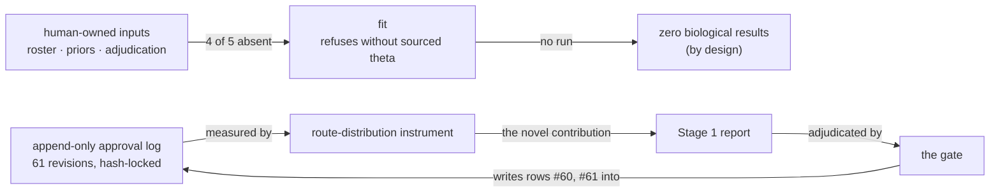

# lung-on-chipsim Stage 1 registered report — paper walkthrough

<!-- Surface skill: /walkthrough-paper · HACP Presentation · Project=bioFM · Section=eval · L1 — Review.
     Written by the CTO 2026-10-02 after the branch was ARCHIVED (principal, 2026-10-01). The report
     exists, the final gate failed, nothing was pushed. Record preserved on main: 78 of 83 files. -->

| Row | |
|---|---|
| **Citation** | Mang-yin Mo · Stage 1 registered report, **never submitted** · 2026 · record preserved on bioFM `main`, branch archived unlanded |
| **Read level** | **PARTIAL** — read §7 and the closure; the methods describe a study that has not run |
| **Modality** | cell — a lung-on-chip simulation of compound transport and response |
| **Wet-lab dependency** | **required for Stage 2, none performed** — and no simulation run either |
| **Oracle chain** | **never exercised.** The fit refuses to run without sourced priors, so no number ever reached an oracle |
| **Innovation tags** | **evaluation** *(a method measuring its own approval record)* · theory *(when a self-measurement is admissible)* |
| **Stack role** | method donor |

## Index
TL;DR · Context · Schematic · Data setup · Formulation · RL anatomy · Results · Limitations · Lineage · **Decision needed**

## TL;DR
A registered report written before any result exists, whose declared novel contribution is a measurement of its own approval log — and whose final gate failed on the same defect it was describing, nine times over. The mechanism is the result; the branch is archived and the paper was never submitted.

## Context
The project has complete machinery and, by design, zero biological results: no agent may write a biological value, so the fit refuses to run until a human supplies sourced priors. That leaves a genre problem — what can you honestly publish from a method with no numbers? A Stage 1 registered report answers it: methods and pre-registered analysis, submitted before results exist. The report then tried to measure the one thing it *did* have — its own decision record.

## Schematic

*The loop at the bottom is the finding: adjudicating the report changed the quantity the report publishes.*

> **The one thing to take away.** A fix is verified against the thing that was changed, not against the property the claim names. Nine dated instances — and **six of the nine were introduced by the repair of a previous instance**, which is what makes it a mechanism rather than a list of mistakes.

## Data setup

| Field | |
|---|---|
| **Source** | a 6,802-compound reference table ingested from public sources, digest-verified; plus the project's own append-only approval log as the measured object |
| **Shape** | reference table: 6,802 rows × 9 attributes. Approval log: 65 data rows / 61 numbered revisions, each carrying a route label |
| **Size** | 6,802 compounds · 65 log rows · 724 files scanned by the content guard |
| **Labels** | compound attributes are ingested source data, **not** experimental output. Route labels are the thing under study |
| **Role in training** | **none** — nothing is trained; the reference table is an input the pipeline has not yet consumed |
| **Leakage guards** | not applicable to the compound table (no model). For the self-measurement the guard that mattered was a **revision pin**, and it is the one that failed |

**Axes.** `6,802` compounds — ingested, not generated. `9` attributes per compound. `61 / 65 / 47` = numbered revisions / data rows / standing-delegation routes, **re-derived at the gated commit** and *not* the 59 / 63 / 46 the draft published.

## Formulation

The report's novel quantity is a distribution, not a model — the share of plan revisions approved by each authority route:

$$\mathrm{route\ share}(k) = \frac{|\{\,r \in \mathrm{rows} : \mathrm{route}(r) = k\,\}|}{|\mathrm{rows}|}$$

**Every scalar, traced.**

| Scalar | Producer · fit · units · direction · hops |
|---|---|
| **route share** | a counter over the append-only log at a pinned revision · fit to nothing · a count ratio · no direction — it is descriptive · **0 hops, and that is the appeal of it** |
| **unaccounted shapes** | the content guard's own scanner over 724 tracked files · counts only, never values · lower = less unreviewed content · 1 hop (shape pattern → "identifier") |
| **mutants killed** | deliberately broken copies the suite must catch · a ratio · higher = the tests test something |

*The pin is the defect: the figure was pinned to a **plan hash**, and rows #58–#61 all carried that hash "(unchanged)", so the pin could not discriminate and the published figure was two rows stale at its own closing.*

## RL anatomy

| Slot | What fills it |
|---|---|
| **policy** | **N/A** — no agent generates a biological value; that is Global Constraint 1, not an omission |
| **reward** | **N/A** — nothing is optimised. A reward here would be the fabricated signal the project exists to avoid |
| **environment** | a lung-on-chip transport-and-response simulator, built and **never run** for want of sourced priors |
| **data/labels** | 6,802 ingested compounds; no labels, no outputs |
| **algorithm** | **N/A** — the contribution is a measurement procedure over a decision record |

*Five N/As or near-N/As. The report is about how a method was approved, not about a model — and the honest version of that table is this empty.*

## Results
- **No biological result, by design.** Zero simulation runs, zero evaluation runs. One human-owned input of five has been delivered (a 26-entry curated roster); adjudication stands at 0 of 26.
- **The mechanism, nine times.** A fix verified against the change rather than the property — six of the nine instances introduced *by a repair*. Three were added by the final gate itself, two of them authored while the author was describing the mechanism in the same document.
- **Corrected before closing, not after.** Six numbers were re-derived and fixed in the closure, **five of them the author's own**, including a constant hardcoded into a generator that enforces "counts are regenerated, never typed".

## Limitations / oracle risk
Nothing here is validated against biology; the compound table is ingested source data, not an experimental output. One source licence is unconfirmed. The content guard is available but not enforced pre-commit. The self-measurement is the deepest limitation: an artifact that measures the process which approves it must pin to a **revision** of that process and re-derive at approval time — this one did neither. The earlier, stronger claim that this made the report a *fixed point* was **withdrawn** by its own author at closing.

## Lineage
Builds on the registered-report genre (methods before results) and the project's own content guard. Enables: the pinning rule above, now carried into every bioFM workstream; and a successor's reading order — **S-01, S-02, S-06, S-07, S-20 first, and do not open by repairing the register.**

## Decision needed to unblock a publication-ready result

| # | Decision | Owner | What it unblocks |
|---|---|---|---|
| 1 | **Is the closure itself publishable** as a short standalone methods note — the mechanism, nine instances, six from repair, plus the pinning rule? | principal | the only publishable thing this branch produced. The Stage 1 report is not submittable; the finding is, and it needs no new work |
| 2 | **The five withheld files** — redact-then-publish, or leave on the archived branch? | principal | completes the preserved record. They carry structure identifiers (229/98/10/9/1) and redacting hash-covered evidence is yours alone |
| 3 | **Stage 2 human-owned inputs** — adjudication (0 of 26), theta priors, transport prior, assumptions, fixture provenance | principal | the biological result. Nothing agentic can start until these exist, and no agent may write them |

**Not blocked on:** agent capacity. The branch is archived and parked by your ruling; items 1 and 2 need only a decision.

## Pen notes

<b>Registered report</b> — peer review of the methods, before the results exist

Stage 1 submits the question, the design and the analysis plan; acceptance is in principle, before data. It exists to stop the analysis from being chosen after seeing the numbers. Chosen here because the project genuinely has zero results and refuses to manufacture any.

<b>Lung-on-chip</b> — a microfluidic device, here simulated rather than run

A chip that reproduces alveolar tissue and airflow to test compound transport and response. This project simulates one; no device was operated, and no simulation was run either, because the fit refuses to proceed on invented priors.

<b>Theta priors</b> — the parameters a human must source, not guess

The fit needs physical parameters with citations. The code refuses to run without them rather than defaulting — which is why there are no results, and why that absence is a design decision rather than a gap. Four of five such inputs are still absent.

<b>Content guard</b> — a scanner for licensed source content in a public repo

Checks tracked files for accession and structure shapes, and for text that merely *reads as* a citation. Reports counts and booleans, never values. Its own blind spots were measured across nine gates — gate 9 surfaced 6 defects and 19 findings that 1,257 passing tests could not see.

<b>Append-only approval log</b> — decisions are added, never edited

A correction is a new row citing the old one, so the record of having been wrong survives. That property is what made the self-measurement possible at all — and what made the stale pin visible rather than silently overwritten.

<b>Route label</b> — how a plan revision's authority was obtained

Direct principal answer, standing ruling applied, or inferred. The column asserted provenance while bound to no check — unlike plans, which bind to hashes, and boundaries, which bind to receipts. Row 55 claimed a direct answer that was actually a standing ruling; correcting it created the convention now in force.

