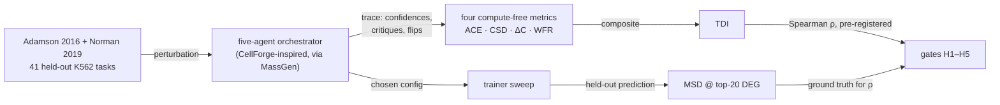

# perturb-seq-eval v0.6.0 — paper walkthrough

<!-- Surface skill: /walkthrough-paper · HACP Presentation · Project=bioFM · Section=eval · L1 — Review.
     Written by the CTO 2026-10-02. Numbers come from paper/claims + artifacts/v0.6.0/summary.json
     through the manuscript's generated macros, never typed. -->

| Row | |
|---|---|
| **Citation** | Mang-yin Mo · unsubmitted preprint · 2026 · manuscript `projects/perturb-seq-eval/paper/paper.tex` (15 pp) · code in-repo |
| **Read level** | **FULL** — the pre-registration is the contribution; the negative result is the payload |
| **Modality** | cell — pooled CRISPR screens in K562 |
| **Wet-lab dependency** | **none** — two public Perturb-seq screens, already measured |
| **Oracle chain** | sequenced transcriptome → normalized expression → MSD over top-20 DEGs → "task difficulty" (**3 hops, no wet lab**) |
| **Innovation tags** | **evaluation** *(trace metrics scored against held-out error)* · orchestration *(five-agent lifecycle as subject)* · data *(provenance-complete run record)* |
| **Stack role** | benchmark + method donor |

## Index
TL;DR · Context · Schematic · Data setup · Formulation · RL anatomy · Results · Limitations · Lineage · **Decision needed**

## TL;DR
Multi-agent systems spend test-time compute uniformly; we asked whether the agents' own confidence-and-critique trace predicts which tasks are hard. Four of five pre-registered gates pass, the transfer gate fails, and the headline metric moves in the direction opposite to the one we registered.

## Context
Test-time compute is allocated flat because nothing cheap says which task deserves more. A trace the system already emits — confidences, critiques, winner flips — costs nothing extra to read. Whether it carries difficulty signal had not been tested under pre-registration, so a positive result in this space is indistinguishable from a search over metrics.

## Schematic

*The trace and the error are produced by two different halves of the system; the gates only ever compare them. Nothing in the loop optimises the metrics.*

> **The one thing to take away.** ACE correlates **negatively** with held-out error in both screens (ρ −0.63, −0.38) — the opposite of the registered direction. Reported as a result, not reinterpreted: a sign flip discovered after the fact is a new hypothesis, not a finding.

## Data setup

| Field | |
|---|---|
| **Source** | Adamson 2016 (CRISPRi) + Norman 2019 (CRISPRa); public, K562 |
| **Shape** | one task = (perturbation, held-out cells); prediction `ŷ ∈ ℝ^G`, scored on the top-20 DEG subset `ŷ[:20]` |
| **Size** | 41 held-out tasks — 21 Adamson, 15 Norman singletons, 5 Norman doublets; drawn deterministically |
| **Labels** | measured post-perturbation expression; no human labelling |
| **Role in training** | eval-only for the hypothesis tests; the trainer sweep fits per task |
| **Leakage guards** | deterministic draw fixed in the pre-registration before any data was seen; the two screens stay separate, and crossing them **is** H5 |

**Axes.** `G` = genes (transcripts measured); `20` = the DEG cut, a ranking choice not a biological constant; `41` = tasks, the unit every ρ is computed over — small, and the CIs say so.

## Formulation

Agent Confidence Entropy over a round's normalised confidences:

$$\mathrm{ACE} = -\sum_i p_i \log p_i \quad\text{where } p_i = c_i / \textstyle\sum_j c_j$$

The composite scored by H4/H5:

$$\mathrm{TDI} = w_1\,\mathrm{ACE} + w_2\,\mathrm{CSD} + w_3(1-\Delta C) + w_4\,\mathrm{WFR}$$

**Every scalar, traced.**

| Scalar | Producer · fit · units · direction · hops |
|---|---|
| **MSD @ top-20 DEG** | mean squared deviation of predicted vs measured expression over the 20 most differentially expressed genes · fit to nothing, it *is* the measurement · dimensionless on normalised counts · lower = better · **3 hops** from sequencing to score |
| **ACE** | entropy over the agents' self-reported confidences · fit to nothing · nats · registered as *higher = harder* (**the data disagrees**) · 1 hop, and the hop is self-report |
| **TDI** | weighted sum above, weights calibrated on Adamson · dimensionless · higher = harder · inherits every component's hops |

*Gate cutoffs printed where they bind: H1 median MSD < 0.20 · H2 < 0.30 · H3 entropy ≥ 0.5 nats · H4 any ρ > 0.5 · H5 transferred ρ > 0.4.*

## RL anatomy

| Slot | What fills it |
|---|---|
| **policy** | **N/A** — no policy is learned; the orchestrator is a fixed five-role workflow with a pinned model roster |
| **reward** | **N/A** — MSD is an evaluation metric, never fed back; nothing optimises against it, which is what keeps it honest |
| **environment** | the MassGen-operated orchestrator plus the trainer sweep |
| **data/labels** | two public Perturb-seq screens; labels are measured expression |
| **algorithm** | **N/A** — pre-registered correlation tests, not an update rule |

*Four N/As is the finding: this is an evaluation of an agentic system, not a training method. The absence is why no gate can be reached by optimisation.*

## Results
- **4 / 5 gates pass, exactly as pre-registered.** H1 Adamson median MSD **0.1315** (CI 0.111–0.149, n=21) · H2 Norman **0.1842** (CI 0.092–0.395, n=20; doublets 0.517) · H3 backbone-choice entropy **0.859 nats** · H4 **4 of 6** within-dataset ρ pass, carried by 1−ΔC and TDI_lifecycle (ρ 0.66–0.70).
- **H5 FAILS.** The Adamson-calibrated composite transfers to Norman at **ρ = 0.286** (n=20, CI −0.244–0.726) against a registered 0.4. It stays failed.
- **The run can be audited.** 123/123 lifecycle runs, 1845 LLM steps, **0 fallbacks · 0 cache hits · 0 refusals · 0 served-model mismatches**; total spend **$8.93** against a $12 stop and a $30 ceiling.

## Limitations / oracle risk
Single model family — no cross-family generality. Same-family judge on a different tier; residual bias acknowledged, not removed. n = 21/20 per screen with bootstrap CIs that are wide, and H5's CI spans zero. The ACE sign is a finding to test next, never a claim. MSD over a top-20 cut is a ranking convention; a different cut is a different difficulty.

## Lineage
Builds on CellForge (orchestrator shape) and MassGen (operation); Adamson 2016 and Norman 2019 supply the screens. Enables: a pre-registered template for scoring agent traces against task outcomes, and a registered follow-up on the ACE sign.

## Decision needed to unblock a publication-ready result

| # | Decision | Owner | What it unblocks |
|---|---|---|---|
| 1 | **Name a venue in `paper/publish.yml`** | principal | the deposit. The program landed (PR #8 → `5a45d4a`) and the deposit follow-up landed (PR #12 → `5637497`); the agent is parked solely on this. Nothing else is in the way. |
| 2 | Cosmetic, bundled with 1 | CTO | A1's blank `prereg_version` renders as `—` with a footnote |

**Not blocked on:** results, numbers, provenance, or spend. This paper is finished except for where it goes.

## Pen notes

<b>Perturb-seq</b> — pooled CRISPR screen read out per cell by RNA-seq

Each cell gets one perturbation and its whole transcriptome is sequenced. Gives thousands of (perturbation → expression) pairs from one experiment. Here it supplies both the task and its answer key. Nearest analogue: a labelled dataset where the label is 20,000-dimensional.

<b>CRISPRi vs CRISPRa</b> — knock a gene down, or drive it up

Adamson is interference (down), Norman is activation (up). They are not the same prediction problem, which is exactly why H5 — transfer between them — was registered as a separate gate. It failed.

<b>MSD @ top-20 DEG</b> — error scored only on the genes that moved

Scoring all genes rewards predicting "nothing changed", which is almost true. Restricting to the top 20 differentially expressed genes makes the metric about the perturbation's effect. The cut is a convention; 0.20 and 0.30 are the registered thresholds.

<b>Pre-registration</b> — hypotheses and cutoffs fixed before the data

Amendment 4 was locked before any run (`a48ae5f` → `535cb68` → `00fae29`). Without it, "4 of 6 correlations pass" is a search result. With it, the tally is a measurement — and the failure has to be reported too.

<b>Spearman ρ</b> — rank correlation, not linear

Asks whether harder tasks *rank* harder, not whether the relationship is a line. Appropriate when the scale of a composite index is arbitrary. n = 20–21 here, so the CIs are wide and one is reported spanning zero.

<b>Served-model mismatch</b> — you asked for one model and got another

A silent substitution would invalidate every per-model claim. Each call records the served model id and `stop_reason`; the run reports **0** mismatches and **0** fallbacks, with no `fallbacks` parameter ever sent. This is the provenance half of the contribution.

