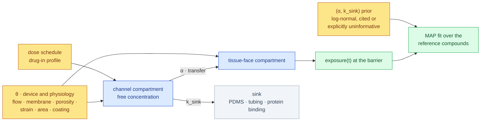

# Experimental design — initiating the LungChipSim M1 modelling and simulation

**Date:** 2026-10-08 · **Status:** design complete, inputs unfilled · **Author:** agent draft under the principal's instruction of 2026-10-08, for principal ratification

## 1 · What this document is for, and the one thing it cannot do

The principal instructed, verbatim:

> *"Resolve tests or CI and research to fill the 6 fields with best effort from known data
> sources. Unbacked data cannot be used and reference must be cited in the experimental design
> for molecular specification. Approximations could be used where metholdogy is supported.
> Create the most informed set-up to initiate the LungChim modelling & simulation"*

Tests and CI are resolved: the suite is green for the first time on this branch (447 passed, 0
failed) and the CI job gates on the whole offline suite rather than a subset.

**The six fields are not filled, and the reason is the principal's own first condition.** The
research was attempted. The target papers were identified. But no primary source could be read:
this container's egress policy answered **403 to CONNECT** for every host that holds one.

| Host | Why it was needed | Proxy result |
|---|---|---|
| `pmc.ncbi.nlm.nih.gov` | open-access full text of the lung-chip and PDMS-absorption papers | 403, connect rejected |
| `pubchem.ncbi.nlm.nih.gov` | compound identity: CID and InChIKey for T21 | 403, connect rejected |
| `doi.org` | resolving every DOI | 403, connect rejected |
| `www.nature.com` | Nature Protocols fabrication detail; Nature Methods airway chip | 403, connect rejected |
| `pubs.rsc.org` | Lab on a Chip: PDMS absorption, chip drug distribution | 403, connect rejected |
| `www.science.org` | Science 2010 lung-on-a-chip and its supplementary materials | 403, connect rejected |
| `www.ebi.ac.uk` | ChEMBL cross-checks | 403, connect rejected |
| `en.wikipedia.org` | (probe) | 403, connect rejected |

Recorded by the proxy's own status endpoint as `connect_rejected: gateway answered 403 to
CONNECT (policy denial or upstream failure)`. The container's documentation says to report a
403 rather than retry or route around it, so that is what this does.

Web **search** worked. It was not enough, and the distinction matters more here than it usually
would. A search result is a summarizer's prose over snippets. From one you cannot quote a
sentence, cannot confirm a DOI, cannot read the figure most per-compound values actually live
in, and cannot tell the authors' own number from a later review's re-citation of it. This
project's founding observation is that **a fabricated citation passes every schema check ever
written**; a citation assembled from search snippets is the same object with a better alibi. So
no value was written, and no DOI below is presented as confirmed.

What was produced instead is everything a set-up needs except the quotes: the model, the field
list, the units, the derivation formulae, the fetch queue naming where in each paper each
number lives, and a validator that refuses a value arriving without its backing.

## 2 · The model being initiated

Two compartments, well mixed, per feasibility argument FP1: the channel and the tissue face.
θ parameterises the device; `α` scales transfer between compartments; `k_sink` removes drug to
the places a chip loses it. The fit is MAP, so the prior is load-bearing, and at T21's floor of
three reference compounds the reported `(α, k_sink)` is substantially prior-determined. That is
Finding E, and it is why `k_sink` has no default anywhere in the code.

## 3 · Which field feeds which term, and how each one is to be obtained

Full extraction targets are in `sourcing-worksheet.yaml`, which is machine-checked. In summary:

| Field | Unit | Feeds | Obtained how | Status |
|---|---|---|---|---|
| `flow_ul_min` | uL/min | channel residence time, hence the transfer term | quoted, or **derived** from a stated uL/h with the conversion shown | source identified, not readable |
| `membrane_um` | um | diffusive path length | quoted directly from the fabrication protocol | source identified, not readable |
| `porosity` | fraction | open fraction of the transfer area | **derived**: pore geometry → porosity, formula in §4 | source identified, lattice unknown |
| `strain_pct` | percent | mechanical modulation of barrier transport | quoted with its frequency | source identified, not readable |
| `area_mm2` | mm^2 | absolute scale of the transfer term | **derived**: channel width × overlap length | source identified, not readable |
| `coating` | categorical | a named condition, not a measurement | quoted as the source names it | source identified, not readable |
| `alpha_prior` | log(cm/s) | the MAP prior on transfer | **derived** from on-chip apparent-permeability values | sources identified |
| `k_sink_prior` | log(1/h) | the MAP prior on loss | **derived** from PDMS fraction-lost values, §4 | sources identified |

## 3a · Which device θ describes, and why that question came first

θ parameterises **one** device. The searches turned up at least four lung chips whose numbers are
routinely quoted together, and they are not interchangeable:

| Device | Membrane | Mechanics | Usable for θ here? |
|---|---|---|---|
| Huh 2010 alveolar chip (PDMS) | thin porous PDMS, stretchable | cyclic strain by vacuum side-chambers | **yes — this is the reference device** |
| Benam 2016 small-airway chip | rigid porous polyester | no cyclic strain | no: a rigid membrane is a different transport path |
| Stucki 2015 array | much thinner elastic membrane, pore density stated | microdiaphragm actuation | no, but its SI is open access and useful for cross-checking method |
| Emulate-era commercial chip | reported much thicker than Huh 2010 | — | no: the figures trace to a vendor FAQ and patents, not peer review, **and they contradict Huh 2010 by roughly fivefold** |

The PoC's minimum viable chip is one alveolar bilayer with cyclic strain, so **Huh 2010 is the
device and Huh 2013 Nature Protocols is its fabrication reference.** Every θ row must come from
those two or a paper explicitly describing that device. A merged θ would describe no real chip.

This was nearly a silent failure. The search relay repeatedly returned membrane and pore
geometry from **gut-chip and kidney-chip patent embodiments** in answer to questions about the
lung chip, and twice volunteered a figure prefixed "from memory". Any candidate number that
resembles those is to be treated as contaminated until it is read in a lung paper. That is the
fabricated-citation mechanism occurring in real time, and it is the clearest possible argument
for the rule the worksheet enforces.

**Candidate values were relayed for some fields and are deliberately not recorded in this
document.** An unverified number written into a design document is the thing that later gets
copied into a config file with its caveat lost — this project has already published one figure
that was two revisions stale at its own closing. What is recorded instead, per field, is where
the number lives and what to watch for when reading it.

### Per-field prognosis for the rerun

| Field | Expected outcome once the page can be read |
|---|---|
| `membrane_um` | likely `cited` with high confidence from Huh 2010 body text, which the relay quoted consistently from two places |
| `strain_pct` | likely `cited` from Huh 2010, which states an amplitude, a frequency and the physiological range it was chosen to match; record the frequency in this document |
| `flow_ul_min` | **no candidate survived scrutiny.** Every figure traced to a simulation input, a vendor blog, an air-channel flush that is not perfusion, or a different device. Needs Huh 2013 or the Science supplementary. A quoted wall shear stress may be the better-constrained anchor if no flow rate is stated |
| `area_mm2` | needs Huh 2013 device layout; the relay produced only simulation-table and other-organ dimensions, and one width with no overlap length, from which no product can be formed |
| `porosity` | pore diameter is quoted for this device but **no pitch and no lattice**, so the formula has no input. Most likely correct entry is `assumed: true` with a stated width — which the scaffold supports as a stated gap the journal reports, not an error |
| `coating` | Huh 2010 names the ECM only generically, without type or concentration. Expect a `cited` but coarse value; concentration figures circulating for other organ chips must not be attached to it |

## 4 · Approximations, and the methodology that supports each

The principal authorised approximations "where methodology is supported". Three are supported;
each is written as a formula so that filling it is arithmetic over quoted inputs, and each
produces a `derived` row that must quote its inputs even though the output appears in no paper.

**Porosity from pore geometry.** Fabrication papers state pore diameter and pitch, rarely
porosity. For a square lattice, `porosity = π(d/2)² / pitch²`; for hexagonal,
`porosity = (2π/√3)(d/2)² / pitch²`. These differ by about 15% for the same `d` and `pitch`, so
**the lattice must be quoted, not inferred**. If the source does not state it, the honest entry
is `assumed: true` with a width spanning both, not a coin-flip between them.

**Exchange area from channel geometry.** `area_mm2 = channel_width_mm × overlap_length_mm`, both
quoted. Some protocol papers state a culture area directly, which would make this `cited`.

**A loss rate from a fraction lost.** Absorption studies report a percentage lost at a time
point, not a rate: `k = −ln(1 − f_lost) / t`. This conversion **assumes single-exponential
loss**, and that assumption is the weak point of the whole prior — see §5.

**A weakly informative log-normal from a published spread.** Taking the min and max of ln(values)
as a 95% interval gives `sigma_log = log_range / 3.92`. Legitimate as a starting width, with one
correction: a handful of papers understates the population spread, so the width should be
widened deliberately rather than taken from the sample. That widening is a modelling choice and
belongs in the design, which is here, not in the data file.

## 5 · Two caveats that change the model, not just the numbers

**PDMS loss is probably not first-order.** Uptake into bulk polymer is typically saturable, and
the absorption literature describes behaviour that is variable and time dependent. If loss
saturates, a single `k_sink` is misspecified: the converted rates are effective values over one
measurement window, not transferable constants. **This is a decision before the prior is fixed,**
with three options: keep one `k_sink` and state the window as a limitation; add a saturable sink
term; or pre-equilibrate the device and treat loss as a constant offset. The third changes the
protocol, not the model.

**A log-normal cannot represent "no measurable loss".** At least one compound in the identified
literature showed no detectable difference from a non-absorbing control. A log-normal prior has
no mass at zero, so the left tail must be generous enough to be nearly uninformative there. This
is the real argument for the wider `sigma_log`, better than any appeal to convention.

**One more, for T21.** The identified literature includes a cross-platform comparison where one
compound's permeability differs substantially between a chip and a static 3D model. The plan's
scope note already says T21 is an independent yardstick rather than a roster subset; this adds
that it must also be **single-platform**, or the gate inherits a between-platform spread as if
it were model error.

## 6 · Bibliography — identified, UNVERIFIED, and the fetch queue

Every entry is a lead, not a citation. **No DOI here is confirmed**: each was read off a search
summary, and `doi_confirmed` is unset on every worksheet row that references them. They are
recorded so a rerun with egress is a short job, and so a reader can see exactly what this design
rests on and that it is not yet standing on it.

| For | Work (unverified) | DOI (unconfirmed) | Where the number should be |
|---|---|---|---|
| θ: strain, flow | Huh et al., "Reconstituting organ-level lung functions on a chip", Science 2010 | `10.1126/science.1188302` | methods and supplementary materials |
| θ: membrane, porosity, area, coating | Huh et al., "Microfabrication of human organs-on-chips", Nature Protocols 2013 | `10.1038/nprot.2013.137` | fabrication and coating steps |
| θ: cross-check | Huh et al., drug toxicity-induced pulmonary edema, Sci Transl Med 2012 | `10.1126/scitranslmed.3004249` | device description |
| α: on-chip permeability | Frost et al., Micromachines 2019 — tracers on a microfluidic bilayer, with a Transwell comparison | `10.3390/mi10080533` | results section and its permeability figure |
| α: on-chip permeability | small-airway microphysiological system, inhaled-drug permeability | PMID lead only | per-compound table |
| α: on-chip permeability | alveolus-on-chip barrier function after radiation injury | `10.1038/s41467-023-42171-z` | barrier-permeability figure |
| θ: cross-check method | Stucki et al., lung-on-a-chip array with bio-inspired respiration, Lab Chip 2015 | `10.1039/C4LC01252F` | open access, with a supplementary PDF |
| θ: do NOT merge | Benam et al., small airway-on-a-chip, Nature Methods 2016 — rigid polyester membrane, no cyclic strain | `10.1038/nmeth.3697` | accepted manuscript on Harvard DASH |
| k_sink | Toepke & Beebe, "PDMS absorption of small molecules…", Lab Chip 2006 | `10.1039/b612140a` **or** `10.1039/b612140c` — **the two differ across sources and must be resolved** | focus article text |
| k_sink | van Meer et al., "Small molecule absorption by PDMS…", BBRC 2017 | `10.1016/j.bbrc.2016.11.062` | per-compound figure, not a table |
| k_sink | Shirure & George, Lab Chip 2017 — dimensionless framework for absorption | `10.1039/C6LC01401A` | model section |
| k_sink | "Simulating drug concentrations in PDMS microfluidic organ chips", Lab Chip 2021 — airway chip | `10.1039/d1lc00348h` | measured partition coefficient and diffusivity |
| T21 identity | PubChem records for each surviving candidate | — | the compound record itself |

**Explicitly not usable as sources:** a vendor datasheet or FAQ (not peer-reviewed, and in
conflict with Huh 2010 on membrane thickness); a conference simulation abstract, whose flow rate
is a model input rather than a measurement; a vendor blog with no primary source named; patent
embodiments for other organ chips; and any static Transwell or 3D-model permeability value where
an on-chip number is required.

**Candidates with no on-chip lung measurement found** before the block, and therefore not
proposed for T21: caffeine, propranolol, digoxin, and rhodamine 123. Rhodamine 123 carries a
further problem worth recording: whether the common airway cell line expresses P-gp at all is
contested, so it would be a poor P-gp yardstick even with a number.

## 7 · What unblocks this, and what it costs

**Either** allow egress for `pmc.ncbi.nlm.nih.gov`, `pubchem.ncbi.nlm.nih.gov`, `doi.org`,
`www.nature.com`, `pubs.rsc.org`, `www.science.org` and `dash.harvard.edu` — **or** drop the PDFs
into the repository and no firewall change is needed at all. Three of the four key documents have
an open-access route:

| Document | Open route identified (unverified) |
|---|---|
| Huh 2010, Science | the author manuscript in PubMed Central, `PMC8335790` |
| Benam 2016, Nature Methods | the accepted manuscript on Harvard DASH |
| Stucki 2015, Lab on a Chip | open access, with a separate supplementary PDF |
| Huh 2013, Nature Protocols | no open route found; this is the one that may need a subscription, and it is the one holding `flow_ul_min` and `area_mm2` |

Then the six θ rows and the four prior rows are filled from the queue above, `sourcing-check`
confirms every value carries its quote and a confirmed DOI, and the proposed `theta_priors.yaml`
is generated from the backed worksheet and validated by `theta-check` before the principal
ratifies it by copying it into `configs/`.

Nothing else in the chain is waiting. The validators, the CLI, the scaffolds, the tests and the
CI are built and green.

## 8 · The honest status line

The set-up is complete and the inputs are empty. Those are not in tension: a set-up is the
machinery that makes a value admissible, and that machinery now refuses an unbacked number in
six distinct ways. What is missing is six quotes from six papers, and the only thing standing
between here and them is a firewall rule.
