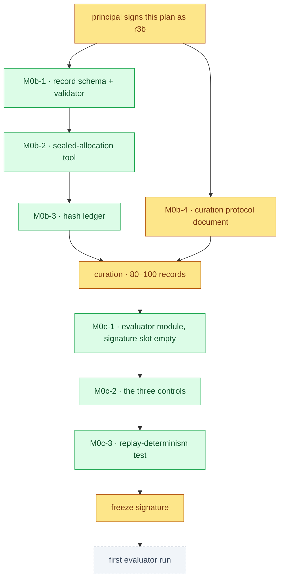

# M0b and M0c — plan draft for signature (2026-10-04)

**Status: DRAFT. Not folded into `build-plan.md`, not signed, not implemented.**

## Why this document exists rather than code

The grill of 2026-10-04 approved the agent-side preparation for M0b and M0c: "the record
schema, its validator, and the sealed-allocation tool" (ledger B6) and "the evaluator as a
versioned module with its signature slot empty" (B8). Before writing any of it, the build plan
was read for their done-conditions. **It has none.** M0b and M0c appear in the phase-ownership
table (`build-plan.md` line 1012–1013) and in the scope check (§8 items 1–2), and both entries
end with the same three words: *"Its own plan."* There is no file path, no field list, no
signature format and no done-condition for the chip-record schema, the sealing tool, the hash
ledger, the splits or the freeze.

Writing that code now would mean inventing the specification and then verifying the code
against the specification it invented. That is the exact mechanism the Stage 1 closure
identified — *a fix is verified against the thing that was changed, not against the property
the claim names* — and six of its nine instances arrived through work that was confident about
the wrong reference point. So this phase produces the plan the build plan says is owed, with
done-conditions a human can refuse, and stops there.

What was implementable today was implemented: S13, S14, T21, T24 and T28's validator all have
done-conditions in the plan, and they are built, tested and lint-clean (see
`tests/test_m1_inputs.py`).

## What a signature on this document would authorise

## M0b · proposed tasks

| # | Task | Owner | Files | Done when |
|---|---|---|---|---|
| M0b-1 | Chip-record schema and validator | agent | `chipsim/records/schema.py`, `chipsim/records/validate.py`, `tests/test_records.py` | a record missing any declared field raises; a record with a field carrying no source raises; a record whose key is not a canonical InChIKey raises; a sentinel fixture round-trips; **no field default exists anywhere in the module** |
| M0b-2 | Sealed three-way allocation tool | agent | `chipsim/records/allocation.py`, `tests/test_allocation.py` | the split is written and its digest recorded **before any record file is opened**, provable by a test that fails if the tool reads a record first; re-running with the same seed reproduces the split byte-for-byte; a changed record set after sealing raises rather than re-splitting; the digest is verified at every read |
| M0b-3 | Allocation hash ledger | agent | `chipsim/records/ledger.py` | every open of the locked test set appends a row naming who opened it and why; the ledger is append-only, verified by a test that a rewrite is detected; the count of locked-set opens is readable and reported beside every coverage figure |
| M0b-4 | Curation protocol | **principal** | `workstreams/lung-on-chipsim/m0b-curation-protocol.md` | the document states, in the principal's own words, what one curated chip record is, which sources are admissible, and what makes a record rejected; no agent drafts it, for the same reason `PROVENANCE.md` is not agent-drafted |

The allocation shape is already ruled and is **not** reopened here: three-way, delta-calibration
and conformal calibration and a locked test set, about 20 conformal points per P-gp group across
two groups (ADR-0002, principal 2026-09-02). Every coverage figure is reported with its
per-group confidence interval, and §5E forbids stating coverage in marginal terms.

**Open question for the principal, the only one in M0b:** does the sealed allocation seal
*record identities* or *record slots*? Sealing identities requires the full record set to exist
before sealing, which inverts the "seal before reading" rule. Sealing slots lets curation
proceed against a sealed split, but means a record's group is fixed by curation order. The
second is the only one consistent with sealing before any record is read, so it is what M0b-2
above specifies; the question is flagged because it is a real methodological choice and it
belongs to the principal, not to the tool.

## M0c · proposed tasks

| # | Task | Owner | Files | Done when |
|---|---|---|---|---|
| M0c-1 | Evaluator module with an empty signature slot | agent | `chipsim/eval/evaluator.py`, `tests/test_evaluator.py` | the evaluator refuses to run while its signature slot is empty; the refusal names the slot; the module is versioned and its version appears in the run journal |
| M0c-2 | The three controls | agent | `chipsim/eval/controls.py` | target-shuffle and site-mutation degradation, cliff-stratified reporting, and the non-monotonicity case each run and each report a value; **none of them asserts a threshold an agent chose** |
| M0c-3 | Replay determinism | agent | `tests/test_replay_determinism.py` (edit) | two runs of the evaluator on one sealed allocation produce identical output, and the test fails if a seed is unpinned |
| M0c-4 | The freeze signature | **principal** | the evaluator's signature field | signed before any fit on real records; after signature nothing edits the evaluator, the split definitions or the allocation (prohibition 3) |

The evaluator's **metric thresholds are not an agent's to write.** Spearman ρ ≥ 0.6, top-10 MoA
recovery and 90% Mondrian coverage are the pre-registered claim; the evaluator computes the
values and reports them against those stated thresholds, and it does not acquire a threshold of
its own anywhere in M0c.

## What this draft does not do

- It does not create any file under `chipsim/records/` or any evaluator module. Nothing above is
  implemented.
- It does not set the M0b curation rate. The 3–4 week figure in the HACP ledger remains a
  planning assumption, replaced by the measured minutes-per-record after the first ten.
- It does not reopen ADR-0002's allocation arithmetic, ADR-0003's power floor, or ADR-0004's
  ruling that the pair stratum is curated and never discovered.
