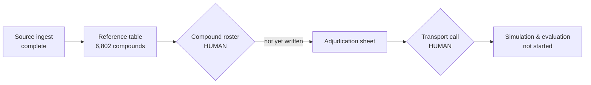

# The rig is built. The experiment has not run.

**Product cut.** The technical cut was not written: this walkthrough was requested as a
one-pager for the principal, and the skill's own rule is that two thin cuts are worse than
one good page when only one audience is real.

The pipeline produced its **first real artifact** — a 6,802-compound reference table whose
contents can be checked byte-for-byte by anyone. Everything downstream of it is waiting on
inputs only a human may write.

| | |
|---|---|
| 6,802 | compounds, 9 attributes, digest-verified |
| 1 of 5 | human-owned inputs delivered |
| 0 | simulation or evaluation runs |

Counts read from the artifact itself, not from a build report. The row and column counts were
read out of the parquet, and the tracked digest was recomputed over the bytes on disk.

## Where the work stops

Green has run. Amber needs a person. Grey cannot start until the amber above it clears.

## What changed

- **Before:** the pipeline had produced nothing; its output folders were empty.
- **Now:** it produces a reference table, records the exact settings of every run, and asks
  for confirmation before it writes.
- The safety check that keeps licensed source content out of the repository has been hardened
  repeatedly — and it kept finding real faults, including several in itself and two in the
  CTO's own instructions.

## The risk worth naming

Most of the recent effort went into making the verification layer trustworthy rather than into
moving the science forward. That was the right call while the checks were unreliable — but it
is a cost, and the team surfaced it before the CTO did.

## The decision in front of you

The **compound roster** — roughly 20–40 curated entries — is the single item that unblocks the
chain. It is a curation claim, so no agent may write it. Everything downstream idles until it
exists.

## What this does not claim

- No biological result has been produced, reviewed or validated. **There is nothing yet to publish.**
- The reference table is ingested source data, not an experimental output.
- The content guard is available but **not enforced** — nothing automatically runs it before a
  commit. That remains the principal's call.
- One source licence is still unconfirmed.
