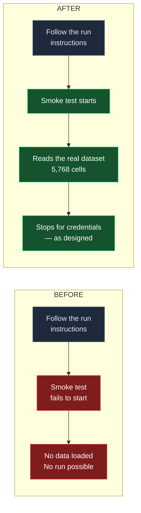

# A documented command had been broken for five months

The start-up step in our own run instructions could not run. It can now.

> **Green = working, red = broken** — the same convention as the technical cut.

## What changed

Two files in the evaluation package were given the same name two days apart, back in April. From that moment the older one became invisible to the system, and the component that loads our real single-cell dataset depended on it. Anyone following our written instructions hit a failure on the first step.

It is fixed. The smoke test now starts, loads the real dataset, and stops where it should — asking for the credentials needed to call the model.

## Why nobody noticed

**Every test passed the entire time.** The broken path runs only when a person follows the instructions by hand; the automated tests never exercise it. This is the uncomfortable part: our test suite was green for five months across a broken entry point, and greenness was never evidence about it.

## The cost

| | |
| --- | --- |
| Time broken | ~5 months |
| Effort to fix | under an hour, including verification |
| Tests affected | none — 198 pass, unchanged |
| Risk introduced | none; the fix restores the original behaviour rather than changing it |

Verification was done by rebuilding the old version of the code and confirming it failed, then confirming the current version succeeds — rather than reasoning that it should.

## What this does not claim

**The blind spot that hid this is still open.** Our automated dependency map cannot see links between the scripts people run and the library code they depend on — more than half of that map is missing for this project. Anyone using it to judge what a change might break would be misled in exactly the way that let this sit unnoticed. That is a known, recorded limitation, not a surprise, and it is not fixed by this work.

**The run itself is still unproven end to end.** The smoke test reaches the point where it needs live model credentials. It has not been run past there, and doing so would spend money — so it awaits a decision, not more engineering.

**No safeguard was added** to stop the same naming collision happening again.
