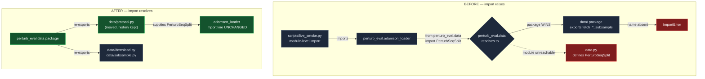

# Technical cut — un-shadowing `perturb_eval.data` (`84fb70f`)

Archetype: **fix**. A name collision made a module unreachable, which broke a documented command for five months while the test suite stayed green.

## Mechanism

> Colour convention, shared with the product cut: **green = fixed/new**, **red = broken**, grey = pre-existing.

## Beats

**1 — A package and a same-named module cannot coexist; the package always wins.**
`src/perturb_eval/data.py` (2026-04-22, v0.3.0) and `src/perturb_eval/data/` (2026-04-24, v0.5.0-phase1) were added two days apart. Python's `FileFinder` resolves the package first, so every name in `data.py` became unreachable. Verified by running it, not by citing the rule: a synthetic `pkg/data.py` + `pkg/data/` pair resolves to `data/__init__.py` and `hasattr(pkg.data, "load_norman")` is `False`.

**2 — This was breakage, not dead code.**
`PerturbSeqSplit` is defined *only* in the shadowed module and nowhere under `data/`. `adamson_loader.py:20` does `from perturb_eval.data import PerturbSeqSplit`, so the import raised. Reproduced structurally: `ImportError: cannot import name 'PerturbSeqSplit' from 'pe.data'`.

**3 — The suite could not see it.**
The only importer of `adamson_loader` is `scripts/live_smoke.py`, and `scripts/` is not collected by pytest. 198 tests passed throughout. A green suite says nothing about a path it does not import.

**4 — The fix moves rather than renames, so no consumer changes.**
`git mv data.py → data/protocol.py` (history preserved) plus a re-export from `data/__init__.py`. `adamson_loader.py:20` is **untouched** and the public API `perturb_eval.data.X` — which the docs describe — is preserved. A rename would have forced an edit at every call site and changed the documented API.

**5 — Three docs referenced the old path by name.**
`README.md`, `docs/THESIS.md`, `docs/DESIGN.md` all pointed at `src/perturb_eval/data.py`. Leaving them stale would have repeated the exact failure being fixed: *a change that audits what it wrote and not what it invalidated.*

**6 — Proven by measurement, before and after.**
The pre-fix tree was extracted with `git archive` into a scratch dir and run:

| tree | `live_smoke.py --help` |
| --- | --- |
| pre-fix | `ImportError` at `adamson_loader.py:20` |
| post-fix | clean usage output |

Then the documented command itself reached real data — `[data] Adamson2016 — 5768 cells, 35635 genes, 7 non-control perturbations` — and stopped at the credential gate.

## Invariants and failure modes

| Property | State |
| --- | --- |
| `from perturb_eval.data import PerturbSeqSplit` | works; consumer line unchanged |
| Public API `perturb_eval.data.X` | preserved |
| What breaks for an existing caller | **nothing** — no reachable caller existed to break |
| Import cost | unchanged; `perturb_eval/__init__` already pulls numpy via `bayesian` |
| Lint | 11 ruff errors before, 11 after; the one `I001` I introduced was found by diffing against the pre-fix baseline and fixed |
| Suite | 198 passed / 2 skipped; the single failure (`test_alias_scgpt_to_scgpt_small`) confirmed **pre-existing** against the pre-fix tree |

**Self-contradiction inside the change: I looked and found none.** The only surviving mention of the old path is the deliberate historical note in `data/__init__.py` explaining why the move happened.

**Adjacent contradiction, found while ingesting, NOT part of this change:** `paper/README.md` still documents a reproduce path built on `paper/experiments/simulate.py` — *"seeded synthetic DGP… ~10 s on a CPU"*. That directory does not exist; it was removed in v0.5.0 under the no-synthetic invariant, and `tests/test_no_synthetic_generators.py` now enforces its absence. The README instructs a reader to run a command that cannot run, and advertises a provenance the project has explicitly disavowed.

## What this does not claim

- **It does not fix the class of failure.** The dependency graph cannot see `scripts/ → src/` edges at all — that is the Poetry src-layout resolver gap (67 of perturb-seq-eval's 116 missing import edges). Anyone assessing blast radius from the graph would still conclude nothing depends on `adamson_loader`.
- **It does not prove `live_smoke` completes.** It reaches the credential gate. No live LLM run was performed: no `.env` exists and `OPENROUTER_API_KEY` is unset — both verified *before* running, so nothing could spend.
- **It does not add a test for the shadowing.** Nothing prevents the same collision recurring under a different name.
- **It does not touch `paper/README.md`.** The staleness above is reported, not repaired.
